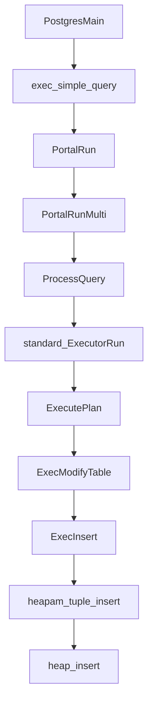

# insert data

一条数据插入的流程如下：



以上流程数据仅仅只是到了内存里面，还没有真正到达磁盘，什么时候进入磁盘还需要BgWriter进程来操作。下面采用自底向上的方式来分析数据的插入及其实现逻辑。

## heap_insert

```c
void heap_insert(Relation relation, HeapTuple tup, CommandId cid,
			int options, BulkInsertState bistate)
```

插入需要提供五个参数，需终点关注以下四个，因为这四个是数据模型的重要数据结构。

- Relation

  ```c
  /*
   * Here are the contents of a relation cache entry.
   */
  
  typedef struct RelationData
  {
  	RelFileNode rd_node;		/* relation physical identifier */
  	SMgrRelation rd_smgr;		/* cached file handle, or NULL */
  	int			rd_refcnt;		/* reference count */
  	BackendId	rd_backend;		/* owning backend id, if temporary relation */
  	bool		rd_islocaltemp; /* rel is a temp rel of this session */
  	bool		rd_isnailed;	/* rel is nailed in cache */
  	bool		rd_isvalid;		/* relcache entry is valid */
  	bool		rd_indexvalid;	/* is rd_indexlist valid? (also rd_pkindex and
  								 * rd_replidindex) */
  	bool		rd_statvalid;	/* is rd_statlist valid? */
  	SubTransactionId rd_createSubid;	/* rel was created in current xact */
  	SubTransactionId rd_newRelfilenodeSubid;	/* highest subxact changing
  												 * rd_node to current value */
  	SubTransactionId rd_firstRelfilenodeSubid;	/* highest subxact changing
  												 * rd_node to any value */
  	SubTransactionId rd_droppedSubid;	/* dropped with another Subid set */
  
  	........
      
  	bool		pgstat_enabled;	/* should relation stats be counted */
  	/* use "struct" here to avoid needing to include pgstat.h: */
  	struct PgStat_TableStatus *pgstat_info; /* statistics collection area */
  } RelationData;
  ```

  可以看到，成员非常多，此处我们先暂时关心其内部细节。只要知道这是个关系上下文，里面存储了很多的上下文信息，数据插入到什么地方与RelationData紧密相关。

- HeapTuple

  ```c
  typedef struct HeapTupleData
  {
  	uint32		t_len;			/* length of *t_data */
  	ItemPointerData t_self;		/* SelfItemPointer */
  	Oid			t_tableOid;		/* table the tuple came from */
  #define FIELDNO_HEAPTUPLEDATA_DATA 3
  	HeapTupleHeader t_data;		/* -> tuple header and data */
  } HeapTupleData;
  ```

- CommandId

- BulkInsertState

### PageAddItemExtended
