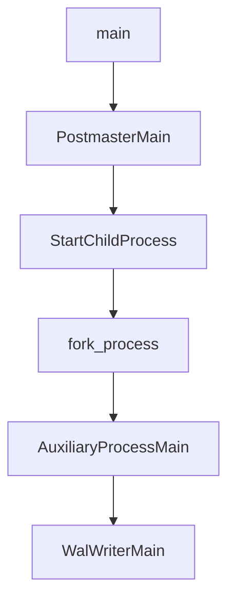
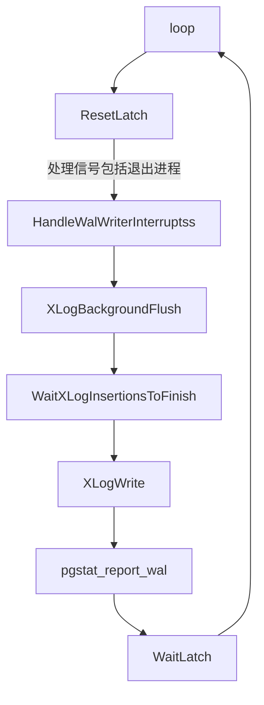

# WalWriter

预写式日志WAL机制是对数据文件的修改必须是只能发生在这些修改已经记录到日志之后，即先写日志再写数据。

WalWriter进程负责定期从WAL缓冲区写出日志，并确定写出日志的起点和终点来调用XlogWriter将日志写入到磁盘。

## 参数配置

- wal_level

  控制wal存储的级别。wal_level确定有多少信息被写入到WAL。默认值是replica，它添加了WAL归档信息，包括只读服务器(流复制)所需的信息。还可以将其设置为minimal，即只写入从崩溃或立即关闭中恢复所需的信息。设置为Logical允许在逻辑解码场景中完成WAL流。

- fsync

  这个参数直接控制日志是否先写到磁盘。默认值为ON(先写)，这意味着系统应该通过发出wal_sync_method设置的fsync指令，来确保更改确实被刷新到磁盘。虽然关闭fsync通常可以提高性能，但在电源故障或系统崩溃时，这会导致不可恢复的数据损坏。因此，只有当您可以轻松地从外部数据重新创建整个数据库时，才建议关闭fsync。

- synchronous_commit

  此参数用于配置系统是否等待WAL完全完成后再将状态信息返回给用户事务。默认值为ON，表示必须等待WAL完成后才能返回事务状态信息；配置OFF可以更快地反馈事务状态。

- wal_sync_method

  这个参数控制WAL写入磁盘的fsync方法。默认值是fsync。可用的值包括open_datasync、fdatasync、fsync_writethrough、fsync、以及open_sync.open_datasync和open_sync。

- full_page_writes

  指示是否将整个页面写入WAL。

- wal_buffers

  指示了用于存储WAL数据的内存空间量。系统默认值为64K。此参数还受wal_writer_delay和commit_delay这两个参数的影响。

- wal_writer_delay

  WalWriter进程的写入间隔。默认值是200毫秒。如果时间过长，可能会导致WAL缓冲区内存不足；如果时间太短，会导致WAL不断写入，增加磁盘I/O负担。

- wal_writer_flush_after

  当脏数据超过这个阈值时，它将被刷新到磁盘。

- commit_delay

  指示在WAL buffer中存储已提交的数据的时间。默认值为0毫秒，表示没有延迟;

  当它被设置为非零值时，在事务提交后，事务将不会被立即写入到WAL中，但它仍然存储在WAL buffer中，等待WalWriter进程定期写入磁盘。

- commit_siblings

  当事务发出提交请求时，如果数据库中的事务数量大于commit_sibling的值，事务将等待一段时间(commit_delay值)；否则，事务将直接写入到WAL。系统默认值是5，这个参数还确定了commit_delay的有效性。

## 源码分析

### 启动



### 写文件



WalWriter会根据WalWriterDelay时间进行循环，当WalWriterDelay时间到达后，再次执行XLogBackgroundFlush进行WAL日志写入。

```c
int			WalWriterDelay = 200;
int			WalWriterFlushAfter = 128;


for (;;)
{
    if (XLogBackgroundFlush())
			left_till_hibernate = LOOPS_UNTIL_HIBERNATE;
	else if (left_till_hibernate > 0)
			left_till_hibernate--;
    if (left_till_hibernate > 0)
			cur_timeout = WalWriterDelay;	/* in ms */
	else
			cur_timeout = WalWriterDelay * HIBERNATE_FACTOR;

	(void) WaitLatch(MyLatch,
						 WL_LATCH_SET | WL_TIMEOUT | WL_EXIT_ON_PM_DEATH,
						 cur_timeout,
						 WAIT_EVENT_WAL_WRITER_MAIN);
}
```


# reference

1. https://www.modb.pro/db/28621