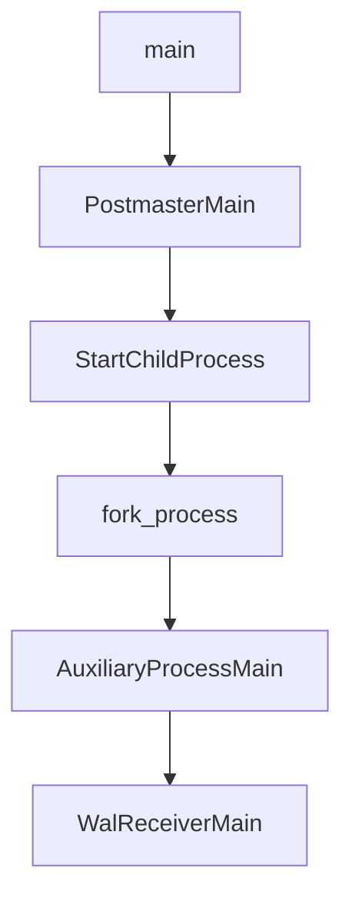
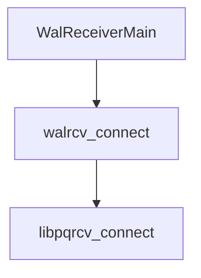
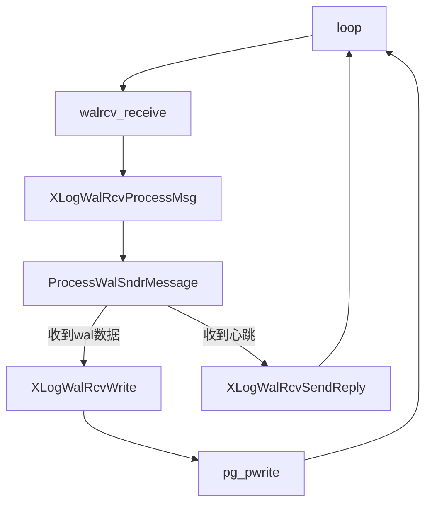

# pg_walreceiver

## 启动流程

### 启动receiver进程



### 连接主库



## wal_receiver整体流程

wal_receiver整体流程由三层循环组成，第一层循环使用launch机制，第二层和第三层则使用`for(;;)`实现。

- 第一层循环是wal_receiver进程的控制循环，负责挂起和监听socket是否有数据到来
- 第二层循环是流复制流程，从一次流复制开始到流复制结束或流复制出现错误
- 第三层循环是wal数据和心跳数据接收，不断的从socket的buffer中收取数据，直到buffer中没有数据

### wal数据接收流程



1. wal数据接收在walreceiver的第三层循环，通过循环调用`walrcv_receive`收取数据，当返回的数据长度小于等于0时退出；其中等于0时表示没有数据，小于0表示收包遇到错误；
   
   ```c
                       for (;;)
                       {
                           if (len > 0)
                           {
                               /*
                                * Something was received from primary, so reset
                                * timeout
                                */
                               last_recv_timestamp = GetCurrentTimestamp();
                               ping_sent = false;
                               XLogWalRcvProcessMsg(buf[0], &buf[1], len - 1,
                                                    startpointTLI);
                           }
                           else if (len == 0)
                               break;
                           else if (len < 0)
                           {
                               ereport(LOG,
                                       (errmsg("replication terminated by primary server"),
                                        errdetail("End of WAL reached on timeline %u at %X/%X.",
                                                  startpointTLI,
                                                  LSN_FORMAT_ARGS(LogstreamResult.Write))));
                               endofwal = true;
                               break;
                           }
                           len = walrcv_receive(wrconn, &buf, &wait_fd);
                       }
   ```

2. 当收到数据后，会根据报文的第一个字节区分wal数据和心跳，并进行区别处理；
   
   ```c
       switch (type)
       {
           case 'w':                /* WAL records */
               {
                   /* copy message to StringInfo */
                   hdrlen = sizeof(int64) + sizeof(int64) + sizeof(int64);
                   if (len < hdrlen)
                       ereport(ERROR,
                               (errcode(ERRCODE_PROTOCOL_VIOLATION),
                                errmsg_internal("invalid WAL message received from primary")));
                   appendBinaryStringInfo(&incoming_message, buf, hdrlen);
   
                   /* read the fields */
                   dataStart = pq_getmsgint64(&incoming_message);
                   walEnd = pq_getmsgint64(&incoming_message);
                   sendTime = pq_getmsgint64(&incoming_message);
                   ProcessWalSndrMessage(walEnd, sendTime);
   
                   buf += hdrlen;
                   len -= hdrlen;
                   XLogWalRcvWrite(buf, len, dataStart, tli);
                   break;
               }
           case 'k':                /* Keepalive */
               {
                   /* copy message to StringInfo */
                   hdrlen = sizeof(int64) + sizeof(int64) + sizeof(char);
                   if (len != hdrlen)
                       ereport(ERROR,
                               (errcode(ERRCODE_PROTOCOL_VIOLATION),
                                errmsg_internal("invalid keepalive message received from primary")));
                   appendBinaryStringInfo(&incoming_message, buf, hdrlen);
   
                   /* read the fields */
                   walEnd = pq_getmsgint64(&incoming_message);
                   sendTime = pq_getmsgint64(&incoming_message);
                   replyRequested = pq_getmsgbyte(&incoming_message);
   
                   ProcessWalSndrMessage(walEnd, sendTime);
   
                   /* If the primary requested a reply, send one immediately */
                   if (replyRequested)
                       XLogWalRcvSendReply(true, false);
                   break;
               }
           default:
               ereport(ERROR,
                       (errcode(ERRCODE_PROTOCOL_VIOLATION),
                        errmsg_internal("invalid replication message type %d",
                                        type)));
       }
   ```
   
     如果是wal报文，则进行写入；如果是心跳报文需要进一步读取报文的最后一个字节是否为1，为1表示需要回复心跳报文。

3. 当一次数据收取结束后（socket的buffer中没有数据），此时walreceiver也需要进行回复，通知walsender收到了数据；
   
   ```c
                       /* Let the primary know that we received some data. */
                       XLogWalRcvSendReply(false, false);
   ```

4. 同时如果写入了数据，需要将数据flush到磁盘
   
   ```c
                       /*
                        * If we've written some records, flush them to disk and
                        * let the startup process and primary server know about
                        * them.
                        */
                       XLogWalRcvFlush(false, startpointTLI);
   ```
