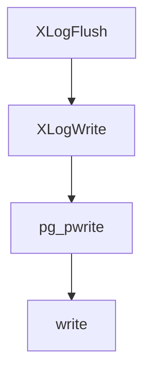

# xlog

- 全局变量

  ```c
  static XLogCtlData *XLogCtl = NULL;
  ```

```c
typedef uint64 XLogRecPtr;

typedef struct XLogwrtRqst
{
	XLogRecPtr	Write;			/* last byte + 1 to write out */
	XLogRecPtr	Flush;			/* last byte + 1 to flush */
} XLogwrtRqst;

typedef struct XLogwrtResult
{
	XLogRecPtr	Write;			/* last byte + 1 written out */
	XLogRecPtr	Flush;			/* last byte + 1 flushed */
} XLogwrtResult;
```

- XLogCtlData

```c
typedef struct XLogCtlData
{
	XLogCtlInsert Insert;

	/* Protected by info_lck: */
	XLogwrtRqst LogwrtRqst;
	XLogRecPtr	RedoRecPtr;		/* a recent copy of Insert->RedoRecPtr */
	FullTransactionId ckptFullXid;	/* nextXid of latest checkpoint */
	XLogRecPtr	asyncXactLSN;	/* LSN of newest async commit/abort */
	XLogRecPtr	replicationSlotMinLSN;	/* oldest LSN needed by any slot */

	XLogSegNo	lastRemovedSegNo;	/* latest removed/recycled XLOG segment */

	/* Fake LSN counter, for unlogged relations. Protected by ulsn_lck. */
	XLogRecPtr	unloggedLSN;
	slock_t		ulsn_lck;

	/* Time and LSN of last xlog segment switch. Protected by WALWriteLock. */
	pg_time_t	lastSegSwitchTime;
	XLogRecPtr	lastSegSwitchLSN;

	/*
	 * Protected by info_lck and WALWriteLock (you must hold either lock to
	 * read it, but both to update)
	 */
	XLogwrtResult LogwrtResult;
	XLogRecPtr	InitializedUpTo;

	char	   *pages;			/* buffers for unwritten XLOG pages */
	XLogRecPtr *xlblocks;		/* 1st byte ptr-s + XLOG_BLCKSZ */
	int			XLogCacheBlck;	/* highest allocated xlog buffer index */

	TimeLineID	InsertTimeLineID;
	TimeLineID	PrevTimeLineID;

	RecoveryState SharedRecoveryState;

	bool		InstallXLogFileSegmentActive;

	bool		WalWriterSleeping;

	XLogRecPtr	lastCheckPointRecPtr;
	XLogRecPtr	lastCheckPointEndPtr;
	CheckPoint	lastCheckPoint;

	XLogRecPtr	lastFpwDisableRecPtr;

	slock_t		info_lck;		/* locks shared variables shown above */
} XLogCtlData;
```

- 

```c
typedef struct XLogCtlInsert
{
	slock_t		insertpos_lck;	/* protects CurrBytePos and PrevBytePos */
	uint64		CurrBytePos;
	uint64		PrevBytePos;

	char		pad[PG_CACHE_LINE_SIZE];

	XLogRecPtr	RedoRecPtr;		/* current redo point for insertions */
	bool		forcePageWrites;	/* forcing full-page writes for PITR? */
	bool		fullPageWrites;

	int			runningBackups;
	XLogRecPtr	lastBackupStart;
	WALInsertLockPadded *WALInsertLocks;
} XLogCtlInsert;
```

- XLogRecord

```c
typedef struct XLogRecord
{
	uint32		xl_tot_len;		/* total len of entire record */
	TransactionId xl_xid;		/* xact id */
	XLogRecPtr	xl_prev;		/* ptr to previous record in log */
	uint8		xl_info;		/* flag bits, see below */
	RmgrId		xl_rmid;		/* resource manager for this record */
	/* 2 bytes of padding here, initialize to zero */
	pg_crc32c	xl_crc;			/* CRC for this record */

	/* XLogRecordBlockHeaders and XLogRecordDataHeader follow, no padding */

} XLogRecord;
```

## xlog写入流程



