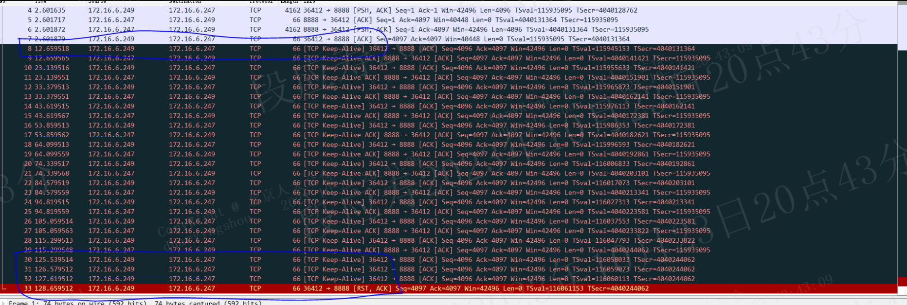
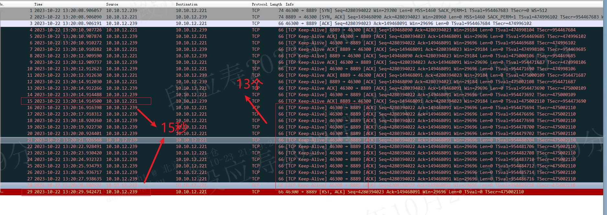

# tcp_user_timeout与keepalive的关系与生效机制

## 仅开启tcp_user_timeout

当tcp流中有数据交互时，tcp流不会进入keepalive，此时的超时主要受tcp_user_timeout影响。数据包被发送后未接收到ACK确认的达到tcp_user_timeout时会断开连接。tcp_user_timeout以毫秒为单位，例如设置为10000时，代表如果发送出去的数据包在十秒内未收到ACK确认，则下一次调用send或者recv，则函数会返回-1，errno设置为ETIMEOUT。

tcp_user_timeout主要解决tcp连接中有数据交互时数据未回复的超时断链。如丢包重传时的超时。

## 仅开启tcp keep-alive

1. 由tcp_keepalive_idle 设置的时长控制进入keep-alive（表示连接没有数据交互持续多久进入keep-alive）；
2. 当进入keep-alive后，由tcp_keepalive_interval 设置的时长控制多久发送一个keepalive；
3. 由tcp_keepalive_count 控制未收到多少个keep-alive-ack时进行拆链；收到keep-alive的一端需要回复keep-alive ack，若未收到keep-alive ack的报文个数达到tcp_keepalive_count时将会断开连接。

keep-alive 超时断开连接的时间为：tcp_keepalive_idle + （tcp_keepalive_interval * tcp_keepalive_count）
如设置tcp_keepalive_idle=10s,tcp_keepalive_interval=1s,tcp_keepalive_count=3时的报文截图如下：

keep-alive主要解决tcp链路中没有数据交互时的连接检测，keepalive通过主动发送报文来检测对端是否存活。如tcp长连接进入空闲状态时一端挂死就需要通过keep-alive来探测。

## 同时开启keepalive和tcp_user_timeout

当同时开启keepalive和tcp_user_timeout时，根据tcp_user_timeout和keepalive超时时间不一样，又分为两种情况（keep-alive 超时断开连接的时间为：tcp_keepalive_idle + （tcp_keepalive_interval * tcp_keepalive_count））：

- tcp_user_timeout小于keepalive超时时间
- tcp_user_timeout大于keepalive超时时间

### tcp_user_timeout小于keepalive超时时间

tcp_user_timeout小于keepalive超时时间时，则当超时达到tcp_user_timeout就会断开连接，keep-alive未ack的报文不会达到tcp_keepalive_count个数。即断开时间会小于keepalive的超时时间。。

如`tcp_user_timeout=15,tcp_keepalive_idle=2s,tcp_keepalive_interval=1s,tcp_keepalive_count=20`时，此时`15<(2+20*1)`,抓包实例如下：

### tcp_user_timeout大于keepalive超时时间

tcp_user_timeout大于keepalive超时时间时，只有当超时达到tcp_user_timeout才会断开连接，keep-alive未ack的报文可能会超过tcp_keepalive_count个数，即断开时间会大于keepalive的超时时间。

如tcp_user_timeout=15,tcp_keepalive_idle=2s,tcp_keepalive_interval=1s,tcp_keepalive_count=3时，此时15>(2+3*1),抓包实例如下：

当tcp_user_timeout和keepalive同时开启时，超时断链时间以tcp_user_timeout为准。

tcp_user_timeout无法处理没有数据交互时一端挂死的场景，因而需要keepalive机制配合；而当引入keep-alive机制后，keep-alive的报文就会受到tcp_user_timeout的控制，只有当某个keepalive报文未ack的时间超过tcp_user_timeout时，才会断开连接。若未达到tcp_user_timeout，则会按照tcp_keepalive_interval持续发送keepalive报文。即同时设置tcp_user_timeout和keepalive时，keepalive的tcp_keepalive_count将会失效，keepalive报文发送个数不会和tcp_keepalive_count严格一致。

tcp_keepalive是对tcp_user_timeout场景的补充，主要是在没有报文交互的长连接中，由tcp_keepalive触发报文发送，并触发tcp_user_timeout的超时机制，来控制tcp连接的超时断开。

# reference

1. https://datatracker.ietf.org/doc/html/rfc5482#page-10
2. https://blog.cloudflare.com/when-tcp-sockets-refuse-to-die/
3. https://man7.org/linux/man-pages/man7/tcp.7.html