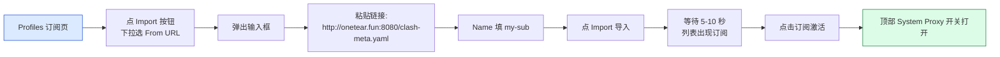
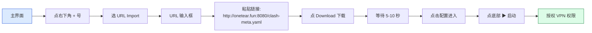

# Clash 客户端配置小白教程：3 步学会用代理上网

> 不会写代码？看不懂命令行？这篇教程只讲"下载、安装、点几下"，跟着做就行。
>
> 你的订阅链接是：`http://onetear.fun:8080/clash-meta.yaml`

---

## 一、Clash 是什么？为什么要用它？

简单说：Clash 是一款帮你"科学上网"的工具。**它本身不带线路**，你只需要把别人给你的"订阅链接"（一串网址）填进去，它就会自动帮你连接好服务器，然后你打开浏览器就能上 Google、Github、YouTube 了。

**整个过程只有 3 步**：
1. 下载一个 Clash 客户端（免费、不到 30 MB）
2. 打开它，粘贴订阅链接
3. 点"启动"按钮，开浏览器上网

> ⚠️ 注意：Clash 只是"客户端工具"，**不提供代理服务**。你需要自己有一个"订阅端"（类似流量卡）。本文假设你已经拿到了订阅链接 `http://onetear.fun:8080/clash-meta.yaml`。

---

## 二、下载哪个客户端？

**推荐使用 Clash Meta（也叫 mihomo）内核的客户端**，因为你的订阅链接是 `clash-meta.yaml` 格式——必须用支持 mihomo 的客户端才能解析。

| 你的系统 | 推荐客户端 | 收费？ |
| --- | --- | --- |
| 🪟 Windows 10/11 | **Clash Verge Rev** | 免费 |
| 🍎 macOS（Intel / M1 / M2 / M3） | **Clash Verge Rev** | 免费 |
| 🐧 Linux（Ubuntu / Debian / 国产） | **Clash Verge Rev** | 免费 |
| 📱 Android 安卓 | **Clash Meta for Android** | 免费 |
| 🍎 iOS 苹果 | **Stash** | 一次性 ¥25 左右 |

下面分平台教你怎么用。

---

## 三、Windows 10 / 11 用户看这里

### 第 1 步：下载客户端

打开浏览器，访问这个网址：

```
https://github.com/clash-verge-rev/clash-verge-rev/releases
```

页面会很长，找一个**看起来像这样的文件名**（数字可能不同）：

```
clash-verge-rev_1.7.2_x64-setup.exe
```

> 💡 不知道怎么找？看页面里**带 `_x64-setup.exe` 字样的下载链接**就对了。

点击下载（约 30 MB）。

### 第 2 步：安装

下载完成后，双击 `clash-verge-rev_1.7.2_x64-setup.exe`，一路点 **下一步** → **安装** → **完成**。

### 第 3 步：配置订阅

启动 Clash Verge Rev，会自动弹出主界面。

#### 3.1 切换到中文（如果界面是英文）

左下角齿轮 ⚙️ → **Language** → **简体中文**。

#### 3.2 添加订阅

左侧菜单找到 **订阅（Profiles）** 标签（图标像一个档案夹），点击进入。

界面长这样：



**详细步骤**：
1. 点击右上角 **Import** 按钮
2. 在下拉菜单选 **From URL**（从 URL 导入）
3. 在 **URL** 输入框**粘贴你的订阅链接**：
   ```
   http://onetear.fun:8080/clash-meta.yaml
   ```
4. **Name（名称）** 随便填，比如 `my-sub`
5. 点击 **Import（导入）**
6. 等待 5-10 秒，列表会出现一个订阅条目
7. **点击该订阅**，让它高亮（表示激活）
8. **顶部 System Proxy 开关打开**（变绿）

### 第 4 步：启动！

主界面顶部有两个开关：
- **System Proxy**（系统代理）：接管浏览器流量 ✅ 打开
- **TUN Mode**（TUN 模式）：接管所有流量，包括命令行 / 容器

新手先只打开 **System Proxy** 即可。

### 第 5 步：测试

打开浏览器，访问 https://www.google.com ——能打开就成功了 🎉

---

## 四、macOS 用户看这里

### 第 1 步：下载客户端

打开浏览器访问：

```
https://github.com/clash-verge-rev/clash-verge-rev/releases
```

找**像这样**的文件名（带 `_universal.dmg` 或 `_x64.dmg`）：

```
clash-verge-rev_1.7.2_universal.dmg
```

> 💡 不知道选 universal 还是 x64？
> - **M1 / M2 / M3 芯片**（2020 年后的 Mac）→ 选 `_universal.dmg` 或 `_arm64.dmg`
> - **Intel 芯片**（2019 年前的 Mac）→ 选 `_x64.dmg`

点下载（约 35 MB）。

### 第 2 步：安装

1. 双击 `.dmg` 文件，会弹出一个窗口
2. 把 **Clash Verge Rev** 图标**拖到 Applications 文件夹**（约 5 秒）
3. 在启动台（Launchpad）找到并打开它

> ⚠️ **首次启动会提示"无法打开，因为开发者无法验证"**：
>
> 解决方法：打开 **系统设置** → **隐私与安全性** → 找到 Clash Verge Rev 那一行 → 点击 **仍要打开**。
>
> 或者在终端执行（如果你不排斥一行命令）：
> ```bash
> sudo xattr -dr com.apple.quarantine "/Applications/Clash Verge Rev.app"
> ```

### 第 3 步：配置订阅

完全和 **第三节"Windows 用户"的第 3 步** 一样：

1. 启动 Clash Verge Rev
2. 左侧菜单 → **订阅（Profiles）**
3. 点击 **Import** → **From URL**
4. 粘贴：
   ```
   http://onetear.fun:8080/clash-meta.yaml
   ```
5. 名称填 `my-sub`
6. 点 **Import**
7. 点击列表里的订阅激活
8. 打开 **System Proxy** 开关

### 第 4 步：测试

浏览器打开 https://www.google.com 验证。

---

## 五、Android 安卓用户看这里

### 第 1 步：下载客户端

打开手机浏览器，访问：

```
https://github.com/MetaCubeX/ClashMetaForAndroid/releases
```

找**像这样**的文件名（带 `.apk`）：

```
CMFA-v2.11.0-meta-arm64-v8a.apk
```

> 💡 不知道选哪个？
> - 大多数现代手机 → 选 **`arm64-v8a`** 或 **`universal`**
> - 极老手机 → 选 `armeabi-v7a`

点击下载（约 20 MB）。

### 第 2 步：安装

1. 下载完成后，**点击 APK 文件**安装
2. 系统会提示"未知来源应用"，**允许安装**
3. 等待安装完成（约 5 秒）

### 第 3 步：添加订阅

打开 **Clash Meta for Android**，界面长这样：



**详细步骤**：
1. 在主界面点击右下角 **+** 按钮
2. 选择 **URL Import**（URL 导入）
3. 在 URL 输入框粘贴：
   ```
   http://onetear.fun:8080/clash-meta.yaml
   ```
4. 点击 **Download**（下载）
5. 等待几秒，配置下载成功
6. **点击该配置**进入
7. 点击底部中间的 **▶ 启动按钮**
8. 系统会弹窗询问 **VPN 权限**，**点确定**

### 第 4 步：测试

手机浏览器打开 https://www.google.com 验证。

---

## 六、iOS 苹果用户看这里

iOS 上没有免费的 Clash 客户端，需要**付费下载**。推荐 Stash（约 ¥25 一次性买断）。

### 第 1 步：准备海外 App Store 账号

中国大陆 App Store 搜不到 Stash。你需要：
- 一个**美区 / 港区 / 日区**的 Apple ID
- 或者从淘宝/闲鱼租一个共享账号（临时登录用）

### 第 2 步：下载 Stash

切换到海外区账号后，在 App Store 搜索 **Stash**，点击购买下载（约 ¥25）。

### 第 3 步：添加订阅

打开 Stash，底部菜单点 **设置（Settings）** → **订阅（Profiles）** → 点 **+** → **URL**。

输入：
```
http://onetear.fun:8080/clash-meta.yaml
```

点击 **Download**。

### 第 4 步：启动

回到主界面：
1. 顶部选择刚下载的订阅
2. 顶部开关打开（变连接状态）

### 第 5 步：测试

Safari 打开 https://www.google.com 验证。

---

## 七、配置完怎么用？

启动代理后：
- ✅ **浏览器**（Chrome / Edge / Safari）能访问 Google / YouTube / GitHub
- ✅ **命令行工具**（git / curl / npm）**需要开启 TUN 模式**才能用
- ❌ **某些国内应用**（微信 / 抖音 / 淘宝）会变慢——这时关掉代理

### 7.1 让命令行也走代理（开发者用）

**Windows / macOS**：在 Clash Verge Rev 主界面顶部打开 **TUN Mode** 开关。

> ⚠️ TUN 模式接管所有流量，包括国内网站——可能让微信变慢。可在 **Settings → System Proxy** 里设置"不走代理的网站"。

**Android**：Clash Meta for Android 默认就是 TUN 模式（VPN），已经接管所有流量。

**iOS**：Stash 默认就是 TUN 模式（VPN），已经接管所有流量。

### 7.2 测试节点速度

在 Clash Verge Rev 订阅列表里，点击订阅条目 → **节点延迟测试** → 选中延迟最低的节点。

**怎么判断节点好？**
- 延迟 < 200ms ✅ 流畅
- 延迟 200-500ms ⚠️ 能用但有点卡
- 延迟 > 500ms ❌ 慢，建议换节点

---

## 八、常见问题

### 8.1 启动后还是打不开 Google

按顺序排查：

| 检查项 | 怎么检查 |
| --- | --- |
| 1. 订阅已激活 | 看 Profile 列表里订阅是否高亮 |
| 2. System Proxy 已打开 | 顶部开关是否变绿 |
| 3. 节点能连上 | 切换不同节点试试 |
| 4. 浏览器代理设置 | 浏览器 → 设置 → 系统代理 |

### 8.2 速度很慢

- 在订阅里点 **测速**，**切换到延迟最低的节点**
- 关闭当前正在下载 / 看视频的应用（占用带宽）
- 切换 TUN 模式（提升稳定性）

### 8.3 订阅下载失败

- 检查链接是否完整：`http://onetear.fun:8080/clash-meta.yaml`
- 在浏览器**直接访问**这个链接，看能不能下载——如果下载到的是一个 YAML 文本文件，那订阅是正常的
- 重新复制粘贴（不要有多余空格）

### 8.4 启动后某些国内网站变慢

**Windows / macOS**：
- Clash Verge Rev → **Settings** → **System Proxy** → **Bypass（绕过的域名/IP）**
- 添加 `*.cn`、`127.0.0.1`、`localhost` 等

**Android / iOS**：
- 在订阅的 **规则（Rules）** 里设置 `DOMAIN-SUFFIX,cn,DIRECT`

### 8.5 macOS 提示"无法打开"

打开 **系统设置** → **隐私与安全性** → 找到 Clash Verge Rev → 点击 **仍要打开**。

### 8.6 iOS 搜不到 Stash

需要海外 Apple ID 账号（美 / 港 / 日）。可以自己注册（需要海外手机号），或临时租共享账号。

---

## 九、写在最后

按这篇教程一步步做，从下载到能用 **10 分钟** 应该够了。流程都是固定的：

1. 下载客户端
2. 粘贴订阅链接
3. 启动

一旦你用过几次，以后每次只需要：
- 打开 Clash 客户端
- 点启动按钮
- 上网
- 关掉

**完全不需要任何技术背景**。如果遇到问题，看本文"第八节 常见问题"，90% 的情况都能自己解决。

---

## 十、参考

- 客户端官方仓库（GitHub）：
  - Clash Verge Rev:<https://github.com/clash-verge-rev/clash-verge-rev>
  - Clash Meta for Android:<https://github.com/MetaCubeX/ClashMetaForAndroid>
  - Stash(iOS):<https://apps.apple.com/app/stash/id1596063349>

- 文档：<https://wiki.metacubex.one/>

---

> 订阅端：`http://onetear.fun:8080/clash-meta.yaml`
> 用 iOS / macOS / Windows / Linux 都行，配置流程基本一致：下载 → 粘贴链接 → 启动。
