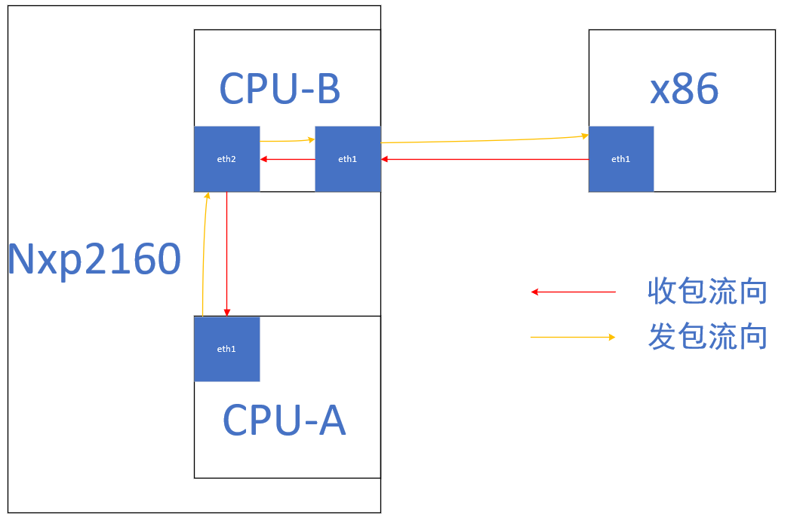
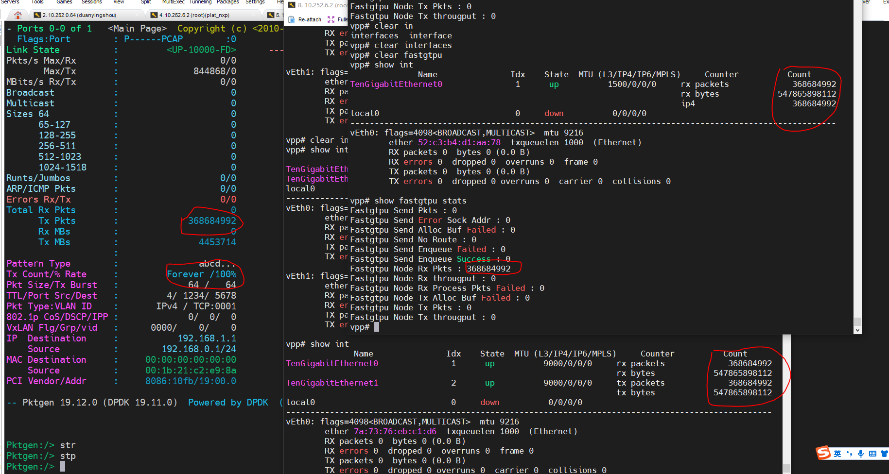
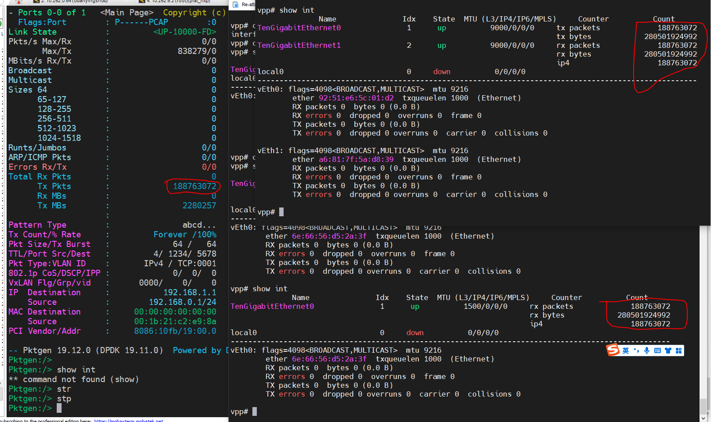
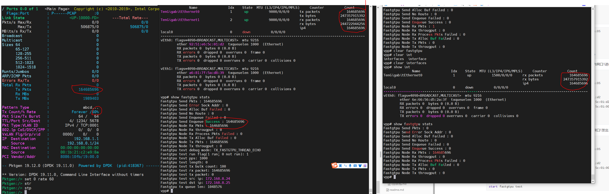
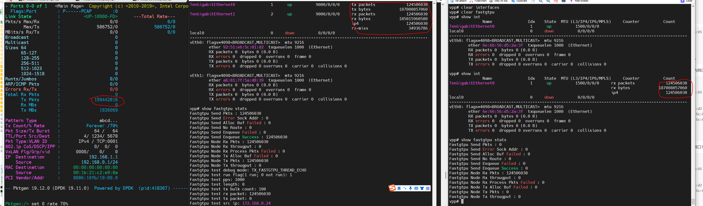

# fatsup cpu间转发测试报告



## 二层转发

cpub对外网口1接入数据包，经mac层转发到cpub对内网口2，经mac层转发到cpua对内网口1进行业务逻辑处理。在cpub上未进行业务处理，在cpub上报文仅到达mac层。

二层转发无需主动发送报文，不需要使用fastup发包测试模式。

二层转发主要是利用vpp l2 bridge功能来实现，通过配置l2 bridge来达到在mac层将网络包转发的目的。

<font color="red">需要特别注意网口1的mac地址需要和pktgen回放报文的目的mac地址相同。</font>

### cpub

cpub需要使用两张网口，一张对外接收x86使用pktgen回放过来的报文，另外一张用于转发报文到cpua。

- 创建网口

```shell
/root/kni/dpaa2/dynamic_dpl.sh dpmac.3 dpmac.4
export DPRC=dprc.2
insmod /root/test/nxp_kni_example/rte_kni.ko carrier=on
```

- 配置fastup

  fastup startup.conf的配置文件不变，但需要更改interface.txt文件内容为如下内容：

```shell
set int state TenGigabitEthernet0 up
set int state TenGigabitEthernet1 up
set interface l2 bridge TenGigabitEthernet1 100
set interface l2 bridge TenGigabitEthernet0 100
set interface mac address TenGigabitEthernet1 42:4b:54:ae:6e:05
set interface mac address TenGigabitEthernet0 92:51:e6:5c:01:d2
l2fib add 92:51:e6:5c:01:d2 100 TenGigabitEthernet1
```

- 运行

```shell
fastup -c /etc/vpp/startup_b2afwd.conf
```

### cpua

cpua只需要使用一张网口，且无需对外发送数据。<font color="red">需要特别注意cpua和cpub之间通过dpmac.3连通。</font>

- 创建网口

  ```shell
  /root/vpp/dpaa2/dynamic_dpl.sh dpmac.3
  export DPRC=dprc.2
  insmod /root/rte_kni.ko carrier=on
  ```

- 配置fastup

  fastup startup.conf的配置文件不变，但需要更改interface.txt文件内容为如下内容：

  ```shell
  set int state TenGigabitEthernet0 up
  set int ip address TenGigabitEthernet0 192.168.8.25/16
  set interface mac address TenGigabitEthernet0 92:51:e6:5c:01:00
  set int mtu 1500 TenGigabitEthernet0
  ```
  
- 运行

  ```shell
  fastup -c /etc/vpp/startup_b2afwd.conf
  ```

### x86回放报文

```shell
./app/x86_64-native-linuxapp-gcc/pktgen -c 0xe0000 --socket-mem 512 -n 2 -- -P -m [18:19].0 -s 0:5gc.pcap -T --crc-strip
```


## 三层转发

cpub对外网口1接入，经ip层转发到cpub对内网口2，经ip层转发到cpua对内网口1进行业务逻辑处理。在cpub上未进行业务处理，在cpub上报文仅到达ip层。

三层转发无需主动发送报文，不需要使用fastup发包测试模式。

三层转发需要先配置ip，再配置ip和mac的对应关系，并配置静态arp。最终的ip转发是通过静态arp转发出去的。

cpub对外网口1的mac地址应设置为pktgen回放报文中的目的mac地址，同时需设置模拟报文的ip地址的arp为cpub对内网口2的mac地址；配置后包会到达对内网口2，还需要在cpub对内网口2上再配置模拟报文的目的ip的mac地址为cpua的对内网口1的mac地址，此时包才能从cpub对内网口2转发到cpua对内网口1。

### cpub

cpub需要使用两张网口，一张对外接收x86使用pktgen回放过来的报文，另外一张用于转发报文到cpua。

- 创建网口

```shell
/root/kni/dpaa2/dynamic_dpl.sh dpmac.3 dpmac.4
export DPRC=dprc.2
insmod /root/test/nxp_kni_example/rte_kni.ko carrier=on
```

- 配置fastup

  fastup startup.conf的配置文件不变，但需要更改interface.txt文件内容为如下内容：

```shell
set int state TenGigabitEthernet0 up
set int state TenGigabitEthernet1 up
set interface mac address TenGigabitEthernet1 42:4b:54:ae:6e:05
set int ip address TenGigabitEthernet0 192.168.8.24/16
set int ip address TenGigabitEthernet1 172.168.1.12/24
set interface mac address TenGigabitEthernet0 92:51:e6:5c:01:d2
set ip arp static TenGigabitEthernet1 192.168.8.24 92:51:e6:5c:01:d2
set ip arp static TenGigabitEthernet0 192.168.8.25 92:51:e6:5c:01:00
```

- 运行

```shell
fastup -c /etc/vpp/startup_b2afwd_withoutapp.conf
```

### cpua

cpua只需要使用一张网口，且无需对外发送数据。需要特别注意cpua和cpub之间通过dpmac.3连通。

- 创建网口

  ```shell
  /root/vpp/dpaa2/dynamic_dpl.sh dpmac.3
  export DPRC=dprc.2
  insmod /root/rte_kni.ko carrier=on
  ```

- 配置fastup

  fastup startup.conf的配置文件不变，但需要更改interface.txt文件内容为如下内容：

  ```shell
  set int state TenGigabitEthernet0 up
  set int ip address TenGigabitEthernet0 192.168.8.25/16
  set interface mac address TenGigabitEthernet0 92:51:e6:5c:01:00
  set int mtu 1500 TenGigabitEthernet0
  set ip arp static TenGigabitEthernet0 192.168.9.243 90:e2:ba:8d:02:f0
  ```

- 运行

  ```shell
  fastup -c /etc/vpp/startup_b2afwd_withoutapp.conf
  ```

### x86回放报文

```shell
./app/x86_64-native-linuxapp-gcc/pktgen -c 0xe0000 --socket-mem 512 -n 2 -- -P -m [18:19].0 -s 0:5gc.pcap -T --crc-strip
```

## 应用层转发

cpub对外网口1接入，网口1先进行业务处理和分流，再将报文由cpub对内网口1发出，cpua对内网口1收包后进行业务处理（fastup收到包后不会进行任何处理，会重新构造一个新的包发出去，即中间的业务逻辑省略了，仅仅是模拟应用层收包发包的过程）。两个cpu都会进行业务处理，在cpub上报文到达应用层后再从应用层发出。

<font color="red">应用层转发需要模拟报文发送，在编译时需要定义FASTGTPU_TX_DEBUG宏。</font>

- cpub对外网口1的mac地址应设置为pktgen回放报文中的目的mac地址，此时报文会由cpub对外网口1将包收到业务层；
- 同时需设置模拟报文的ip地址的arp为cpub对内网口2的mac地址，配置后对外网口1的包会到达对内网口2；
- 还需要在cpub对内网口2上再配置模拟报文的目的ip的mac地址为cpua的对内网口1的mac地址，此时包才能从cpub对内网口2转发到cpua对内网口1。

### cpub

cpub需要使用两张网口，一张对外接收x86使用pktgen回放过来的报文，另外一张用于转发报文到cpua。

- 创建网口

```shell
/root/kni/dpaa2/dynamic_dpl.sh dpmac.3 dpmac.4
export DPRC=dprc.2
insmod /root/test/nxp_kni_example/rte_kni.ko carrier=on
```

- 配置fastup

  fastup startup.conf的配置文件不变，但需要更改interface.txt文件内容为如下内容：

```shell
set int state TenGigabitEthernet0 up
set int state TenGigabitEthernet1 up
set interface mac address TenGigabitEthernet1 42:4b:54:ae:6e:05
set int ip address TenGigabitEthernet0 172.168.8.24/16
set int ip address TenGigabitEthernet1 192.168.8.25/16
set interface mac address TenGigabitEthernet0 92:51:e6:5c:01:d2
set ip arp static TenGigabitEthernet0 172.168.8.25 92:51:e6:5c:01:00
set fastgtpu test ip dst 172.168.8.25
set fastgtpu test ip src 172.168.8.24
set fastgtpu test mode 3
start fastgtpu test
```

- 运行

```shell
fastup -c /etc/vpp/startup_b2afwd_withapp.conf
```

### cpua

cpua只需要使用一张网口，且无需对外发送数据。需要特别注意cpua和cpub之间通过dpmac.3连通。

- 创建网口

  ```shell
  /root/vpp/dpaa2/dynamic_dpl.sh dpmac.3
  export DPRC=dprc.2
  insmod /root/rte_kni.ko carrier=on
  ```

- 配置fastup

  fastup startup.conf的配置文件不变，但需要更改interface.txt文件内容为如下内容：

  ```shell
  set int state TenGigabitEthernet0 up
  set int ip address TenGigabitEthernet0 172.168.8.25/16
  set interface mac address TenGigabitEthernet0 92:51:e6:5c:01:00
  set int mtu 1500 TenGigabitEthernet0
  ```
  
- 运行

  ```shell
  fastup -c /etc/vpp/startup_b2afwd_withapp.conf
  ```

### x86回放报文

```shell
./app/x86_64-native-linuxapp-gcc/pktgen -c 0xe0000 --socket-mem 512 -n 2 -- -P -m [18:19].0 -s 0:5gc.pcap -T --crc-strip
```

## 测试结果

### 二层转发

二层转发能达到cpu线速10Gbps不丢包，其结果如下图所示：



### 三层转发

二层转发能达到cpu线速10Gbps不丢包，其结果如下图所示：



### 应用层转发

### 与fastgtpu同线程

与fastgtpu同线程时最大流量能达到6Gbps（收到一个报文回复一个报文），其结果如下图所示：



超过6Gbps，fastup收包能力不足，会出现大量rx-missing，其结果如下图所示：



### 单独一个线程

