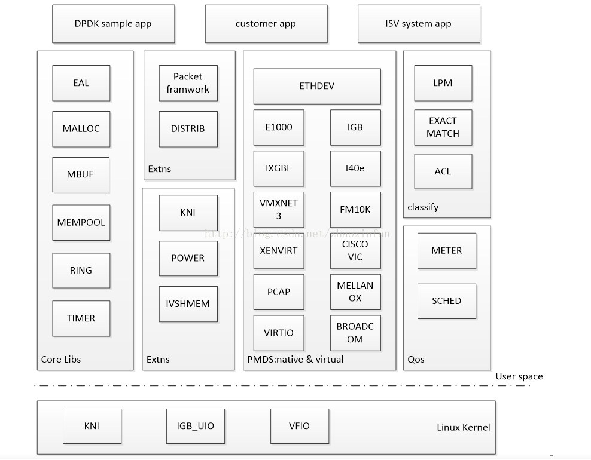

# dpdk相关

## dpdk特点

DPDK全称为Date planedevelopment kit，是一个用来进行包数据处理加速的软件库

-  轮询：在包处理时避免中断上下文切换的开销
- 用户态驱动：规避不必要的内存拷贝和系统调用，便于快速迭代优化
- 亲和性与独占：特定任务可以被指定只在某个核上工作，避免线程在不同核间频繁切换，保证更多的cache命中
- 降低访存开销：利用内存大页HUGEPAGE降低TLB miss，利用内存多通道交错访问提高内存访问有效带宽
- 软件调优：cache行对齐，预取数据，多元数据批量操作

dpdk架构图如下：



- 核心库Core Libs提供系统抽象、大页内存、缓存池、定时器及无锁环等基础组件
- PMD库，提供全用户态驱动，以便通过轮询和线程绑定得到极高网络吞吐，支持各种本地和虚拟网卡
- Classify库，支持精确匹配，最长匹配和通配符匹配，提供常用包处理的查表操作
- Qos库，提供网络服务质量相关组件，限速和调度

### Hugepage配置

DPDK中，如果有多个核可能需要同时访问一个网卡，那DPDK中会为每个核准备一个单独的接收队列/发送队列，这样避免了竞争，也避免了cache一致性问题。

一般的常规页大小为4K字节，使用大页时页大小设置为2M或1G字节。

- 非NUMA系统

```shell
# 预留1024个2M内存页
echo 1024> /sys/kernel/mm/hugepages/hugepages-2048kB/nr_hugepages
```

- NUMA系统

```shell
echo 1024>/sys/devices/system/node/node0/hugepages/hugepages-2048kB/nr_hugepages
echo 1024>/sys/devices/system/node/node1/hugepages/hugepages-2048kB/nr_hugepages
```

## dapp2

### dpdk编译

- 下载源码

  ```shell
  git clone https://source.codeaurora.org/external/qoriq/qoriq-components/dpdk -b github.qoriq-os/integration
  ```

- 编译

  ```shell
  export CROSS=aarch64-linux-gnu-
  make config T=arm64-dpaa2-linuxapp-gcc
  make T=arm64-dpaa-linuxapp-gcc install CONFIG_RTE_KNI_KMOD=n CONFIG_RTE_EAL_IGB_UIO=n -j 8
  ```

### dpdk使用

- 网卡更换dpdk驱动

  ```shell
  cd /mnt/emcc2
  ./dynamic_dpl.sh dpmac.4
  export DPRC=dprc.2
  ```

- 删除dpdk

  ```shell
  ./destroy_dynamic_dpl.sh dprc.2
  ```

## x86

```shell
make config T=x86_64-native-linuxapp-gcc
make T=x86_64-native-linuxapp-gcc install CONFIG_RTE_KNI_KMOD=y CONFIG_RTE_EAL_IGB_UIO=y -j 8
```


## kni

dpdk收到的包需要交给内核协议栈处理。

# reference

1. https://blog.csdn.net/zhaoxinfan/article/details/78408945#t2
2. https://jinshaohui.blog.csdn.net/article/details/101098803