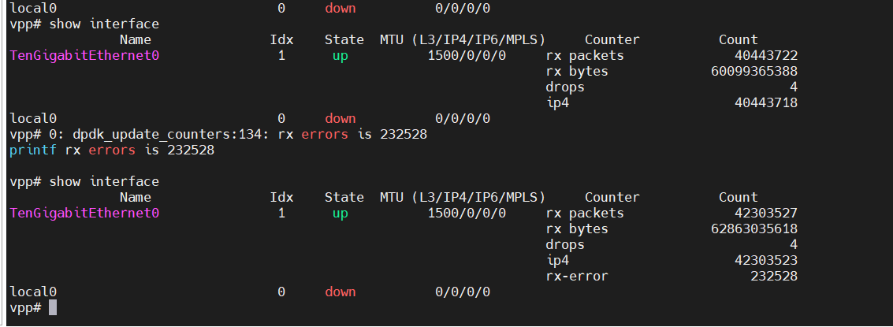
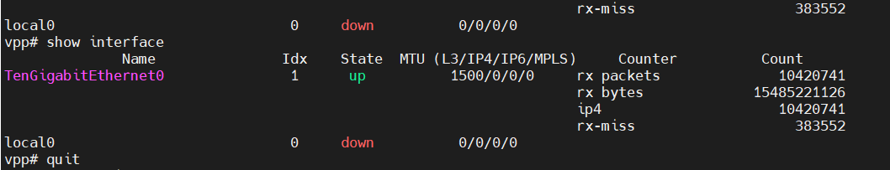

# shofastup测试

## 编译打包

需要使用专门的交叉工具编译，交叉编译工具文件为fsl-qoriq-glibc-x86_64-fsl-toolchain-aarch64-toolchain-2.5.sh，使用如下命令安装：

```shell
fsl-qoriq-glibc-x86_64-fsl-toolchain-aarch64-toolchain-2.5.sh -d /opt/cross
```

若/opt/cross已存在该交叉编译工具无需安装。

注：暂时只能以该交叉工具编译vpp，且openssl、dpdk、vpp都需要以该工具链编译。

交叉编译工具链中包含的openssl库可以用来编译fastup，暂时先不用编译opens数量。

- openssl

```shell
#编译openssl
git checkout OpenSSL_1_1_0g
export CROSS=/opt/cross/sysroots/x86_64-fslsdk-linux/usr/bin/aarch64-fsl-linux/aarch64-fsl-linux-
export CC=aarch64-fsl-linux-gcc
#./Configure linux-aarch64 --prefix=/opt/cross/sysroots/x86_64-fslsdk-linux/usr shared
./Configure linux-aarch64 --prefix=/home/duanyingshou/code/openssl/build_linux_aarch64/ shared
make depend
make CC="/opt/cross/sysroots/x86_64-fslsdk-linux/usr/bin/aarch64-fsl-linux/aarch64-fsl-linux-gcc --sysroot=/opt/cross/sysroots/aarch64-fsl-linux -fPIC" LD="/opt/cross/sysroots/x86_64-fslsdk-linux/usr/bin/aarch64-fsl-linux/aarch64-fsl-linux-ld" AR="/opt/cross/sysroots/x86_64-fslsdk-linux/usr/bin/aarch64-fsl-linux/aarch64-fsl-linux-ar rv " EXTRA_CFLAGS='-g -Ofast -fPIC -ftls-model=local-dynamic' -j 8
make install
```

1. 编译时打包/opt/cross/sysroots/x86_64-fslsdk-linux/usr/bin/aarch64-fsl-linux/aarch64-fsl-linux-ar失败

   解决方法添加rv参数

2. 编译openssl成功，但在编译vpp时openssl报错找不到符号表

   解决方法添加LD="/opt/cross/sysroots/x86_64-fslsdk-linux/usr/bin/aarch64-fsl-linux/aarch64-fsl-linux-ld"

- dpdk

```shell
# 编译dpdk
export CROSS=/opt/cross/sysroots/x86_64-fslsdk-linux/usr/bin/aarch64-fsl-linux/aarch64-fsl-linux-
make config T=arm64-dpaa2-linuxapp-gcc CROSS=aarch64-fsl-linux- CROSS_COMPILE="aarch64-fsl-linux-" CC="/opt/cross/sysroots/x86_64-fslsdk-linux/usr/bin/aarch64-fsl-linux/aarch64-fsl-linux-gcc --sysroot=/opt/cross/sysroots/aarch64-fsl-linux -fPIC -g"  EXTRA_CFLAGS='-g -Ofast -fPIC -ftls-model=local-dynamic'
make T=arm64-dpaa2-linuxapp-gcc -j 4 CC="/opt/cross/sysroots/x86_64-fslsdk-linux/usr/bin/aarch64-fsl-linux/aarch64-fsl-linux-gcc --sysroot=/opt/cross/sysroots/aarch64-fsl-linux -fPIC" EXTRA_CFLAGS='-g -Ofast -fPIC -ftls-model=local-dynamic' CONFIG_RTE_KNI_KMOD=n CONFIG_RTE_EAL_IGB_UIO=n install -j 8
```

- vpp

修改vpp下的toolchain.cmake的20和21行如下：

```shell
set(CMAKE_C_COMPILER ${toolchain}/usr/bin/$ENV{CROSS_PREFIX}/$ENV{CROSS_PREFIX}-gcc)
set(CMAKE_CXX_COMPILER ${toolchain}/usr/bin/$ENV{CROSS_PREFIX}/$ENV{CROSS_PREFIX}-g++)
```

```shell
#编译vpp
export PLATFORM=dpaa
export DPDK_PATH=/home/duanyingshou/code/dpdk/arm64-dpaa2-linuxapp-gcc
#export OPENSSL_PATH=/home/duanyingshou/code/openssl/build_linux_aarch64/
export CROSS_TOOLCHAIN=/opt/cross/sysroots/x86_64-fslsdk-linux
export CROSS_PREFIX=aarch64-fsl-linux
export CROSS_SYSROOT=/opt/cross/sysroots/aarch64-fsl-linux/
export PATH=$CROSS_TOOLCHAIN/bin:$CROSS_TOOLCHAIN/usr/bin/aarch64-fsl-linux:$PATH
cd build-root
make distclean
#TAG可以使用dpaa_debug，编译时不会优化，方便debug，详见 vpp/build-data/platforms/dpaa.mk
make V=0 PLATFORM=dpaa TAG=dpaa 
```

- 打包

```shell
cp ~/code/fastup_nxp/src/fastuplibs/libup/lib/arm64/*  ~/code/fastup_nxp/build-root/install-dpaa-aarch64/vpp/lib
cp ~/code/fastup_nxp/src/fastuplibs/libutils/lib/arm64/* ~/code/fastup_nxp/build-root/install-dpaa-aarch64/vpp/lib
cd ~/code/fastup_nxp/build-root/install-dpaa-aarch64/
tar zcvf ~/package/vpp_arm64.tar.gz vpp
```

## 配置

- dpaa2

```shell
export ROOT_DPRC=dprc.1
export PARENT_DPRC=dprc.2

export DPCON_COUNT=3
export DPBP_COUNT=4
export DPMCP_COUNT=1
export DPSECI_COUNT=8
export DPIO_COUNT=4
export DPCI_COUNT=2
export DPDMAI_COUNT=2

./vpp/dpaa2/dynamic_dpl.sh dpmac.4
export DPRC=dprc.2
```

- hugepage

```shell
echo 6 > /proc/sys/vm/nr_hugepages
echo 0 > /proc/sys/vm/swappiness
```

- vpp

  - startup.conf

    ```shell
    heapsize 256M
    plugin_path /root/vpp/lib/vpp_plugins
    
    unix {
      interactive
      #nodaemon
      gid vpp
      log /tmp/vpp.log
      full-coredump
      cli-listen /run/vpp/cli.sock
     # startup-config /etc/vpp/interface.txt
      startup-config /etc/vpp/interface_gtpu.txt
    }
    
    api-trace {
      on
    }
    
    api-segment {
      gid vpp
    }
    
    session {
      evt_qs_memfd_seg
    }
    
    socksvr {
      socket-name /tmp/vpp-api.sock
    }
    
    cpu {
            main-core 1
            corelist-workers 3
            #workers 2
    }
    
    dpdk {
            ## Change default settings for all intefaces
            huge-dir /mnt/hugepages
            no-pci
            num-mem-channels 1
             dev default {
                    ## Number of receive queues, enables RSS
                    ## Default is 1
                    num-rx-queues 1
                    num-rx-desc 40960
    
                    # rss { ipv4 }
    
                    ## Number of transmit queues, Default is equal
                    ## to number of worker threads or 1 if no workers treads
                    num-tx-queues 1
            }
            proc-type primary
            #log-level  8
    }
    
    plugins {
            ## Adjusting the plugin path depending on where the VPP plugins are
            path /root/vpp/lib/vpp_plugins
            vat-path /root/vpp/lib/vpp_api_test_plugins
    
            plugin default { enable }
            plugin gtpu_plugin.so { disable }
            #plugin fastgtpu_plugin.so { disable }
    
    }
    ```

  - interface.txt

    ```shell
    set int state TenGigabitEthernet0 up
    set int ip address TenGigabitEthernet0 192.168.8.24/24
    set int ip address TenGigabitEthernet0 192.168.9.24/24
    set interface mac address TenGigabitEthernet0 42:4b:54:ae:6e:05
    set int mtu 1500 TenGigabitEthernet0
    set ip arp static TenGigabitEthernet0 192.168.8.25 90:e2:ba:8d:02:f0
    ```

  - interface_gtpu.txt

    ```shell
    set int state TenGigabitEthernet0 up
    set int ip address TenGigabitEthernet0 192.168.8.25/16
    set interface mac address TenGigabitEthernet0 42:4b:54:ae:6e:05
    set int mtu 1500 TenGigabitEthernet0
    ```

  - 环境变量
  
    ```shell
    export PATH=/root/vpp/bin:$PATH
    export LD_LIBRARY_PATH=/root/vpp/lib
    ```
  
## 运行

- pktgen

  ```shell
  # -c cpu core mask
  # -m [18:19].1 18core用来做rx，19core用来作tx，使用dpdk的port1
  # -s 1:5gc.pcap 使用port1来回放5gc.pcap
  ./app/x86_64-native-linuxapp-gcc/pktgen -c 0xe0000 --socket-mem 2048 -n 2 -- -P -m [18:19].0 -s 0:5gc.pcap -T --crc-strip
  ```

- vpp
  
  ```shell
  vpp -c starup.conf
  ```
  
## 结果

- only fastup

  main线程1核、worker线程1核，收发满线速10g，15min无丢包。

  

- fastup with fastgtpu, without callback

  main线程1核、worker线程1核，收包满线速10g，15min无丢包。

  

- fastup with fastgtpu and callback

  - main线程1核、worker线程1核，收包满线速6g，15min无丢包
  
    
  
  - main线程1核、worker线程1核，超过7g出现rx-miss，运用层收包能力不足，且无法通过调整rx ring来增加收发能力

## 问题

### dpdk rx-errors丢包



### dpdk rx-miss丢包



## 解决方式

### rx-errors

<font color="red">rx-errors丢包是因为dpdk rx ring过小，只需要在startup.conf中配置dpdk的rx ring即可。</font>

在startup.conf文件中设置num-rx-desc，默认值为1024，按实际测试情况：

```shell
dev default {
                ## Number of receive queues, enables RSS
                ## Default is 1
                num-rx-queues 1
                # dpdk rx ring size
                num-rx-desc 8912

                # rss { ipv4 }
                ## to number of worker threads or 1 if no workers treads
                num-tx-queues 1
}
```

num-rx-desc大小作用效果如下：

- 无回调

  - 1g线速1024大小不丢包
  - 5g线速4096大小不丢包
  - 10g线速8912大小不丢包

- 有回调

  - 5g线速8192大小不丢包
  - 6g线速8192大小不丢包
  - 7g线速40960会出现rx-miss

### rx-miss

rx-miss表示网卡收到了包，表示rte_rx_queue已经塞满了数据包，所以该包被丢失。此时该包存在于物理网卡的RX FIFO中，但是不会存在于内存中的rte_rx_queue中。

rx-miss由于应用层取包速度慢，无法及时消耗掉rte_rx_queue中的数据包。

## 结论

- vpp空转、vpp加载fastgtpu插件10g线速无丢包，dpdk的rx ring需设置为8192
- fastup回调无业务逻辑，6g线速无丢包，超过6g会出现丢包
