# nxp l3fwd测试

dpdk层三转发。

核心网（x86机器）使用pktgen发包到nxpls2160（arm机器），nxp通过dpdk l3fwd进行转发。

网络拓扑图如下：

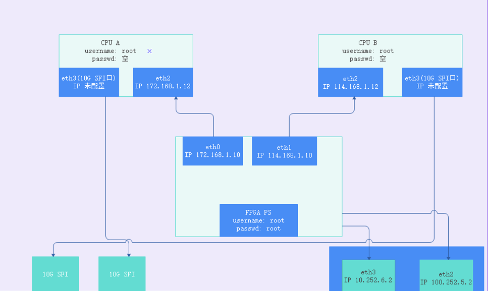

转发使用不同的网口，分为：

- 前传
- 后传

具体步骤分为两步：

- 核心网（x86）跑pktgen
- nxp（arm）跑l3fwd

## 核心网

核心网使用pktgen生成包进行发送。

### pktgen

pktgen是一个位于linux内核层的高性能网络测试工具，主要用来测试网络驱动与网卡设备，支持多线程，能够产生随机mac地址、IP地址、UDP端口号的数据包。

pktgen基于dpdk开发，在进行发包时，需要使用dpdk。

### 执行步骤

1. 准备工具板；

2. 编译dpdk；

3. 编译pktgen；

4. 配置dpdk；

   ```shell
   modprobe uio
   cd dpdk-17.08/x86_64-native-linuxapp-gcc/kmod/
   insmod igb_uio.ko
   #设置大页
   echo 2048 > /sys/devices/system/node/node0/hugepages/hugepages-2048kB/nr_hugepages
   cd usertools
   #绑定前先down掉网卡
   ifconfig eno4 down
   #绑定网卡，可以用下面的b5:00.2 (./dpdk-devbind.py –status
   #可以查到)，也可以用网卡名字eno4
   ./dpdk-devbind.py -b  igb_uio  b5:00.2
   #查看网卡状态
   ./dpdk-devbind.py –status
   #绑定成功会显示b5:00.2被DPDK接管
   #换成普通驱动
   ./dpdk-devbind.py -b i40e 0000:b5:00.2
   ifconfig eno4 121.168.1.13
   ```

   

5. 配置pktgen；

6. 执行pktgen；

   ```shell
   cd /home/liubin/new2/pktgen-dpdk-pktgen-3.4.2
   ./app/x86_64-native-linuxapp-gcc/pktgen -c 0x31 --socket-mem 2048 -n 2 -- -P -m [4:5].0 -s 0:5gc.pcap -T --crc-strip
   
   ./app/x86_64-native-linuxapp-gcc/pktgen -c 0xe0000 --socket-mem 2048 -n 2 -- -P -m [18:19].0 -s 0:5gc.pcap -T --crc-strip
   ./app/x86_64-native-linuxapp-gcc/pktgen -c 0xe0000 --socket-mem 2048 -n 2 -- -P -m [18:19].1 -s 1:5gc.pcap -T --crc-strip
   # -c cpu core mask
   # -m [18:19].1 18core用来做rx，19core用来作tx，使用dpdk的port1
   # -s 1:5gc.pcap 使用port1来回放5gc.pcap
   ```

   ```c
   #启动发包
   >> str
   #停止发包
   >> stp
   #设置端口0按线速的99%发包
   >> set 0 rate 99% 
   ```

7. pktgen参数说明

## nxp

nxp使用l3fwd进行转发，l3fwd是dpdk提供的三层转发example。

### 执行步骤

1. 准备工具板；

   - 管理口

   ```c
   10.252.6.2 root root
   ```

   - cpu1

   ```c
   ssh root@172.168.1.12
   ```

   - cpu2

   ```c
   ssh root@114.168.1.12
   ```

2. 编译dpdk；

   - not support kni

   ```shell
   # 打包代码上传
   scp dpdk-18.11.1-rc2.zip duanyingshou@10.252.0.19:/home/duanyingshou/dpdk/
   # 拷贝arm64-dpaa-linuxapp-gcc到dpdk目录下
   cp /home/xiaotao/dpdk-18.11.1-rc2/arm64-dpaa-linuxapp-gcc ./ -R
   # 解压缩
   unzip dpdk-18.11.1-rc2.zip
   # 交叉编译，使用dpaa2
   export CROSS=aarch64-linux-gnu-
   make config T=arm64-dpaa2-linuxapp-gcc
   make T=arm64-dpaa2-linuxapp-gcc -j 4 CONFIG_RTE_KNI_KMOD=n CONFIG_RTE_EAL_IGB_UIO=n install 
   export RTE_TARGET=arm64-dpaa2-linuxapp-gcc
   export RTE_SDK= <path/to/DPDK/source/code>
   make -C examples/l3fwd
   # 交叉编译，使用dpaa
   export CROSS=aarch64-linux-gnu-
   make config T=arm64-dpaa-linuxapp-gcc
   make T=arm64-dpaa-linuxapp-gcc -j 4 CONFIG_RTE_KNI_KMOD=n CONFIG_RTE_EAL_IGB_UIO=n install 
   ```

   - support kni

   ```shell
   export CROSS=aarch64-linux-gnu-
   make config T=arm64-dpaa2-linuxapp-gcc
   export RTE_KERNELDIR=/home/duanyingshou/linux
   make T=arm64-dpaa2-linuxapp-gcc CONFIG_RTE_KNI_KMOD=y CONFIG_RTE_EAL_IGB_UIO=n install  -j 32
   make examples T=arm64-dpaa2-linuxapp-gcc
   ```

   

3. 编译l3fwd；

   - nxp

   ```shell
   export RTE_TARGET=arm64-dpaa2-linuxapp-gcc
   export RTE_SDK= <path/to/DPDK/source/code>
   make -C examples/l3fwd
   ```

   - x86

   ```shell
   export RTE_TARGET=x86_64-native-linuxapp-gcc
   export RTE_SDK= <path/to/DPDK/source/code>
   make -C examples/l3fwd
   ```

4. 上传程序

   nxp已包含dpdk驱动，因而只需上传如下文件：

   - dpdk应用

     - l3fwd
     - pktgen
     - testpmd
     - ......

   - dpaa2

     - dynamic_dpl.sh
     - destroy_dynamic_dpl.sh

     如上两个文件用来对网卡进行驱动切换，类似于x86下的dpdk-devbind脚本。

5. 配置dpdk；

   - 激活网卡

     默认网卡是down的状态，需要使用ifconfig配置ip激活。

     ```shell
     ifconfig eth3 121.168.1.12
     ifconfig eth4 121.168.1.11
     #网卡up较慢，可以在另一端使用ping快速激活网卡
     ping 121.168.1.12
     ```

     <font color="red">注意：必须先激活网卡，不然后续运行l3fwd时会出现port 0 link down。</font>

   - 切换dpdk驱动

   ```shell
   # 根据实际情况来确定使用哪张网卡
   ./dpaa2/dynamic_dpl.sh dpmac.4
   export DPRC="dprc.2"
   ```

   <font color="red">**注意**：运行前需要导出环境变量 export DPRC="dprc.2"</font>

6. 配置执行l3fwd；

   ```shell
   ./l3fwd -c 0x3 -n 4 -- -P -p 0x3 --config="(0,0,1)"
   ./l3fwd -c 0x3 -n 4 -- -P -p 0x1 --config="(0,0,1)"
   ./l3fwd -c 0x100000 -n 4 -- -P -p 0x1 --config="(0,0,20)"
   # -c cpu coremask，需转换为二进制，每一位代表一个核，bit位为1表示使用该核
   # -n 开启的通道数
   # -P 全部转发
   # -p port mask,可以使用的port，需转换为二进制，每一位代表一个核，bit位为1表示使用该port
   # --config="(0,0,1)"Map queue 0 from port 0 to lcore 1
   ```

7. 统计丢包率；

   ```shell
   # 查看网口收发包情况
   restool dpmac info dpmac.4
   ```

   对比两端rx、tx。

### 结果

- 开始

开始流量情况如下：

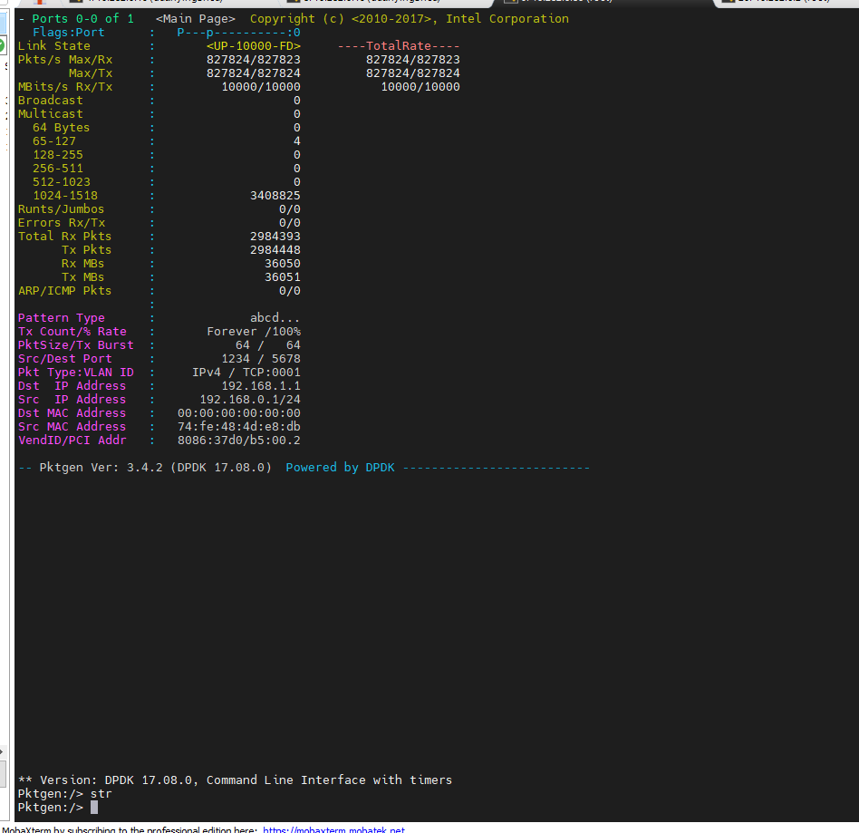

- 2分钟

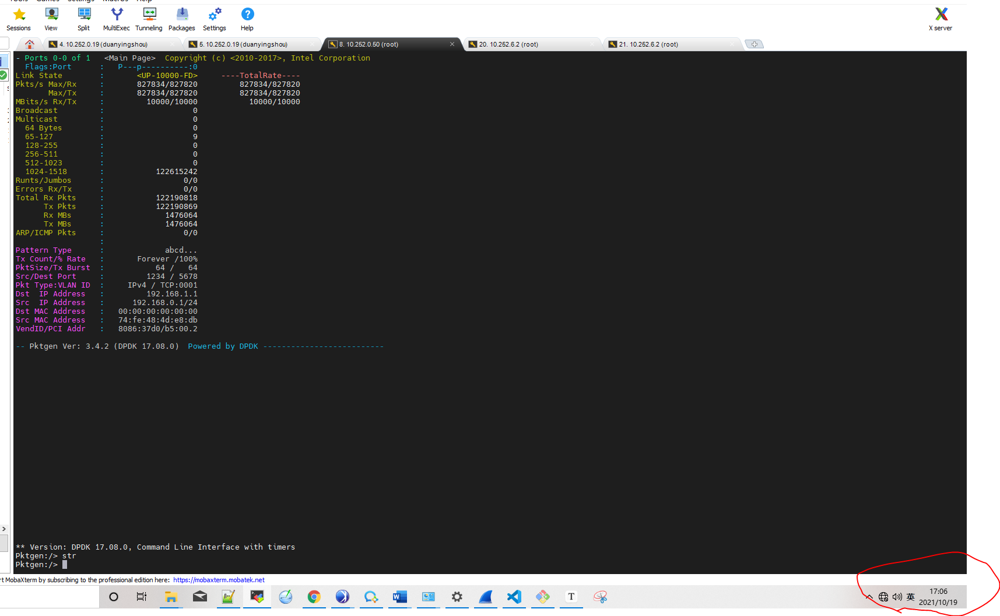

- 10分钟

  10分钟时并未出现转发错误。

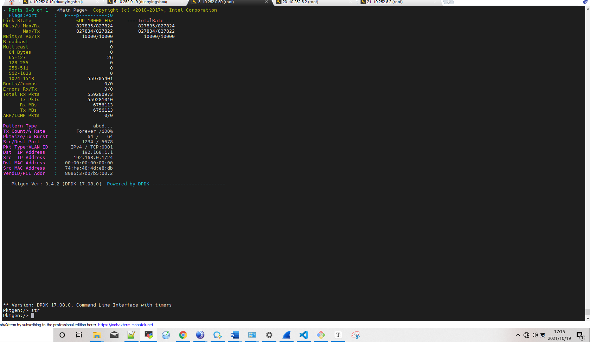

- 20分钟

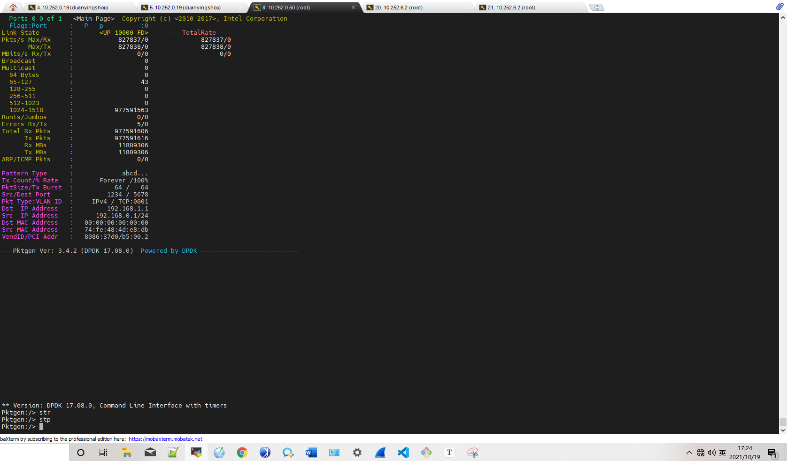

20分钟内总共有5个包转发出错，共丢失53个包。

### 丢包原因分析

我们的实测过程中，pktgen发送的都是大包。

由上面的图分析可知：

1. 网络中存在杂包，即65-127字节的包；
2. pktgen发送和接收包个数不相等，无法确认丢包是在哪个环节，需进行两端对比排查；

经过对比发现，启动pktgen的命令使用的核会被其他程序抢占，导致cpu切换。在执行时，绑定其他程序不使用的核可避免丢包。

使用如下命令执行pktgen时，将使用0核执行pktgen管理程序，4核进行发包，5核进行收包；

```shell
./app/x86_64-native-linuxapp-gcc/pktgen -c 0x31 --socket-mem 2048 -n 2 -- -P -m [4:5].0 -s 0:5gc.pcap -T --crc-strip
```

在实际机器上运行时，pktgen的rx和tx并非独占：

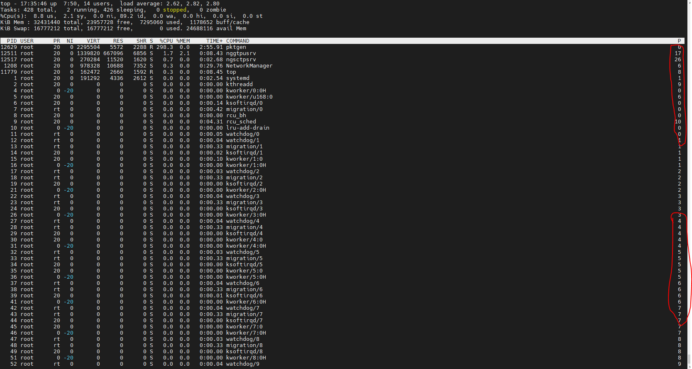

更换成如下命令，pktgen将使用17核执行pktgen管理程序，18核进行发包，19核进行收包；

```shell
./app/x86_64-native-linuxapp-gcc/pktgen -c 0xe0000 --socket-mem 2048 -n 2 -- -P -m [18:19].0 -s 0:5gc.pcap -T --crc-strip
```

<font color="red">在执行程序时，需留意现有cpu核的使用情况，尽量使程序独占核，避免与其他系统上的程序发送调度。</font>

### 无丢包结果

10min时无丢包，情况如下图：

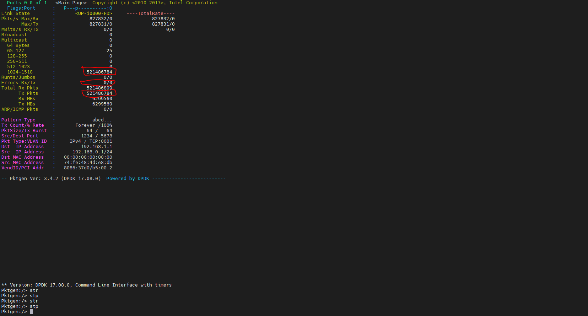

23min时无丢包，情况如下图：

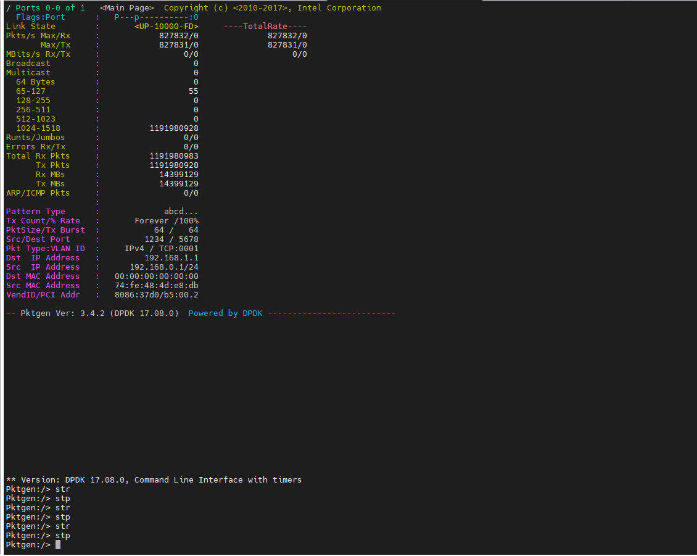

以上为使用cpu-A跑的结果，达到线速，无丢包。

使用cpu-B同样达到线速，无丢包。17分钟结果如下：

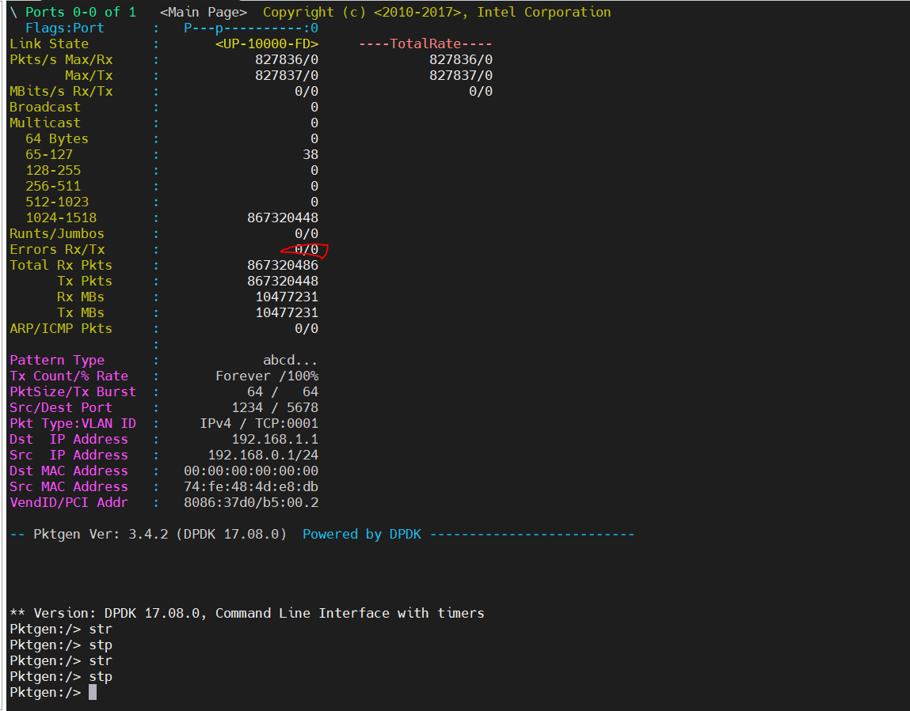

24分钟结果如下：

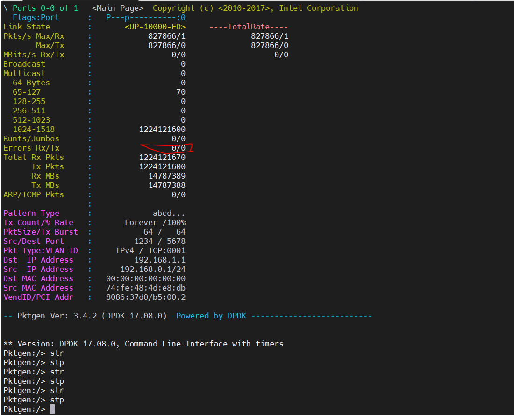

### 杂包定位

<font color="red">nxp端存在杂包，为110字节大小。通过抓包发现，杂包为LLDP报文，每30秒发送一次。</font>在测试时若出现丢包，该类报文对分析杂包会存在较大干扰。

- LLDP

**链路层发现协议**（Link Layer Discovery Protocol，LLDP）是一种[数据链路层](https://baike.baidu.com/item/数据链路层)协议。

网络设备可以通过在本地网络中发送LLDPDU（Link Layer Discovery Protocol Data Unit）来通告其他设备自身的状态。是一种能够使网络中的设备互相发现并通告状态、交互信息的协议。

杂包情况如下：

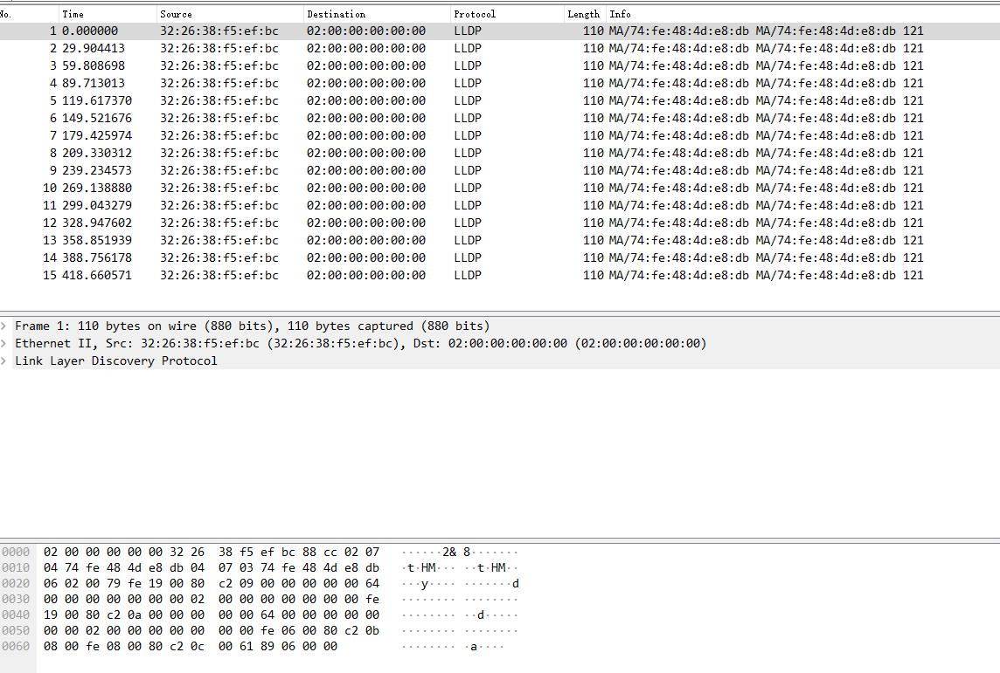

通过对比mac地址可发现确实为nxp端发出的报文，如下图：

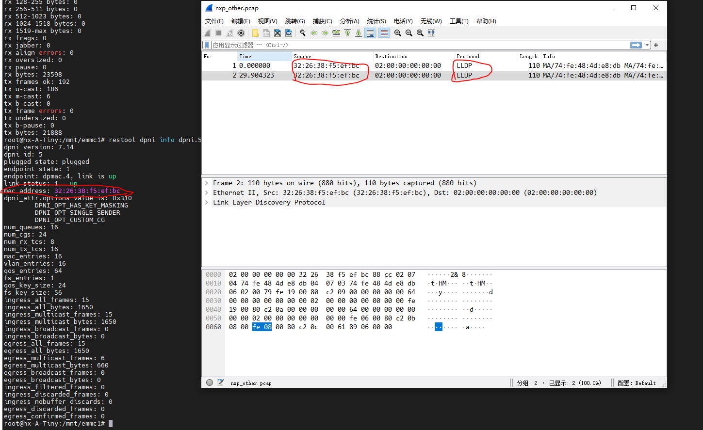

### LLDP报文来源

阅读nxp用户手册发现：

>
>
>The DPAA2 Ethernet driver supports enabling PFC for a subset of the traffic classes. This configuration is done using a higher
>level protocol, LLDP - Link Layer Discovery Protocol.

dpaa2支持LLDP协议。

>
>
>There's a current known limitation for PFC to work only with DPNIs created using the DPL. DPNIs created with restool will not
>behave as expected.

<font color="red">使用DPL方式创建DPNI时默认会启用PFC，即LLDP协议。使用restool创建DPNI不会启用RFC。</font>

## 结论

- 核心网到nxp能达到线速，且零丢包
- nxp端启动l3fwd会每30秒发送LLDP报文，会对测试进行干扰(丢包情况下)

- <font color="red">cpu-A和cpu-B均达到线速，且无丢包</font>

## 思考

- nxp网口从down状态到up状态所需时间较长，后续需留意
- nxp板已包含dpdk驱动，用户态无法看到dpdk相关实现，后续也需留意

