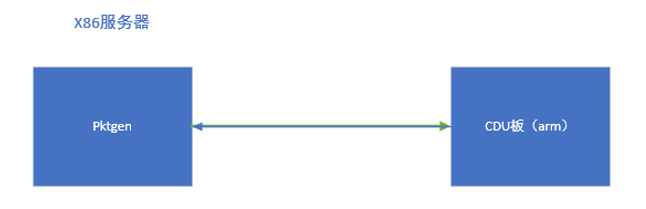
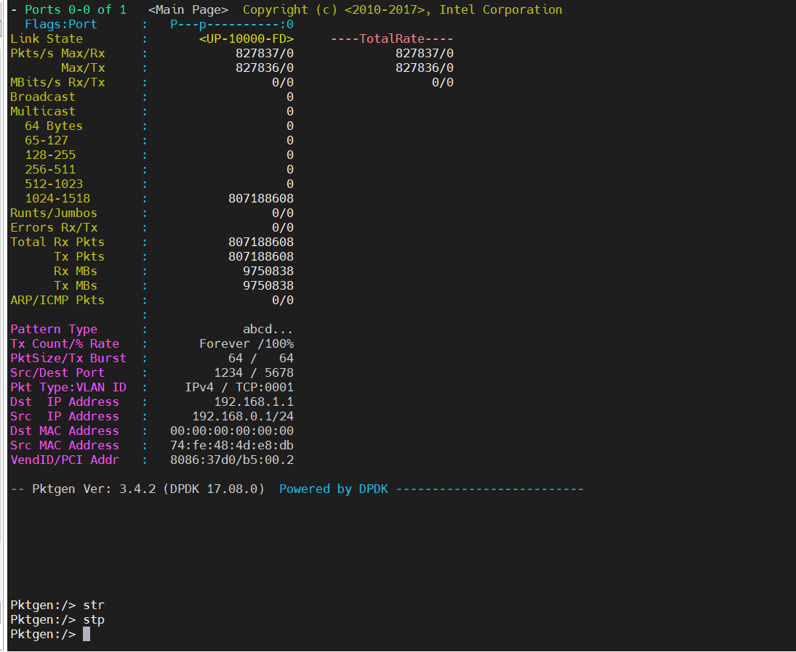
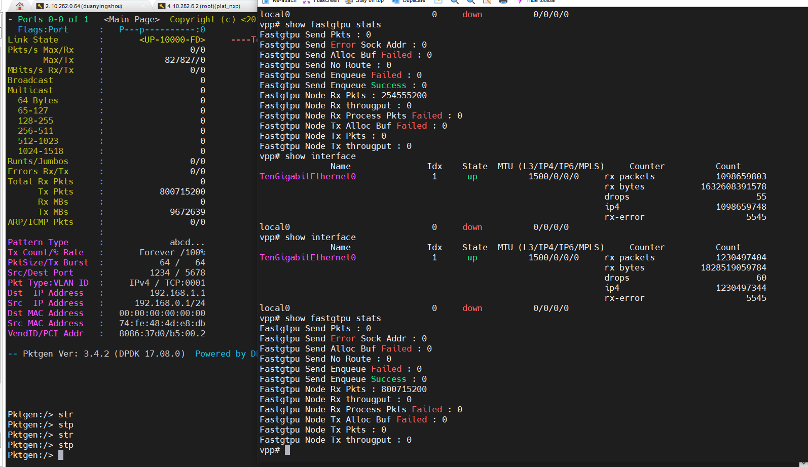
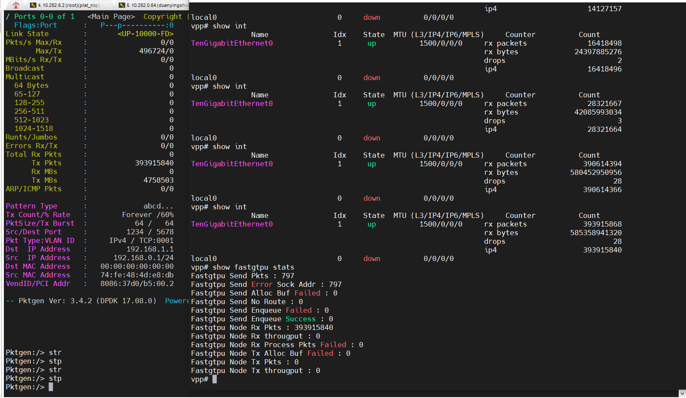
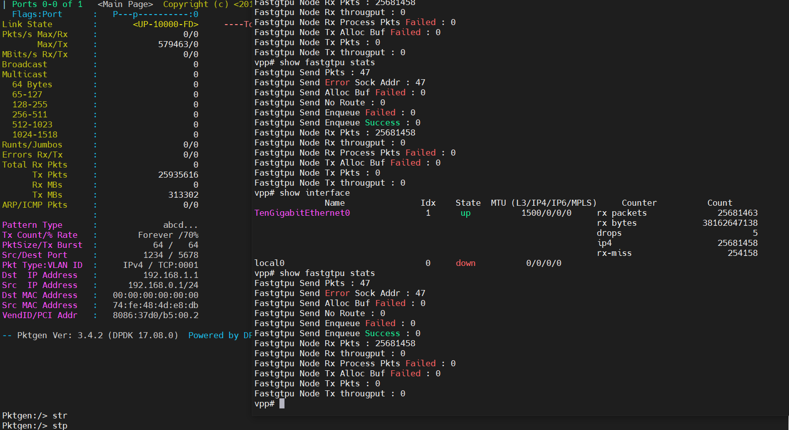

# nxp测试报告

## 1. 测试目标

测试验证fastup在nxp2160 10G网口上的收发包能力。

## 2. 测试环境

nxp测试组网如下：



- 主测端为x86服务器，使用10g网卡打流发包；
- 被测端为nxp2160，使用10g网卡分收发包

## 3. 测试方法

通过pktgen作为流量生成器，以不同速率往nxp2160 10g网卡发包，验证fastup网口收发包能力。

- 主侧端x86服务器，使用pktgen作为流量生成器，设置不同速率打流发包

fastup基于vpp开发，而vpp底层收发包又基于dpdk，因而在验证fastup时需要依次验证：

- dpdk收发包能力
- vpp收发包能力
- fastup收发包能力

因为fastup基于GTPU协议，因而dpdk收发包能力主要测试三层转发能力、vpp主要测试三层转发能力、vpp gtpu插件测试、fastup测试，因而需依次进行如下四种测试：

1. dpdk l3fwd测试，测试dpdk收发包能力
2. vpp三层转发测试，测试vpp收发包能力
3. vpp fastgtpu插件测试，测试vpp fastgtpu收发包能力
4. fastup测试，测试fastup收发包能力

按照自底向上的关系，越往上层的处理逻辑越多，性能越低。因而需优先测试底层性能，再基于底层性能对上层进行测试。

备注：dpdk和vpp使用版本如下：

- dpdk：DPDK 18.11.1-rc2
- vpp： v19.06-LSDK

## 4. 测试过程

### 4.1 dpdk l3fwd测试

- 主测端使用pktgen 满线速10g发包

  ```shell
  # -c cpu core mask
  # -m [18:19].1 18core用来做rx，19core用来作tx，使用dpdk的port1
  # -s 1:5gc.pcap 使用port1来回放5gc.pcap
  ./app/x86_64-native-linuxapp-gcc/pktgen -c 0xe0000 --socket-mem 2048 -n 2 -- -P -m [18:19].0 -s 0:5gc.pcap -T --crc-strip
  ```

  <font color="red">运行时，需注意避免pktgen所绑定的核上有其他程序再跑。</font>

- 被测端使用dpdk l3fwd收发包

  nxp dpdk配置如下：

  ```shell
  export ROOT_DPRC=dprc.1
  export PARENT_DPRC=dprc.2
  
  export DPCON_COUNT=3
  export DPBP_COUNT=4
  export DPMCP_COUNT=1
  export DPSECI_COUNT=8
  export DPIO_COUNT=4
  export DPCI_COUNT=2
  export DPDMAI_COUNT=2
  echo 6 > /proc/sys/vm/nr_hugepages
  echo 0 > /proc/sys/vm/swappiness
  export DPRC=dprc.2
  ```

  运行方式如下：

  ```shell
  # 根据实际情况来确定使用哪张网卡
  ./dpaa2/dynamic_dpl.sh dpmac.4
  export DPRC="dprc.2"
  #dpdk 使用单核单队列
  ./l3fwd -c 0x3 -n 4 -- -P -p 0x3 --config="(0,0,1)"
  # -c cpu coremask，需转换为二进制，每一位代表一个核，bit位为1表示使用该核
  # -n 开启的通道数
  # -P 全部转发
  # -p port mask,可以使用的port，需转换为二进制，每一位代表一个核，bit位为1表示使用该port
  # --config="(0,0,1)"Map queue 0 from port 0 to lcore 1
  ```

在主测端统计收发包个数是否一致。pktgen收发包结果统计如下：

10分钟无丢包，结果如下：


17min无丢包，结果如下：


24分钟无丢包，结果如下：


| rate   | tx        | rx   | duration(min) | drop |
| ------ | --------- | ---- | --------- | --------- |
| 10gbps | 521486784 |  521486784    | 10 | 0 |
| 10gbps | 867320448 | 867320448 | 17 | 0 |
| 10gbps | 1224121670 | 1224121670 | 24 | 0 |

<font color="red">经测试验证，nxp2160 10g网口dpdk跑满10g线速无丢包。</font>

### 4.2 vpp测试

- 主测端使用pktgen 满线速10g发包

- 被测端使用vpp收发包

  dpdk配置与l3fwd一致，配置如下：

  ```shell
  export ROOT_DPRC=dprc.1
  export PARENT_DPRC=dprc.2
  
  export DPCON_COUNT=3
  export DPBP_COUNT=4
  export DPMCP_COUNT=1
  export DPSECI_COUNT=8
  export DPIO_COUNT=4
  export DPCI_COUNT=2
  export DPDMAI_COUNT=2
  echo 6 > /proc/sys/vm/nr_hugepages
  echo 0 > /proc/sys/vm/swappiness
  export DPRC=dprc.2
  ```
  
  vpp使用main线程占1核，worker线程占1核的模式，其startup.conf配置如下：
  
  ```shell
  heapsize 256M
  plugin_path /root/vpp/lib/vpp_plugins
  
  unix {
    interactive
    #nodaemon
    gid vpp
    log /tmp/vpp.log
    full-coredump
    cli-listen /run/vpp/cli.sock
    #startup-config /etc/vpp/interface.txt
  }
  
  api-trace {
    on
  }
  
  api-segment {
    gid vpp
  }
  
  session {
    evt_qs_memfd_seg
  }
  
  socksvr {
    socket-name /tmp/vpp-api.sock
  }
  
  cpu {
  	main-core 1
  	workers 3
  }
  
  dpdk {
          ## Change default settings for all intefaces
          huge-dir /mnt/hugepages
          no-pci
          num-mem-channels 1
           dev default {
                  ## Number of receive queues, enables RSS
                  ## Default is 1
                  num-rx-queues 1
  				num-rx-desc 8912
                  # rss { ipv4 }
  
                  ## Number of transmit queues, Default is equal
                  ## to number of worker threads or 1 if no workers treads
                  num-tx-queues 1
  	}
  	proc-type primary
          #log-level  8
  }
  
  plugins {
          ## Adjusting the plugin path depending on where the VPP plugins are
          path /root/vpp/lib/vpp_plugins
          vat-path /root/vpp/lib/vpp_api_test_plugins
  
          plugin default { enable }
          plugin gtpu_plugin.so { disable }
          #plugin fastgtpu_plugin.so { disable }
  
  }
  ```
  
  实际测试过程中需留意dpdk配置num-rx-desc，该值过小会导致vpp丢包，在测试过程中需设当修改该值。当前测试中，建议该值设为8192。
  
  vpp运行后还需要设置ip、mac等参数，可在命令行配置，也可在interface.txt中添加如下内容：
  
  ```shell
  set int state TenGigabitEthernet0 up
  set int ip address TenGigabitEthernet0 192.168.8.24/24
  set int ip address TenGigabitEthernet0 192.168.9.24/24
  set interface mac address TenGigabitEthernet0 42:4b:54:ae:6e:05
  set int mtu 1500 TenGigabitEthernet0
  set ip arp static TenGigabitEthernet0 192.168.8.25 90:e2:ba:8d:02:f0
  ```
  
  然后使用如下方式启动vpp:
  
  ```shell
  vpp -c /etc/vpp/startup.conf
  ```

在主测端统计收发包个数是否一致。pktgen收发包结果统计如下：

main线程1核、worker线程1核，收发满线速10g，15min无丢包。



| rate   | tx        | rx   | duration  | drop |
| ------ | --------- | ---- | --------- | --------- |
| 10gbps | 807188608 |  807188608  | 15 | 0 |

<font color="red">经测试验证，nxp2160 10g网口vpp空转跑满10g线速无丢包。</font>

### 4.3 vpp fastgtpu测试

- 主测端使用pktgen 满线速10g发包

- 被测端使用vpp收发包

  <font color="red">仅将包收到fastgtpu插件，不往上走到libup逻辑处理，因而需在代码中将libup回调注释掉。</font>将fastgtpu_rx_node.c的72行注释掉，代码片段如下：

  ```c
  // pstFastGtpuMain->pfnUpRcvCb(pcCurData, pstBuf->current_length);
  ```
  
  dpdk和vpp配置不变，需将interface.txt改为如下内容：
  
  ```shell
  set int state TenGigabitEthernet0 up
  set int ip address TenGigabitEthernet0 192.168.8.25/16
  set interface mac address TenGigabitEthernet0 42:4b:54:ae:6e:05
  set int mtu 1500 TenGigabitEthernet0
  ```
  
  <font color="red">使用fastup时（加载fastgtpu插件），需要注意ip应在同一网络中以保证联通。</font>

统计主测端的tx和被测端的rx个数，统计结果如下：：

main线程1核、worker线程1核，收包满线速10g，15min无丢包。



| rate   | pktgen_tx | vpp_rx    | duration | drop |
| ------ | --------- | --------- | -------- | ---- |
| 10gbps | 800715200 | 800715200 | 15       | 0    |

<font color="red">经测试验证，nxp2160 10g网口vpp fastgtpu空转跑满10g线速无丢包。</font>

### 4.4 fastup测试

- 主测端使用pktgen 满线速10g发包

- 被测端使用fasup收发包

  dpdk配置与vpp配置均与vpp fastgtpu一致，均需在libup中将相关业务逻辑注释即可。

统计主测端的tx和被测端的rx个数，统计结果如下：

main线程1核、worker线程1核，收包满线速6g，15min无丢包



main线程1核、worker线程1核，超过7g出现rx-miss，运用层收包能力不足，且无法通过调整rx ring来增加收发能力



| rate  | pktgen_tx | vpp_rx    | duration | drop   |
| ----- | --------- | --------- | -------- | ------ |
| 6gbps | 393915840 | 393915840 | 15       | 0      |
| 7gbps | 25935616  | 25681458  | 1        | 254158 |

## 5. 测试结论

- <font color='red'>dpdk 10g满线速无丢包</font>
- <font color='red'>vpp空转10g满线速无丢包</font>
- <font color='red'>vpp fastgtpu空转10g满线速无丢包</font>
- <font color='red'>fastgtpu无业务6g线速无丢包，超过6g丢包严重，丢包率为9.78e-3</font>
- <font color="red">测试过程中需注意dpdk的rx ring，当流量较大该参数较小时会发送丢包，应适当将其增大（建议8192）</font>


| 测试方式 | 速率 | tx        | rx   | 时间 | 丢包 |
| ------ | --------- | ---- | --------- | --------- | --------- |
| dpdk | 10gbps | 521486784 |  521486784    | 10 | 0 |
| dpdk | 10gbps | 867320448 | 867320448 | 17 | 0 |
| dpdk | 10gbps | 1224121670 | 1224121670 | 24 | 0 |
| vpp | 10gbps | 807188608 |  807188608  | 15 | 0 |
| vpp fastgtpu | 10gbps | 800715200 | 800715200 | 15       | 0    |
| fastup | 6gbps | 393915840 | 393915840 | 15      | 0 |
| fastup | 7gbps | 25935616  | 25681458 | 1        | 254158 |

## 6. 测试结果对比

非自研板测试结果如下：

| 配置\流量\丢包率                  | 2G       | 3.5G     | 5G       | 10G      | 备注                    |
| --------------------------------- | -------- | -------- | -------- | -------- | ----------------------- |
| 没有PHY配置  （dpdk）             | 0        | 0        | 6.572e-7 | 1.024e-4 | 只给VPP配置资源         |
| 注册fastgtpu插件 （vpp fastgtpu） | 1.877e-4 | 2.014e-4 | 2.184e-4 | 2.399e-4 | 插件不做任何动作        |
| 注册GTPU端口  （fastup）          | 1.697e-4 | 2.006-4  | 2.232e-4 | 2.337e-4 | RX Node收到数据即刻释放 |

与自研板nxp对比结果如下：

| 测试方式     | 非自研板最大不丢包速率 | nxp最大不丢包速率 |
| ------------ | ---------------------- | ----------------- |
| dpdk         | 10gbps                 | 10gbps            |
| vpp          | 5gbps                  | 10gbps            |
| vpp fastgtpu | 2gbps                  | 10gbps            |
| fastup       | 2gbps                  | 6gbps             |

按当前测试结果来看:

<font color="red">1. nxp为上层libup留下6gbps余量；</font>

<font color="red">2. nxp板性能比非自研板要高；</font>

