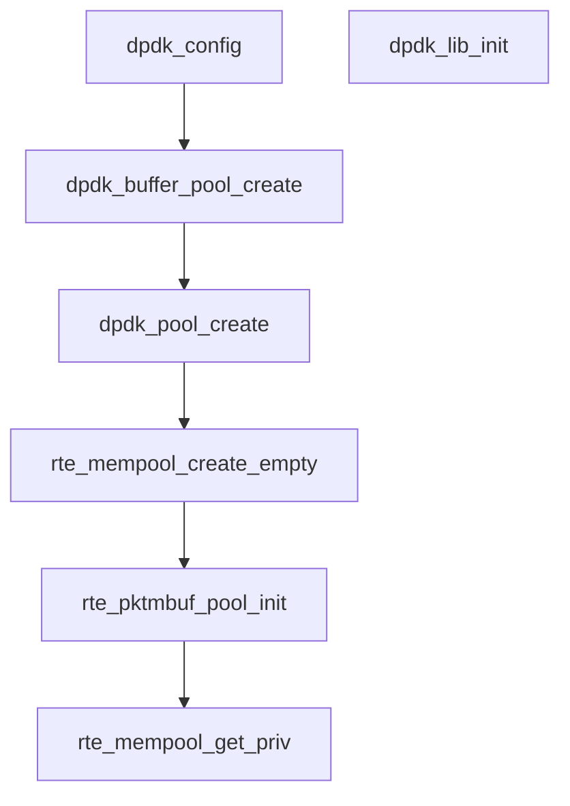

# vpp与dpdk的关系

dpdk作为vpp的一个插件，主要用来从网卡收发包。

vpp使用如下命令参数初始化dpdk eal。

```shell
EAL init args: -c a -n 1 --in-memory --huge-dir /mnt/hugepages --no-pci --proc-type primary --file-prefix vpp --master-lcore 1
```


## dpdk初始化流程

### 读取配置

```c
dpdk_config
```

### 初始化库

```c
dpdk_lib_init
```

### 注册节点

- 输入节点

```c
dpdk_device_inpu
```

- 输出节点

  - 接口tx function的赋值

    ```c
    VNET_DEVICE_CLASS_TX_FN (dpdk_device_class)
    ```

    

  - 接口output node和tx node的初始化

    ```c
    ```

### 网口操作

```c
/* A class of hardware interface devices. */
/* 一类硬件接口的操作函数集合，这些函数是在硬件设备的驱动上封装的一层 */
typedef struct _vnet_device_class
{
    /* Index into main vector.类索引 */
    u32 index;

    /* Device name (e.g. "FOOBAR 1234a").设备类名字 */
    char *name;

    /* Function to call when hardware interface is added/deleted. */
    /* 添加/删除一个该类设备的实例函数 */
    vnet_interface_function_t *interface_add_del_function;

    /* Function to bring device administratively up/down. */
    /* 设备UP/DOWN操作函数 */
    vnet_interface_function_t *admin_up_down_function;

    /* Function to call when sub-interface is added/deleted */
    /* 以该类型设备为主设备，添加/删除一个子接口的函数 */
    vnet_subif_add_del_function_t *subif_add_del_function;

    /* Function to call interface rx mode is changed */
    /* 接收模式变化函数 */
    vnet_interface_set_rx_mode_function_t *rx_mode_change_function;

    /* Function to call interface l2 mode is changed */
    /* 接口的二层模式变化操作函数 */
    vnet_interface_set_l2_mode_function_t *set_l2_mode_function;

    /* Redistribute flag changes/existence of this interface class. */
    u32 redistribute;

    /* Transmit function. */
    /* 发送函数 */
    vlib_node_function_t *tx_function;

    /* Transmit function candidate registration with priority */
    /* 注册的多个候选的发送函数，最终根据优先级选择一个最高的赋值给tx_function */
    vlib_node_fn_registration_t *tx_fn_registrations;

    /* Error strings indexed by error code for this node. */
    /* 发送函数错误原因字符数组 */
    char **tx_function_error_strings;

    /* Number of error codes used by this node. */
    /* tx_function_error_strings数组大小 */
    u32 tx_function_n_errors;

    /* Renumber device name [only!] support, a control-plane kludge */
    int (*name_renumber) (struct vnet_hw_interface_t * hi,
                          u32 new_dev_instance);

    /* Interface flow offload operations */
    /* 流量卸载功能操作函数集合 */                      
    vnet_flow_dev_ops_function_t *flow_ops_function;

    /* Format device instance as name. */
    format_function_t *format_device_name;

    /* Parse function for device name. */
    unformat_function_t *unformat_device_name;

    /* Format device verbosely for this class. */
    format_function_t *format_device;

    /* Trace buffer format for TX function. */
    format_function_t *format_tx_trace;

    /* Format flow offload entry */
    format_function_t *format_flow;

    /* Function to clear hardware counters for device. */
    /* 清除统计函数 */
    void (*clear_counters) (u32 dev_class_instance);

    uword (*is_valid_class_for_interface) (struct vnet_main_t * vnm,
                                           u32 hw_if_index,
                                           u32 hw_class_index);

    /* Called when hardware class of an interface changes. */
    void (*hw_class_change) (struct vnet_main_t * vnm,
                             u32 hw_if_index, u32 new_hw_class_index);

    /* Called to redirect traffic from a specific interface instance */
    /* 强制重定向一个接口的流量到指定的node */                         
    void (*rx_redirect_to_node) (struct vnet_main_t * vnm,
                                 u32 hw_if_index, u32 node_index);

    /* Link-list of all device classes set up by constructors created below */
    /* 形成链表 */
    struct _vnet_device_class *next_class_registration;

    /* Function to set mac address. */
    /* 链路层地址变化函数 */
    vnet_interface_set_mac_address_function_t *mac_addr_change_function;
} vnet_device_class_t;
```

## vpp中dpdk内存管理



dpdk_pool_create与rte_pktmbuf_pool_create的区别：

### dpdk mempool

- mempool基础

>Mempool是固定大小的对象分配器。 在DPDK中，它由名称唯一标识，并且使用mempool操作来存储空闲对象。Mempool的组织是通过三个部分实现的：
>
>- mempool对象节点：mempool的对象挂接在 static struct rte_tailq_elem rte_mempool_tailq 全局队列中，可以通过名字进行唯一标识符；此队列只是mempool的一个对象指示结构，并不是实际的内存区；
>- mempool实际内存区： struct rte_memzone 是实际分配的连续内存空间，存储所创建的mempool对象；
>- ring无锁队列：作为一个无锁环形队列 struct rte_ring ，存储着mempool对象的指针，提供了方便存取使用mempool的空间的办法。
>
>
>
>mempool的对象通过与ring无锁队列建立关联方便存取；同时，为了减少多核访问造成的冲突，引入了local_cache对象缓冲区。该local_cache非硬件上的cache，而是为了减少多核访问ring造成的临界区访问，coreX app会优先访问该local_cache上的对象。入队的时候优先入local_cache中，出队的时候优先从local_cache中出队。

- mempool创建使用

>
>
>先注意一下 rte_mempool_create 的参数中的两个 mp_init  和 obj_init ，前者负责初始化mempool中配置的私有参数，如在数据包中加入的我们自己的私有结构；后者负责初始化每个mempool对象。我们然后按照mempool的3个关键部分展开说明。
>
>- mempool头结构的创建
>
>   mempool头结构包含3个部分： struct rte_mempool ， struct rte_mempool_cache 和mempool private。创建是在 rte_mempool_create_empty() 中完成的，先进行了对齐的检查,然后从mempool队列中取出头节点，我们创建的mempool结构填充好，就挂接在这个节点上。接下来做一些检查工作和创建flag的设置.rte_mempool_calc_obj_size() 计算了每个obj的大小，这个obj又是由三个部分组成的，header_size、elt_size、trailer_size，即头，数据区，尾。在没有开启RTE_LIBRTE_MEMPOOL_DEBUG调试时，没有尾部分；头部分的结构为： struct rte_mempool_objhdr ，通过这个头部，mempool中的obj都是链接到队列中的，所以，提供了遍历obj的方式（尽管很少这么用）。函数返回最后计算对齐后的obj的大小，为后面分配空间提供依据。
>
>- mempool实际空间的创建
>
>  这部分的创建是在函数 rte_mempool_populate_default(struct rte_mempool *mp) 中完成的。
>
>  首先计算为这些元素需要分配多大的空间， rte_mempool_ops_calc_mem_size（） 
>
>  接着 rte_memzone_reserve_aligned（） 分配空间。把元素添加到mempool,实际上就是把申请的空间分给每个元素。
>
>- ring的创建
>
>转自[DPDK-----内存管理之mempool](https://www.cnblogs.com/rex-2018-cloud/p/10039065.html)


# reference

1. https://blog.csdn.net/the_dog_tail_grass/article/details/113603311
2. https://blog.csdn.net/u010827484/article/details/103377792
3. https://segmentfault.com/a/1190000019400426
3. https://www.cnblogs.com/rex-2018-cloud/p/10039065.html

