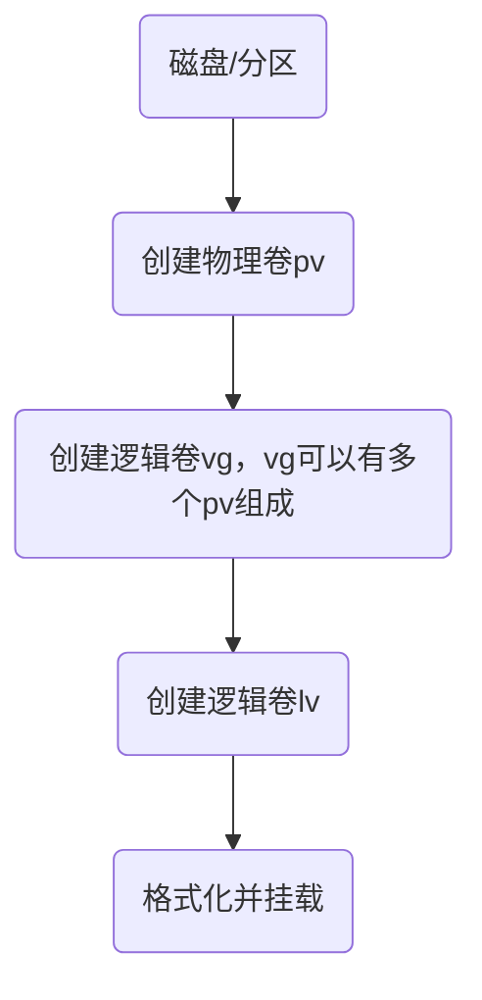

# lvm详解


## lvm是什么

LVM（Logical Volume Manager）逻辑卷管理，是在硬盘分区和文件系统之间添加的一个逻辑层，为文件系统屏蔽下层硬盘分区布局，并提供一个抽象的盘卷，在盘卷上建立文件系统。它提供了一种灵活的方式来管理和操作磁盘空间，使管理员能够动态地创建、调整大小、合并和移动逻辑卷，而无需中断系统。

LVM的主要目标是将物理存储设备（如硬盘、SSD等）抽象为逻辑卷（Logical Volume），屏蔽了物理磁盘和分区的细节，使用户和系统能够以逻辑上的方式管理存储空间。当我们对底层的物理硬盘进行操作时，不再是针对分区进行操作，而是通过逻辑卷对底层硬盘进行管理操作。

lvm其实跟ext4这样的文件系统类似，抽象成一个个分区后，将这些分区挂载到某个目录下，就可以像操作目录一样操作磁盘了。

lvm与ext4这样的文件系统最大的区别是，ext4针对是某个磁盘的一部分的抽象，而lvm则是针对一个或多个磁盘的一部分或者整体的抽象，lvm能够将多个磁盘抽象成同一个逻辑卷。

### 关键术语

- 物理存储介质（The physical media）：其实就是硬盘或者ssd，LVM存储介质，可以是硬盘分区、整个硬盘、raid阵列或SAN硬盘。设备必须初始化为LVM物理卷，才能与LVM结合使用。
- 物理卷PV（physical volume）：物理卷就是LVM的基本存储逻辑块，但和基本的物理存储介质比较却包含与LVM相关的管理参数，创建物理卷可以用硬盘分区，也可以用硬盘本身。
- 卷组VG（Volume Group）：LVM卷组类似于非LVM系统中的物理硬盘，一个卷组VG由一个或多个物理卷PV组成。可以在卷组VG上建立逻辑卷LV。
- 逻辑卷LV（logical volume）：类似于非LVM系统中的硬盘分区，逻辑卷LV建立在卷组VG之上。在逻辑卷LV之上建立文件系统。

### lvm的搭建流程



## lvm有什么用

1. 卷组VG可以使多个硬盘空间看起来像是一个大硬盘。

2. 逻辑卷LV可以创建跨多个硬盘空间的分区。

3. 在使用逻辑卷LV时，可以在空间不足时动态调整大小，不需要考虑逻辑卷LV在硬盘上的位置，不用担心没有可用的连续的空间。

4. 可以在线对卷组VG、逻辑卷LV进行创建、删除、调整大小等操作。但LVM上的文件系统也需要重新调整大小。

5. LVM允许创建快照，用来保存文件系统的备份。


## 如何使用lvm

1. 使用lsblk查看磁盘分区，确定要使用的磁盘或者分区，可以是没有创建过分区的物理磁盘，也可以已经创建出来的分区；

2. 选择磁盘或者分区利用pvcreate创建物理卷PV,创建完成后可以使用pvs查看pv

```shell
pvcreate /dev/sda
pvs
```
创建完成后，使用lsblk -f查看文件系统类型时已经变更为了LVM2_member.

```shell
(base) ➜  ~ lsblk -f
NAME            FSTYPE      LABEL UUID                                   MOUNTPOINT
sda                                                                      
└─sda1          LVM2_member       6xxxxxxxxxxxxxxxx
```

可以使用pvdisplay查看pv的详细情况。

```shell
pvdisplay /dev/sda1
```

3. 创建vg

使用vgcreate创建vg，命令如下：

```shell
# 这里的vg_data就是vg的名称
vgcreate vg_data /dev/sda1
```
创建完成后使用如下命令查看vg的详细情况：

```shell
vgs
vgdisplay vg_data
```
4. 创建逻辑卷lv

```shell
lvcreate -n lvname -L lvsize(M，G) vgname
```

```shell
lvcreate -n lv_data -L 64M vg_data
```
5. 格式化分区，并将其挂载

```shell
mkfs.ext4 /dev/vg/lv_data
mkdir /data
mount /dev/vg/lv_data /data
```
6. lv扩容

lvm最重要的功能就是动态调整分区大小，如果之前创建的vg还有剩余的空间，则可以直接在原有lv的基础上扩容，使用如下命令扩展：

```shell
lvextend -L +100M /dev/vg/lv_data
resize2fs /dev/vg/lv_data
```
如果vg里的所有空间都已经分配完了，则需要先扩展vg，再扩展lv。

缩容则采用如下命令：

```shell
lvreduce -L 100M  /dev/vg/lv_data
resize2fs /dev/vg/lv_data
```

7. 扩展vg

扩展vg一般是增加了一块磁盘，这个时候就可以把这块磁盘扩展到vg里，比如sdb。

```shell
pvcreate /dev/sdb
vgextend vg_data /dev/sdb
```


## 关于lvm的一些疑问

### lvm创建的文件是如何分配到具体的物理磁盘上的

lvm创建的文件分配到磁盘上有多个策略，具体如下：

1. 线性分配（linear）

这是默认的分配策略，无需特别设置，数据按顺序依次放到各个物理磁盘上，一个物理磁盘放满后才会放在另外一个物理磁盘。

2. 条带分配（striped）

需要在使用lvcreate时用-i指定条带数，存储文件时会将数据均匀地存储在各个磁盘上。比如有两个物理磁盘，创建lv时使用如下命令：

```shell
lvcreate -n lv_data -L 64M vg_data -i 2
```

3. 镜像分配(mirrored)

每一份数据都会有多个镜像副本存储，提高数据容错性。需要在使用lvcreate时用-m指定镜像数。

```
lvcreate -n lv_data -L 64M vg_data -m 2
```

4. 条带镜像分配

这个是条带分配和镜像分配的结合，需要使用lvcreate时用-m指定镜像数，用-i指定条带数

```shell
lvcreate -n lv_data -L 64M vg_data -i 2 -m 2
```

若要查看lvm当前的磁盘分配策略，可以使用如下命令查看：

```shell
lvdisplay type
```
比如下面的就是linear

```shell
 --- Segments ---
  Logical extents 0 to 12800:
    Type                linear
    Physical volume     /dev/nvme0n1p3
    Physical extents    475271 to 488071
   
  Logical extents 12801 to 537087:
    Type                linear
    Physical volume     /dev/sda1
    Physical extents    0 to 524286
```

- 线性方式（linear）：以一块盘为基础进行读写。当数据写入到一个物理卷（盘）时，写满后才会开始写入下一个物理卷。这种方式的性能较低，因为它无法充分利用多个盘的并行读写能力。

- 条带方式（striped）：以多块盘并行读写数据。数据被分成大小相等的条带，然后同时写入到多个物理卷中的相应条带位置。这样可以充分利用多个盘的并行读写能力，从而提高读写性能。

<font color="red">一般来说，随机读写比较多的场景下，条带方式通常比线性方式具有更高的性能。顺序读写且文件较大的场景下，线性方式通常比条带方式具有更高的性能。 </font>

### 是否可以将lvm的磁盘空间回收，创建新的lvm

如果lvm创建时使用的是整块磁盘，那无法将未使用的空间回收回来重新重建vg，进而创建lv。
因而在创建pv时尽量先创建分区，不要一开始就使用整个磁盘，后面再按需进行添加和扩展。

### 当使用条带方式（striped）存储策略时，若某个物理盘损坏是否会影响数据可读性

<font color="red">当使用 Striped（条带化）方式在多个物理磁盘上分配数据时，如果其中一块物理磁盘发生故障，将会影响全量数据的可用性和完整性。</font> 这是因为条带化将数据分割成多个块，并将这些块分散存储在各个物理磁盘上。如果某个物理磁盘发生故障，相应的数据块将无法访问。这可能导致条带化卷中所有的数据块都变得不完整，从而影响到全量数据的可用性。具体影响程度将取决于使用的条带大小、故障磁盘的位置以及卷的冗余配置。

要减少物理磁盘损坏对全局数据的影响，可采取如下措施：

- 冗余备份
- 定期备份