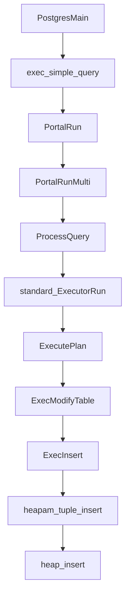

# insert data

```mermaid
graph TB
PostgresMain-->exec_simple_query-->PortalRun-->PortalRunMulti-->ProcessQuery-->
    	standard_ExecutorRun-->ExecutePlan-->ExecModifyTable-->ExecInsert-->
    	heapam_tuple_insert-->heap_insert
```

