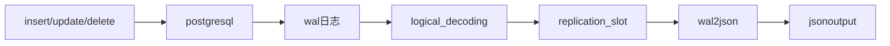

# pg_replication

## 基本概念

- 逻辑复制

  逻辑复制是将数据重新执行一次insert、update或delete。逻辑复制则允许在数据层面复制，并在安全性上提供更细粒度的控制。

- 流复制（物理复制）

  实现方式是将wal日志中记录的内容按照确切的块地址逐字节的拷贝到备库，因此主备之间数据分布是一致的，这意味着在主备机器上，同一条记录的ctid是相同的。

- 逻辑解码

  逻辑解码是提取数据库表的所有永久修改到一个连贯的、容易理解的格式 （不需要详细的数据库内部状态知识就可以解读）的过程。

- 复制槽

  在逻辑复制的概念中，一个槽代表一连串的修改，这些修改可以以它们在原始服务器上制作的顺序在客户端上重放。

- 输出插件

  输出插件将数据从预写式日志的内部表示转换到复制槽想要的消费者的格式。

- 导出快照

  当用流复制接口创建了一个新的复制槽时，pg会导出一个快照， 该快照将准确的显示数据库的状态，之后所有的修改都将包含在修改流中。这可以用来创建一个新的复制品， 可以通过使用[`SET TRANSACTION SNAPSHOT`](http://www.postgres.cn/docs/9.4/sql-set-transaction.html) 读取槽创建瞬间数据库的状态。这个事务稍后可以用来转储在那个时间点的数据库状态， 之后可以使用槽的内容更新该数据库而不丢失任何修改。

## 逻辑复制

### 逻辑解码

逻辑解码基本原理是从 WAL日志解码，跟踪所有 DML (INSERT, UPDATE, DELETE)更改。之后转换成各种可用的格式，比如 Json。

其流程大致如下：



对于逻辑解码插件，主要有以下几类。按照格式来分主要有

- JSON format plugins
- Protobuf Format Plugins
- Avro Format Plugins
- SQL Format Plugins
- Miscellaneous Plugins

### 参数配置

逻辑解码参数配置如下：

```shell
wal_level=logical
max_replication_slots=10
max_wal_sender=10
```

- 将`wal_level`设置为logical允许WAL记录逻辑解码所需的信息。
- `max_replication_slots`指定了发送端可以支持的最大复制槽数量，默认为10个
- `max_wal_sender`指定发送方用于流复制的并发连接的最大数量，默认值也是10

### pg_recvlogica

pg_recvlogical是 PostgreSQL自带的工具，它管理插槽并使用插槽中的流数据。

必须至少要指定下列选项之一来选择一个动作：

- `--create-slot`

  为`--dbname`指定的数据库用`--slot` 指定的名称创建一个新的逻辑复制槽，使用 `--plugin`指定的输出插件。

- `--drop-slot`

  删除名称由`--slot`指定的复制槽，然后退出。

- `--start`

  从`--slot`指定的逻辑复制槽开始进行流式传送更改，一直继续 到被一个信号终止。如果服务器端关机或者断开连接导致更改流结束，会进入一个 循环一直重试，通过指定`--no-loop`可以防止这种情况下进入 循环重试。流格式由槽创建时指定的输出插件决定。连接必须是连接到用于创建该槽的同一个数据库上。

`--create-slot`和`--start`可以被一起指定。 `--drop-slot`不能和另一个动作组合在一起。

## 物理流复制

物理流复制内容主要引用自[博客](http://mysql.taobao.org/monthly/2018/01/03/)。

物理流复制是一种数据库主备同步技术，该特性同步的数据是数据库中物理页面变化数据（WAL），该模式备库的底层数据页面状态和主库完全相同，这样的实现方案让数据库主备以及同步状态都非常稳定。

### 流复制中的角色

-  主库 backend 进程

  它负责执行用户的 SQL，在修改数据前会先记录 WAL（Write-Ahead Logging）日志。这些日志中事物提交日志（CommitTransaction）由 backend 进程负责写到磁盘。

- 主库 WALsender 进程

  负责把 WAL 日志发送给备库的 WALreceiver 进程。

-  备库 WALreceiver 进程

  负责接收 WALsender 发送的 WAL 日志，并持久化到存储。

- 备库 startup 进程

  负责恢复 WALsender 写到磁盘上的 WAL 日志，把数据 apply 到数据页面上。

### 异步流复制

默认状态下的流复制是以异步方式工作的，也就是说主库写本地数据和 WAL 日志，WALsender 异步的把数据发送给备库，备库收到数据后再异步的做数据恢复。

异步模式可以做到较好的性能，它的劣势是：极端情况下，主库如果当机，被库被激活成主库，部分 WAL 没有发送到备库，可能造成数据丢失。

### 同步流复制

相对于异步模式，PostgreSQL 还支持同步模式的流复制。同模模式可以细分为三级

- REMOTE_WRITE 

  保证该事务的所有数据被备库收到（备库收到数据并调用 write 写磁盘，但并未持久化到磁盘）

-  REMOTE_FLUSH 

  保证该事务的所有数据在备库持久化到磁盘（调用 flush，但只读查询看不到）

- REMOTE_APPLY 

  保证该事务的所有数据在备库被恢复到数据页面（恢复进程读取并解析 WAL，再 APPLY 到数据页面，在备库上执行的只读查询能看到数据的变化）

#### 源码解析

>简单的说 PostgreSQL ACID 是基于 MVCC 和 WAL 技术。数据的修改过程可以简单描述为:
>
>- 首先 backend 开启是一个事务,获得一个事务号 XID;
>- 在这个事务中对数据的任意修改，都被 XID 标记。
>- 其他 backend 在扫描数据时，会看到被这个 XID 修改过的数据，根据当前的隔离级别，选择对这些数据是否可见（默认的读已提交隔离级别看不到这些数据）。
>- 只有当此 XID 最后被标记成 commit （写 WAL commit log 和写 clog）后，其他的 backend 才能看到这个 XID 修改的数据。
>
>实现流复制的同步模式，关键点在每个事务提交或回滚时，保证它产生的所有数据变化日志，即 WAL 都“同步”到备库。最后一条 WAL commit log 尤为关键。

>  1. [主库 backend 进程]调用 RecordTransactionCommit 中写 WAL commit log，获得这条日志在在 WAL 中的位置 XLogRecPtr
>  2. [主库 backend 进程]完成写 WAL 后，进入 SyncRepWaitForLSN 等待 WAL 日志“同步”到备库。具体做法是:在共享内存中创建一个等待队列 SHMQueue 记录 XLogRecPtr，并调动 WaitLatch，让出 CPU 等待被唤醒。
>  3. [主库 WALsender 进程]相应所有备库的 WALreceiver 拉取 WAL 的请求。把 WAL 发送给所有备库。
>  4. [备库 WALreceiver 进程]写 WAL 的偏移（LogstreamResult.Write）和持久化 WAL 偏移（LogstreamResult.Flush）记录下来。
>  5. [备库 startup 进程]不断的恢复数据，把当前恢复到的 WAL 位点放在共享内存 xlogctl->lastReplayedEndRecPtr 中。
>  6. [备库 WALreceiver 进程]不断通过 r 报文和主库 WALsender 进程同步的状态，即 XLOG_WRITE_LSN XLOG_REMOTE_LSN XLOG_APPLY_LSN（XLogWalRcvSendReply）
>  7. [主库 WALsender 进程]收到备库发送的 r 报文后，检查共享内存中的等待队列 SHMQueue, 根据备库反馈的位点结合 SHMQueue，唤醒那些等待队列中睡眠的 主库 backend 进程（WalSndWaitForWal）。
>  8. [主库 backend 进程]被唤醒，当前事务成功提交，SQL 执行完成返回给客户端。

- 事务写入流程

  ```mermaid
  graph TB
  CommitTransactionCommand-->CommitTransaction-->RecordTransactionCommit-->BufmgrCommit-->XactLogCommitRecord-->SyncRepWaitForLSN
  ```

- WalSender

  ```mermaid
  graph TB
  BackendStartup-->BackendRun-->PostgresMain-->InitWalSender-->exec_replication_command-->StartReplication-->WalSndLoop-->XLogSendPhysical
  exec_replication_command-->StartLogicalReplication-->WalSndLoop-->XLogSendLogical
  ```

- WalReciver

  ```mermaid
  graph TB
  main-->PostmasterMain-->StartChildProcess-->fork_process-->AuxiliaryProcessMain-->WalReceiverMain
  ```

## reference

1. https://www.modb.pro/db/11333
2. http://www.postgres.cn/docs/9.4/logicaldecoding-explanation.html
3. https://www.modb.pro/db/48147
4. https://www.modb.pro/db/90943
5. http://mysql.taobao.org/monthly/2018/01/03/