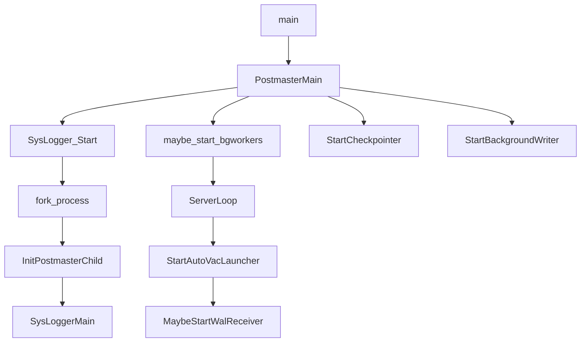

# pgsql架构

##  整体模式

pgsql采用C/S架构（客户端/服务端）模式。应用层通过INET或者Unix Socket利用既定的协议与数据库服务器进行通信。

pgsql把客户端称为前端，把服务端称为后端。前端通过调用**libpq**来与后端通信。
后端由多个进程组成，前端发送网络数据报文（查询请求）到后端，后端解析请求后回复相应的报文。

## pgsql后端进程

- postgres主进程（postmaster）

管理后端的常驻进程，也称为’postmaster’。
其默认监听UNIX Domain Socket和TCP/IP（Windows等，一部分的平台只监听tcp/ip）的5432端口，等待来自前端的的连接处理。
监听的端口号可以在PostgreSQL的设置文件postgresql.conf里面可以改。

当有前端连接过来的时候，postmaster会fork一个子进程来处理前端的连接请求。并通过共享内存进行进程间通信。

- postgres子进程

子进程根据pg_hba.conf定义的安全策略来判断是否允许进行连接，根据策略，会拒绝某些特定的IP及网络，或者也可以只允许某些特定的用户或者对某些数据库进行连接。

- 辅助进程

  - writer process
  - WAL wriiter process
  - archive process
  - stats collector process
  - logger process
  - autovacuum
  - wal sender/wal receiver

### 启动流程

### 后端处理流程

1. 接收前端发送过来的请求报文
2. parse模块进行文本解析，得到查询树
3. analyze模块进行分析处理
4. 通过查询语句的重写实现视图和规则
5. 查询优化，优化查询树
6. executor执行处理
7. 返回执行结果给前端
8. 重复步骤1-7

