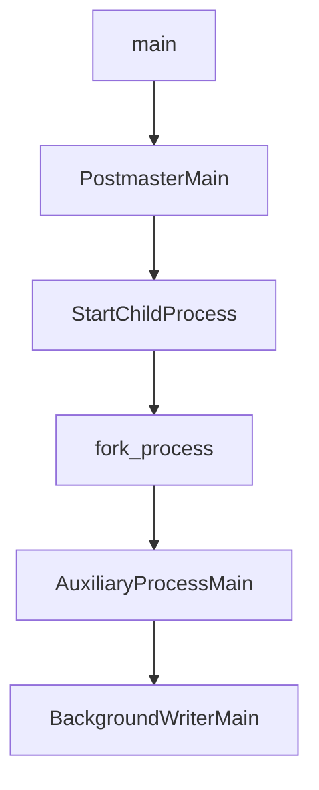

# BgWriter

Bgwriter是一个Background Writer进程的简称，Bgwriter会定时将缓存中一些已经更改的数据(脏缓冲区)写入到磁盘。

BgWriter是postmaster通过fork创建的子进程。

## 源码分析

## 启动

- 主进程fork子进程



- 子进程流程

  ```mermaid
  graph TB
  BackgroundWriterMain-->|注册信号|GetCurrentTimestamp-->|分配内存上下文|AllocSetContextCreate-->MemoryContextSwitchTo-->WritebackContextInit-->sigsetjmp-->loop
  ```
  
  ```mermaid
  graph TB
  loop-->ResetLatch-->|处理信号包括退出BgWriter进程|HandleMainLoopInterrupts-->BgBufferSync-->pgstat_report_bgwriter-->FirstCallSinceLastCheckpoint-->WaitLatch-->|处理磁盘请求|loop
  ```
  
  sigsetjmp会保存目前堆栈环境，然后将目前的地址作一个记号。而在程序其他地方调用siglongjmp()时便会直接跳到这个记号位置，然后还原堆栈，继续程序的执行。 返回0时代表已经做好记号上，若返回非0则代表由siglongjmp（）跳转回来。
  
  ## 写文件
  
  ```mermaid
  graph TB
  BgBufferSync-->SyncOneBuffer-->FlushBuffer-->|写xlog文件|XLogFlush-->XLogWrite-->XLogFileInit-->XLogFileOpen-->pg_pwrite
  FlushBuffer-->|写数据文件|smgropen-->smgrwrite
  ```
  
  
