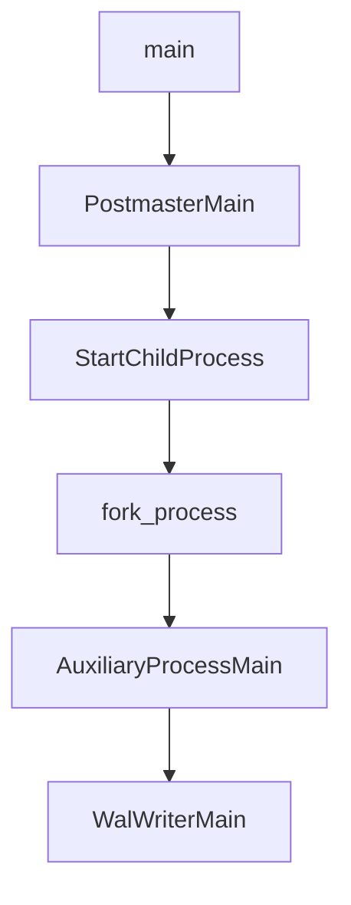
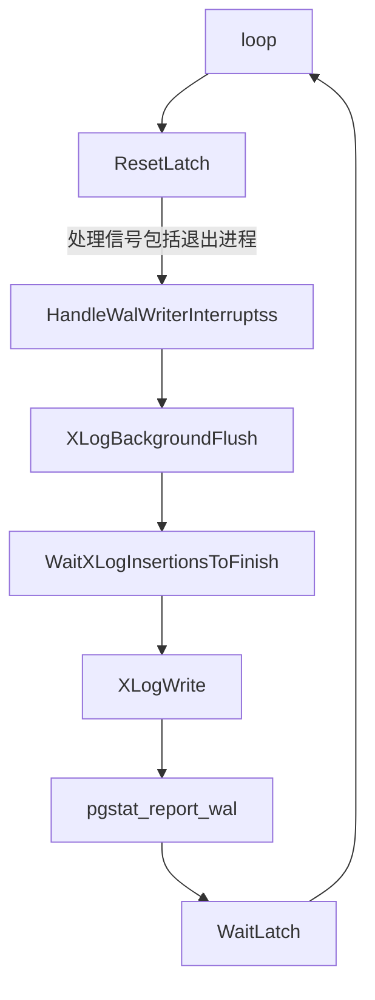

# WalWriter

预写式日志WAL机制是对数据文件的修改必须是只能发生在这些修改已经记录到日志之后，即先写日志再写数据。

WalWriter进程负责定期从WAL缓冲区写出日志，并确定写出日志的起点和终点来调用XlogWriter将日志写入到磁盘。

- 启动

```mermaid
graph TB
main-->PostmasterMain-->StartChildProcess-->fork_process-->AuxiliaryProcessMain-->WalWriterMain
```

- 写文件

```mermaid
  graph TB
  loop-->ResetLatch-->|处理信号包括退出进程|HandleWalWriterInterruptss-->XLogBackgroundFlush-->WaitXLogInsertionsToFinish-->XLogWrite-->pgstat_report_wal-->WaitLatch-->loop
```