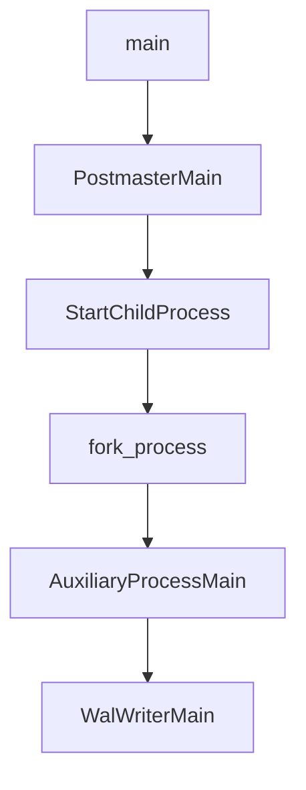
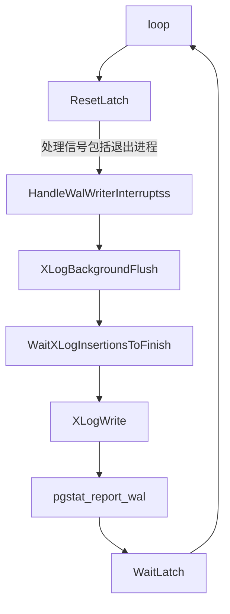

# WalWriter

- 启动

```mermaid
graph TB
main-->PostmasterMain-->StartChildProcess-->fork_process-->AuxiliaryProcessMain-->WalWriterMain
```

- 写文件

```mermaid
  graph TB
  loop-->ResetLatch-->|处理信号包括退出进程|HandleWalWriterInterruptss-->XLogBackgroundFlush-->WaitXLogInsertionsToFinish-->XLogWrite-->pgstat_report_wal-->WaitLatch-->loop
```