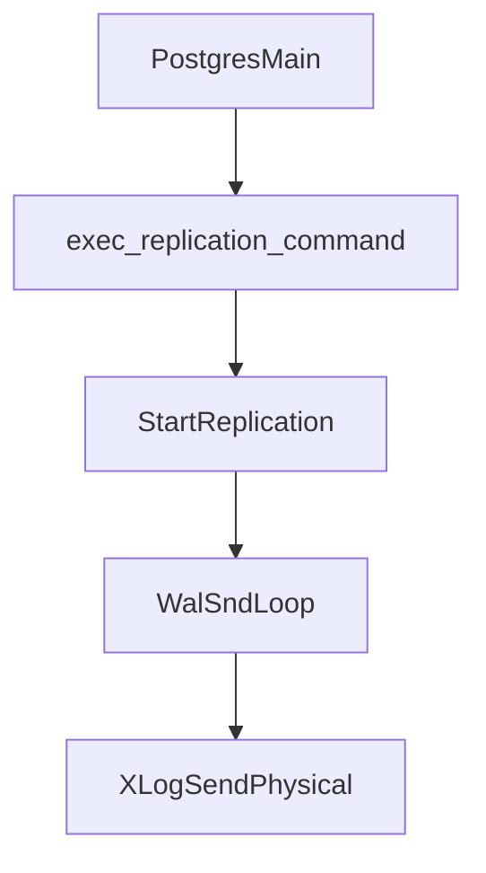
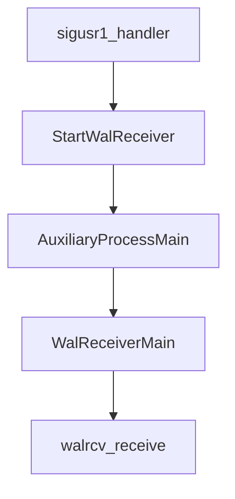
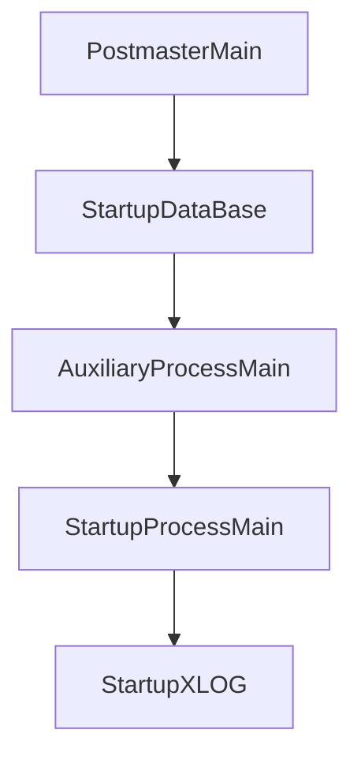
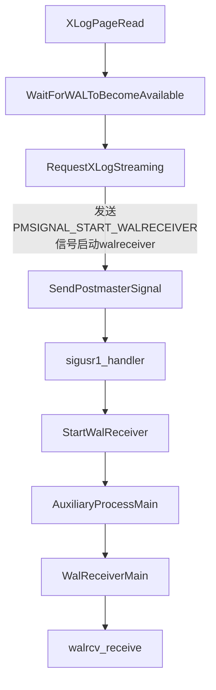

  
在PostgreSQL流复制过程中，有三个进程协同工作：walsender进程，walreceiver进程和startup进程。其中walsender进程属于主节点的进程，主要用来向备节点发送wal record； walreceiver和startup进程属于备节点进程，wal receiver主要用来接收主端发送来的wal record并写入磁盘上的XLOG文件中，之后startup进程就会对这些wal数据进行replay。三个进程共同协作，完成主备的整个流复制过程。本篇博客主要关注于WalReceiver进程和startup进程之间的交互逻辑。首先看一下这三个进程的调用堆栈，可以更加方便定位所需阅读的代码细节：

walsender进程是用来发送WAL日志记录的，执行顺序如下：

`PostgresMain()->exec_replication_command()->StartReplication()->WalSndLoop()->XLogSendPhysical()`  



walreceiver进程是用来接收WAL日志记录的，执行顺序如下：`sigusr1_handler()->StartWalReceiver()->AuxiliaryProcessMain()->WalReceiverMain()->walrcv_receive()`  



startup进程是用来apply日志的，执行顺序如下：`PostmasterMain()->StartupDataBase()->AuxiliaryProcessMain()->StartupProcessMain()->StartupXLOG()`



在流复制启动过程中，三个进程的启动顺序是从备库到主库，即：startup —> walreceiver —> walsender。但是值得注意的是Startup启动后，不会马上发送信号给postmaster来启动wal receiver进程，它先会进行一系列条件的判断然后决定是否通知postmaster启动wal receiver进程。 我们知道Startup进程回放日志所需要的WAL文件有3个来源：归档中获取、pg\_wal文件夹下获取、从primary 节点以流复制方式获取。在实际流复制过程中， 如果是非归档，则先会从pg\_wal中获取；否则优先从archive归档中获取（Archive Mode）； 如果两者都没有，startup要恢复的wal，只能从primary 节点以流复制方式获取，这时startup会发送信号（通过函数SendPostmasterSignal(PMSIGNAL\_START\_WALRECEIVER) ，可以查看之前的博文了解这段过程）给postmaster进程，请求其启动wal receiver进程从Primary节点来获取wal数据。

在流复制运行中，WAL数据的流向则是walsender进程占据主动位置：walsender —> walreceiver —> startup。从主库[backend](https://so.csdn.net/so/search?q=backend&spm=1001.2101.3001.7020)执行业务操作所产生的XLOG会顺着上述流程从主库walsender进程网络发送到walreceiver网络接收并落盘，最终备库startup进程会对XLOG进行应用。

## startup进程主要流程

startup进程进入standby模式和apply日志主要过程：

1. 读取pg\_control文件，找到redo位点;读取recovery.conf，如果配置standby\_mode=on则进入standby模式。
2. 如果是Hot Standby需要初始化clog、subtrans、事务环境等。初始化redo资源管理器，比如Heap、Heap2、Database、XLOG等。
3. 读取WAL record，如果record不存在需要调用XLogPageRead->**WaitForWALToBecomeAvailable->RequestXLogStreaming**唤醒walreceiver从walsender获取WAL record。
4. 对读取的WAL record进行redo，通过record->xl\_rmid信息，调用相应的redo资源管理器进行redo操作。比如heap\_redo的XLOG\_HEAP\_INSERT操作，就是通过record的信息在buffer page中增加一个record。还有部分redo操作(vacuum产生的record)需要检查在Hot Standby模式下的查询冲突，比如某些tuples需要remove，而存在正在执行的query可能读到这些tuples，这样就会破坏事务隔离级别。通过函数ResolveRecoveryConflictWithSnapshot检测冲突，如果发生冲突，那么就把这个query所在的进程kill掉。
5. 检查一致性，如果一致了，Hot Standby模式可以接受用户只读查询；更新共享内存中XLogCtlData的apply位点和时间线；如果恢复到时间点，时间线或者事务id需要检查是否恢复到当前目标；
6. 回到步骤3，读取next WAL record。  
   

## WalReceiver进程主要流程

WalReceiver进程进入工作状态后主要执行流程如下所示：

1. WalReceiver进程进入流复制之前，**startup进程已经recovery.conf文件中的primary\_conninfo参数信息解析后填充**到`walrcv->conninfo`、`walrcv->slotname`、`walrcv->receiveStart`、`walrcv->receiveStartTLI`等共享内存WalRcvData中。 WalReceiver进程通过walrcv\_connect连接主库。
2. 进入第一层死循环，执行identify\_system命令，获取主库systemid/timeline/xlogpos等信息，执行TIMELINE\_HISTORY命令拉取history文件，如果需要，则创建临时复制槽。
3. (3.1)执行wal\_startstreaming开始启动流复制  
   （3.1.1）通过walrcv\_receive获取WAL日志，并向wal segment文件中写入xlog，期间也会回应主库发过来的心跳信息(发送write位点、flush位点、apply位点)  
   （3.1.2）如果walrcv\_receive获取不到数据，向主库发送write位点、flush位点、apply位点，发送feedback信息(xmin、xmin\_epoch、catalog\_xmin、catalog\_xmin\_epoch)，避免vacuum删掉备库正在使用的记录，如果flush了XLOG逻辑位置**唤醒startup进程**，跳转到4  
   （3.1.3）如果walrcv\_receive获取EOF，向主库发送write位点、flush位点、apply位点，发送feedback信息(xmin、xmin\_epoch、catalog\_xmin、catalog\_xmin\_epoch)，避免vacuum删掉备库正在使用的记录，如果flush了XLOG逻辑位置**唤醒startup进程**，跳转到5  
   (3.2)如果wal\_startstreaming返回false，说明主库在该时间线上已经没有wal可以发送了，跳转到6
4. WaitLatchOrSocket等待超时/网络可读/latch被触发：  
   （4.1）等待超时，向主库发送接收位点、flush位点、apply位点，发送feedback信息(xmin、xmin\_epoch、catalog\_xmin、catalog\_xmin\_epoch)，跳转到3.1.x  
   （4.2）**startup进程通过latch唤醒WalReceiver**进程，向主库发送write位点、flush位点、apply位点，跳转到3.1.x
5. 执行walrcv\_endstreaming结束流复制，接收wal sender发送过来的时间线文件，进入步骤6
6. 关闭目前的xlog segment文件描述符，发送feedback信息(xmin、xmin\_epoch、catalog\_xmin、catalog\_xmin\_epoch)，如果flush了XLOG逻辑位置**唤醒startup进程**，进入步骤7
7. WalRcvWaitForStartPosition函数**等待startup进程更新receiveStart和receiveStartTLI**，一旦更新，进入步骤2。  
   

## WalReceiver&startup交互



1. startup进程向postmaster请求启动WalReceiver进程  
   startup进程通过如下`WaitForWALToBecomeAvailable->RequestXLogStreaming`流程设置receiveStart和receiveStartTLI，要求WalReceiver进行流复制。

```
void RequestXLogStreaming(TimeLineID tli, XLogRecPtr recptr, const char *conninfo, const char *slotname, bool create_temp_slot) {
WalRcvData *walrcv = WalRcv;
...
walrcv->receiveStart = recptr;
walrcv->receiveStartTLI = tli;
latch = walrcv->latch;
SpinLockRelease(&walrcv->mutex);
    // startup进程将WalReceiver状态从WALRCV_STOPPED转变为WALRCV_STARTING时，设置launch为true，向postmaster请求启动WalReceiver进程
    // startup进程通过latch唤醒WalReceiver进程
if (launch) SendPostmasterSignal(PMSIGNAL_START_WALRECEIVER);
else if (latch) SetLatch(latch);
}
```

2. walReceiver进程调用XLogWalRcvFlush函数如果已经flush了XLOG逻辑位置则唤醒startup进程

```
static void XLogWalRcvFlush(bool dying) {
if (LogstreamResult.Flush < LogstreamResult.Write) {
WalRcvData *walrcv = WalRcv;
issue_xlog_fsync(recvFile, recvSegNo);
LogstreamResult.Flush = LogstreamResult.Write;
/* Update shared-memory status */
SpinLockAcquire(&walrcv->mutex);
if (walrcv->flushedUpto < LogstreamResult.Flush) {
walrcv->latestChunkStart = walrcv->flushedUpto;
walrcv->flushedUpto = LogstreamResult.Flush;
walrcv->receivedTLI = ThisTimeLineID;
}
SpinLockRelease(&walrcv->mutex);
WakeupRecovery(); /* Signal the startup process and walsender that new WAL has arrived */ // 唤醒startup进程
if (AllowCascadeReplication()) WalSndWakeup();
if (!dying) { /* Also let the primary know that we made some progress */
XLogWalRcvSendReply(false, false);
XLogWalRcvSendHSFeedback(false);
}
}
}
```

3. startup进程要求WalReceiver进行现在发送应用反馈，每当应用interesting xlog records时，startup进程都会调用此方法，以便 walreceiver 可以检查它是否需要将apply通知（notification）发送回主节点，主库可能在应用了**synchronous\_commit = remote\_apply**参数的COMMIT中等待walreceiver的反馈。从这里可以看到WalReceiver除了发送write位点、flush位点、apply位点消息之外，针对remote\_apply从库应用之后才commit这种情况，增加了startup进程强制WalReceiver唤醒发送反馈这一特性，加速主库进行commit操作。

```
void WalRcvForceReply(void) {
Latch   *latch;
WalRcv->force_reply = true;  // 设置强制回复标志
SpinLockAcquire(&WalRcv->mutex); /* fetching the latch pointer might not be atomic, so use spinlock */
latch = WalRcv->latch;
SpinLockRelease(&WalRcv->mutex);
if (latch) SetLatch(latch);
}
```

4. walReceiver进程WalRcvWaitForStartPosition函数等待startup进程设置receiveStart和receiveStartTLI

```
static void WalRcvWaitForStartPosition(XLogRecPtr *startpoint, TimeLineID *startpointTLI) {
WalRcvData *walrcv = WalRcv;
intstate;
SpinLockAcquire(&walrcv->mutex);
state = walrcv->walRcvState;
if (state != WALRCV_STREAMING) {
SpinLockRelease(&walrcv->mutex);
if (state == WALRCV_STOPPING) proc_exit(0);
else elog(FATAL, "unexpected walreceiver state");
}
walrcv->walRcvState = WALRCV_WAITING;
walrcv->receiveStart = InvalidXLogRecPtr;
walrcv->receiveStartTLI = 0;
SpinLockRelease(&walrcv->mutex);
/* nudge startup process to notice that we've stopped streaming and are now waiting for instructions. */
WakeupRecovery();
for (;;) {
ResetLatch(MyLatch);
ProcessWalRcvInterrupts();
SpinLockAcquire(&walrcv->mutex);
if (walrcv->walRcvState == WALRCV_RESTARTING) {
/* No need to handle changes in primary_conninfo or primary_slotname here. Startup process will signal us to terminate in case those change. */
*startpoint = walrcv->receiveStart;
*startpointTLI = walrcv->receiveStartTLI;
walrcv->walRcvState = WALRCV_STREAMING;
SpinLockRelease(&walrcv->mutex);
break;
}
if (walrcv->walRcvState == WALRCV_STOPPING) { /* We should've received SIGTERM if the startup process wants us to die, but might as well check it here too. */
SpinLockRelease(&walrcv->mutex);
exit(1);
}
SpinLockRelease(&walrcv->mutex);
(void) WaitLatch(MyLatch, WL_LATCH_SET | WL_EXIT_ON_PM_DEATH, 0, WAIT_EVENT_WAL_RECEIVER_WAIT_START);
}
}
```

startup进程则通过`WaitForWALToBecomeAvailable->RequestXLogStreaming`流程设置receiveStart和receiveStartTLI，并且是通过[latch](https://so.csdn.net/so/search?q=latch&spm=1001.2101.3001.7020)唤醒WalReceiver进程。

5. walReceiver进程关闭  
   (1) startup进程执行如下ShutdownWalRcv函数请求walreceiver进程关闭，并通过walRcvStoppedCV监视walReceiver进程关闭，等待 walreceiver 通过将状态设置为 WALRCV\_STOPPED 来确认其死亡。

```
void ShutdownWalRcv(void) {
WalRcvData *walrcv = WalRcv;
pid_twalrcvpid = 0;
boolstopped = false;
/* Request walreceiver to stop. Walreceiver will switch to WALRCV_STOPPED mode once it's finished, and will also request postmaster to not restart itself.*/ // 请求walreceiver进程关闭
SpinLockAcquire(&walrcv->mutex);
switch (walrcv->walRcvState) {
case WALRCV_STOPPED: break;
case WALRCV_STARTING:
walrcv->walRcvState = WALRCV_STOPPED;
stopped = true;
break;
case WALRCV_STREAMING:
case WALRCV_WAITING:
case WALRCV_RESTARTING:
walrcv->walRcvState = WALRCV_STOPPING;
/* fall through */
case WALRCV_STOPPING:
walrcvpid = walrcv->pid;
break;
}
SpinLockRelease(&walrcv->mutex);
/* Unnecessary but consistent. */
if (stopped) ConditionVariableBroadcast(&walrcv->walRcvStoppedCV);

/* Signal walreceiver process if it was still running. */ // 向walreceiver进程发送SIGTERM信号
if (walrcvpid != 0) kill(walrcvpid, SIGTERM);

/* Wait for walreceiver to acknowledge its death by setting state to WALRCV_STOPPED. */ // 等待 walreceiver 通过将状态设置为 WALRCV_STOPPED 来确认其死亡
ConditionVariablePrepareToSleep(&walrcv->walRcvStoppedCV);
while (WalRcvRunning())
ConditionVariableSleep(&walrcv->walRcvStoppedCV, WAIT_EVENT_WAL_RECEIVER_EXIT);
ConditionVariableCancelSleep();
}
```

walReceiver进程信号处理函数WalRcvDie向walRcvStoppedCV条件变量进行广播，通知startup进程。

```
static void WalRcvDie(int code, Datum arg) {
WalRcvData *walrcv = WalRcv;
XLogWalRcvFlush(true); /* Ensure that all WAL records received are flushed to disk */
SpinLockAcquire(&walrcv->mutex); /* Mark ourselves inactive in shared memory */
walrcv->walRcvState = WALRCV_STOPPED;
walrcv->pid = 0;
walrcv->ready_to_display = false;
walrcv->latch = NULL;
SpinLockRelease(&walrcv->mutex);
ConditionVariableBroadcast(&walrcv->walRcvStoppedCV);
if (wrconn != NULL) walrcv_disconnect(wrconn); /* Terminate the connection gracefully. */
WakeupRecovery(); /* Wake up the startup process to notice promptly that we're gone */
}
```

walReceiver进程WalReceiverMain处理walRcvState状态向walRcvStoppedCV条件变量进行广播，通知startup进程。  


(2) startup进程WaitForWALToBecomeAvailable会通过WalRcvStreaming从WALRCV\_STARTING状态向Streaming转变或是否存活。  
startup进程通过WalRcvRunning函数监控walReceiver进程从WALRCV\_STARTING状态向Running转变超时或是否存活，会向walRcvStoppedCV条件变量进行广播，以保证退出ShutdownWalRcv函数的这个sleep循环。或者在启动进程重载配置文件时StartupRequestWalReceiverRestart函数会调用WalRcvRunning函数。  


图片和部分内容参考自阿里内核月报 https://www.kancloud.cn/taobaomysql/monthly/81110  
在这里衷心感谢阿里内核团队的分享