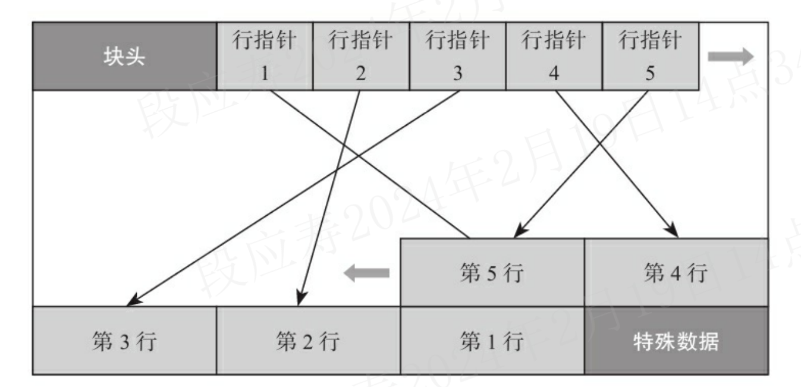
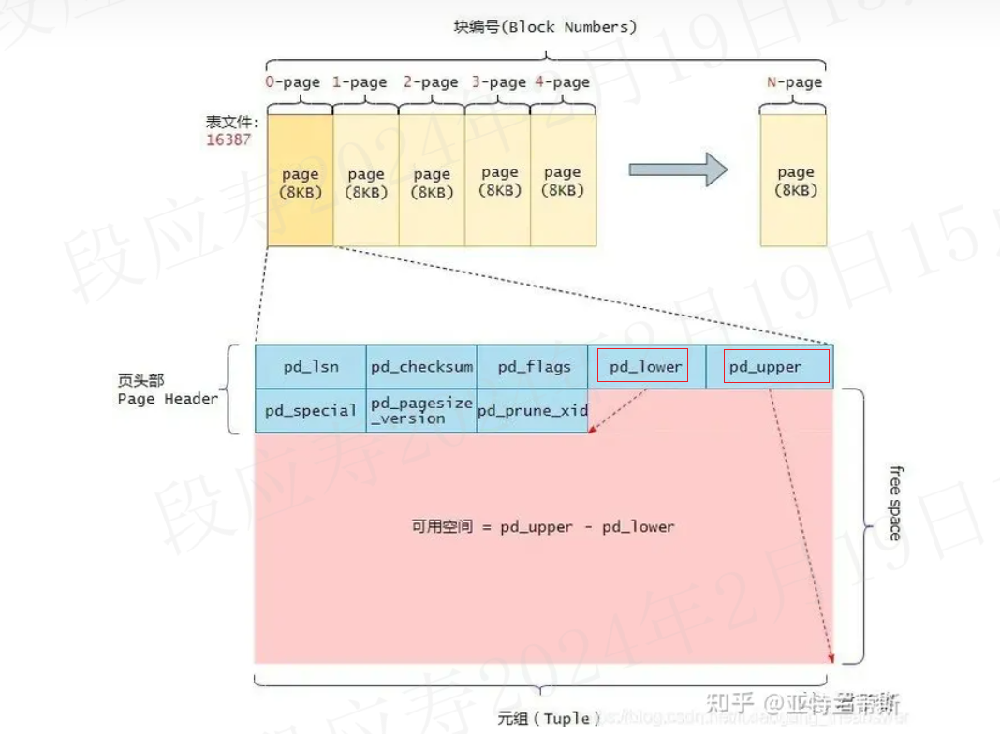
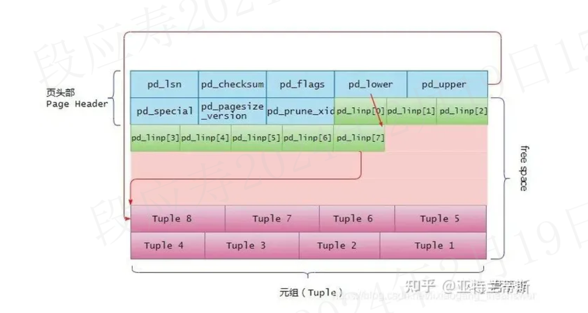
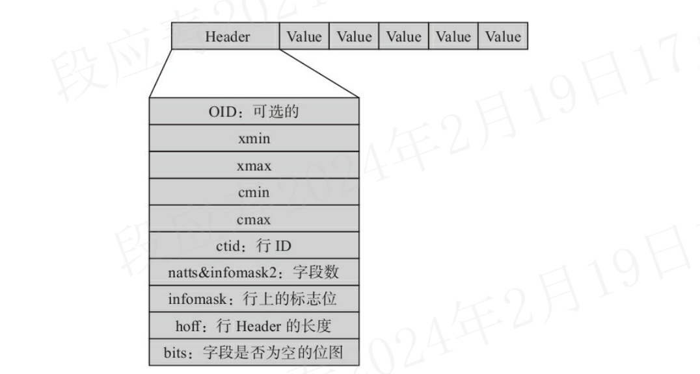
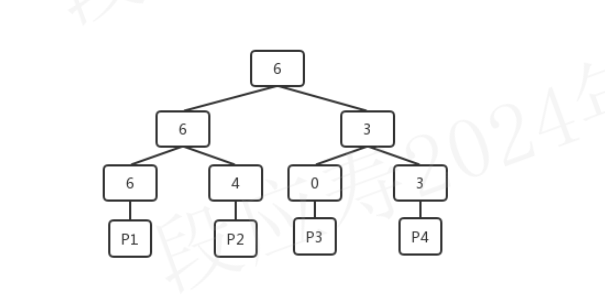
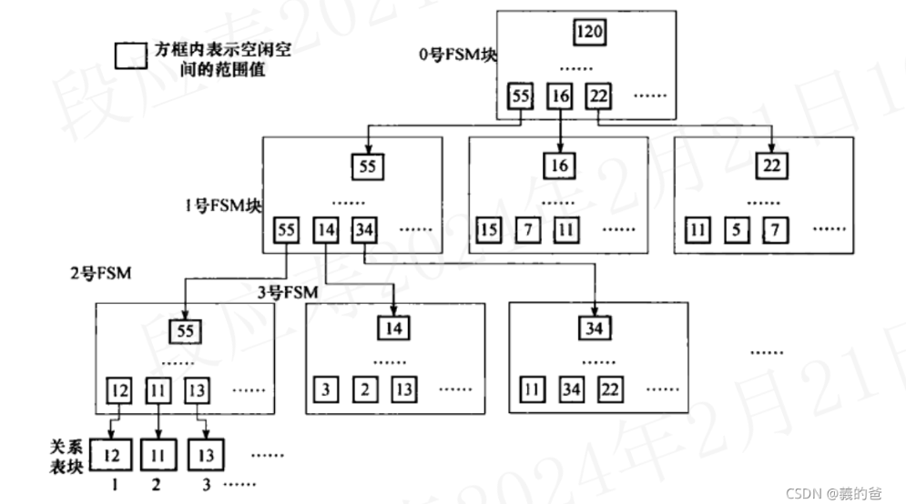
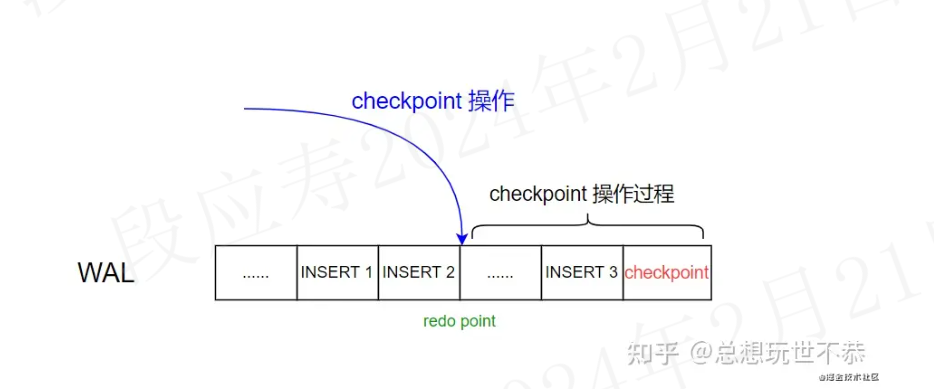
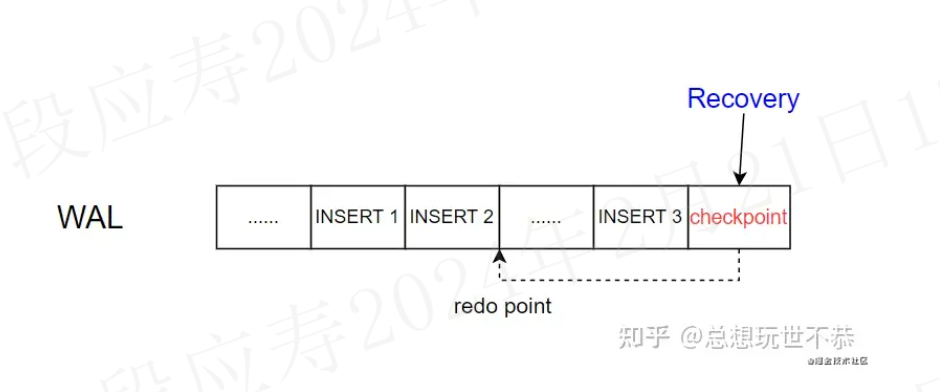
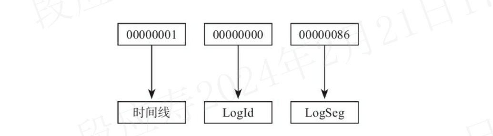

# 0 Postgresql存储、索引及系统优化、主备切换

<font color="red">基于pg12描述。</font>

## 1 Postgresql存储

### 1.1 数据（表）物理存储结构

Postgresql当前不支持使用裸设备或者块设备，必须基于文件系统来存储。

#### 1.1.1 关键概念

- Realation：表示表或索引。
- Tuple：表示表中的行。
- Page：表示在磁盘中的数据块。
- Buffer：表示在内存中的数据块

#### 1.1.2 数据块结构

数据块是多行数据的存储结构。

数据块的大小默认是8KB,最大是32KB，一个数据块里存储了多行数据，其数据存储方式采用两头向中间靠拢的方式。
最前面是块头，块头后面记录了各个数据行的指针，数据行从块尾向中间排列，直到和行指针相遇（即没有空间存放新的行数据）。
行数据指针与行数据之间的部分就是空闲空间。数据块存储结构如下图所示：



##### 1.1.2.1 块头
块头主要记录了如下信息：
  - 块的checksum
  - 空闲空间的起始位置和结束位置
  - 特殊数据的起始位置
块头的代码结构如下所示：

```c
typedef struct PageHeaderData
{
	PageXLogRecPtr pd_lsn;		/*本页最后一次更改所写入的XLOG记录的LSN(即当前WAL位置)*/
	uint16		pd_checksum;	/* 本页数据的checksum */
	uint16		pd_flags;		/*标志位*/
	LocationIndex pd_lower;		/* 空闲空间的起始偏移位置 */
	LocationIndex pd_upper;		/* 空闲空间的结束偏移位置 */
	LocationIndex pd_special;	/* 指向特殊空间的起始偏移量 */
	uint16		pd_pagesize_version; /* 页面大小及页面版本号 */
	TransactionId pd_prune_xid; /* 可删除的旧XID，如果没有则为零 */
	ItemIdData	pd_linp[FLEXIBLE_ARRAY_MEMBER]; /* 行指针数组(变长数组),它指向该页中的元组(也就是表记录) */
} PageHeaderData;
```

pd_flags可取值如下：

```c
//是否有未使用的行指针?
#define PD_HAS_FREE_LINES 0x0001 

//没有足够的空间容纳新元组?
#define PD_PAGE_FULL  0x0002

//页面上的所有元组对每个人都可见?
#define PD_ALL_VISIBLE  0x0004

//所有有效pd_flags位的OR操作
#define PD_VALID_FLAG_BITS 0x0007
```

当向表中插入数据时，postgres会分配8KB(BLCKSZ)的内存空间。
除了页的头部数据占用的空间外，其余的空间都是可用于存储元组的(当然行指针也有占用空间)。
当没有行数据时，pd_upper指向可用空间（空闲空间）的末尾，而pd_lower指向页头(PageHeaderData)之后的第一个空闲空间的起始位置。
pd_upper - pd_lower是该页中剩余可用的空闲空间，随着元素的不断插入，pd_upper和pd_lower变量会不断地随着更新。



##### 1.1.2.2 行指针

行指针是一个32bit的数字，具体结构如下：

```c
typedef struct ItemIdData
{
	unsigned	lp_off:15,		/* 行内容的偏移量 */
				lp_flags:2,		/* 指针的标记位 */
				lp_len:15;		/* 行内容的长度 */
} ItemIdData;
```

行指针中表示行内容在业内（块中）的偏移量是15bit，能表示的最大偏移量是2^15=32768，因此在Postgresql中的最大大小是32KB。

行指针的长度为4个字节，它形成一个简单的(ItemId，行指针)数组，该数组起着元组索引的作用。每个索引编号从1开始，称为“偏移数”。

当将一个新的元组添加到页的时候，新的行指针也被添加到pd_linp数组中，以指向其对应的元组。

当不断向页中插入数据时候，其元组、行指针以及可用空间的变化如下图所示：



当向页中插入一行数据时，需要做如下几件事情：
 
1. 更新行指针的页偏移位置和行长度；
2. 将行数据插入到指定位置；
3. 更新页空闲空间的起始位置和结束位置；
4. 重新计算checksum；

如何读取存储的行数据呢？

页头大小是固定的，同时pd_lower记录了空闲空间的起始位置，且行指针的长度是固定的32bit（4字节），根据这三个数据就可以计算有多少行数据。

```shell
n = (pd_lower - sizeof(PageHeaderData))/4
```

访问的时候先从页头的尾部开始依次访问行指针，根据lp_off确定行的起始位置，根据lp_off+lp_len确定行的结束位置。

#### 1.1.3 tuple结构

这里的tuple指的是数据行，就是前面提到的块（页）结构中行指针所指向的数据。

tuple的物理结构同样是先有一个行头，后面跟了各项数据。

tuple的结构如下图：




##### 1.1.3.1 行头

行头的结构体定义如下：

```c
struct HeapTupleHeaderData
{
	union
	{
		HeapTupleFields t_heap;
		DatumTupleFields t_datum;
	}			t_choice;

	ItemPointerData t_ctid;		/* 一个行版本在它所处的表内的物理位置 */

	/* Fields below here must match MinimalTupleData! */

#define FIELDNO_HEAPTUPLEHEADERDATA_INFOMASK2 2
	uint16		t_infomask2;	/* 字段数，其中低11位表示这行有多少个列。其他的位则是HOT（Heap Only Touples）技术及行可见性的标志位。 */

#define FIELDNO_HEAPTUPLEHEADERDATA_INFOMASK 3
	uint16		t_infomask;		/* 用于标识行当前的状态，比如行是否具有OID，是否有空属性，共有16位
，每位都代表不同的含义 */

#define FIELDNO_HEAPTUPLEHEADERDATA_HOFF 4
	uint8		t_hoff;			/* 表示行头的长度 */

	/* ^ - 23 bytes - ^ */

#define FIELDNO_HEAPTUPLEHEADERDATA_BITS 5
	bits8		t_bits[FLEXIBLE_ARRAY_MEMBER];	/* 是一个数组，用于标识该行上哪些字段（列）为空 */

	/* MORE DATA FOLLOWS AT END OF STRUCT */
};
```

其中t_choice成员变量是一个共用体数据类型。对于t_choice中的t_heap成员，它描述了当前元组的事务id、事务id等信息，如下：

```c
typedef struct HeapTupleFields
{
	TransactionId t_xmin;		/* 插入该行版本的事务ID，对应用户看到的xmin */
	TransactionId t_xmax;		/* 删除此行时的事务ID，第一次插入时，此字段为0。如果查询出来此字段不为0，则可能是删除这行的事务还未提交，或者是删除此行的事务回滚了，对应用户看到的xmax */

	union
	{
		CommandId	t_cid;		/* 插入或者删除id，或者同时是插入和删除id，其实就是cmin和cmax */
		TransactionId t_xvac;	/* old-style VACUUM FULL xact ID */
	}			t_field3;
} HeapTupleFields;
```

##### 1.1.3.2 行头关键字段

- xmin
插入数据行的事务ID。
- xmax
删除数据行的事务ID。

xmin和xmax是如何更新的？
> 1. 新插入一行时，将新插入行的xmin设置为当前的事务ID，xmax为0，因为没有删除；
>2. 修改一行时，因为MVCC机制，实际上是新插入一行。原数据行上的xmin不变，xmax更新为当前的事务ID（因为修改时，原数据行相当于删除了，即标记删除）。而新插入的数据行的xmin设置为当前的事务ID，xmax设置为0，因为没有删除；
>3. 删除一行时，把被删除行上的xmax填写为当前的事务ID。


如何根据xmin和xmax确定访问哪个tuple？

PG中每个表都包含了一些系统字段，其中包括cmin和cmax
- cmin
插入该元组的命令在插入事务中的命令标识（从0开始累加）
- cmax
删除该元组的命令在插入事务中的命令标识（从0开始累加）

简单来说，cmin和cmax都是表示tuple的command id，即cmin是产生该条tuple的command id，cmax是删除该tuple的command id。
cmin和cmax用于判断同一个事务内的其他命令导致的行版本变更是否可见。如果一个事务内的所有命令严格顺序执行，那么每个命令总能看到之前该事务内的所有变更，不需要使用命令标识。

行上记录了操作这行的命令ID，当其他命令读取这行数据时：
- 如果当前的命令ID大于等于数据行上的命令ID，说明这行数据是
可见的；
- 如果当前的命令ID小于数据行上的命令ID，则这条数据不可见

为什么这里有cmin和cmax两个字段，但在实际的结构体里却没有对应的字段？
>在每个tuple的头部，这两个字段都是存放在t_cid中，其长度为4bytes。
>在PG8.3版本前，cmin和cmax确实是分别存放在不同字段中的，但是从8.3版本开始，为了减少cmin和cmax对heap page空间的占用，将这两个字段都存放在t_cid中了，即combo cid。
>一般来说，当我们的事务中只是插入数据时，t_cid存储的就是cmin，因为此时也只有cmin是有效的。而当进行了update或者delete操作时，才会产生cmax。当这种既有cmin又有 cmax的情况，即在同一个事务中既有插入又有更新的时候，t_cid存储的就是combo cid(组合cid)。

如何判断是combo cid？

> 使用到tuple中的标志位infomask,combo cid的标志位是HEAP_COMBOCID，其值是0x0020。定义如下：
```c
#define HEAP_COMBOCID			0x0020	/* t_cid is a combo CID */
```
>在通过HeapTupleHeaderGetCmin/HeapTupleHeaderGetCmax获取cmin或者cmax的时候，首先会通过头部的控制字段判断tuple->t_infomask & HEAP_COMBOCID，如果是combo cid，那么通过这个cmobo cid字段，获取真正的cmin或者cmax。


如何通过combo cid获取cmin和cmax？

> cmin和cmax存储在ComboCidKeyData结构中。其定义如下:

```c
/* Key and entry structures for the hash table */
typedef struct
{
	CommandId	cmin;
	CommandId	cmax;
} ComboCidKeyData;

typedef ComboCidKeyData *ComboCidKey;

typedef struct
{
	ComboCidKeyData key;
	CommandId	combocid;
} ComboCidEntryData;
```
> 事务在第一次更新本事务插入的tuple时，会新开辟一个数组ComboCidKey comboCids；
其大小初始的时候为100（每次空间不够的时候，会将数组的大小的扩大2倍）。
同时还会使用一个hashmap，用来根据ComboCidKeyData查找combo cid。
```c
comboHash = hash_create("Combo CIDs",
			CCID_HASH_SIZE,
			&hash_ctl,
			HASH_ELEM | HASH_BLOBS | HASH_CONTEXT);
```
>将combo cid存储映射cmin/cmax，在update/delete本事务中插入的tuple时，调用GetComboCommandId函数，生成一个combo cid存储在tuple头部原来的cmin/cmax域。大致流程如下：
>1. 首先根据(cmin, cmax)查找comboHash，如果找到返回ComboCidEntryData中的combo cid（reuse机制, 这个hashmap的作用）；
>2. 如果没找到，往comboCids数组中添加一个ComboCidKeyData元组，同时往hashmap插入一个entry。返回的combo cid为usedComboCids（comboCids数组当前的大小），然后usedComboCids++。

>获取真正的cmin和cmax，通过tuple header上的combo cid，直接作为下标到comboCids返回对应的元组。相当于使用combo cid作为key，（cmin,cmax）作为value保存在hash表中，当根据tuple的infomask确定为combo cid时，就使用t_cid进行查找，进而得出cmin，和cmax。

为什么有了xmin，xmax后，还需要有cmin和cmax？

> xmin,xmax，cmin，cmax都是为了实现MVCC机制而引入的。其中xmin，xmax是在事务级别控制行的可见性，当一个事务存在多条命令时（插入、更新、删除），就需要使用cmin，cmax来控制事务内命令级别行的可见性。

- infomask
行上的xmin、xmax、cmin、cmax和CLOG日志一起用于控制行的可见性。
每个事务在CLOG中占用两个bit，数据库运行一段时间后，如几年，就可能产生上亿个事务，最多时甚至可能达到20亿个事务，它们使用的CLOG可能占用512MB的空间，在这么大的CLOG中查询事务的状态，效率可能不高，于是PostgreSQL对查询行的可见性做了优化，把一些可见性的信息记录在infomask字段上，该字段的t_infomask中有以下与可见性相关的标志位：

```c
#define HEAP_HASNULL			0x0001	/* has null attribute(s) */
#define HEAP_HASVARWIDTH		0x0002	/* has variable-width attribute(s) */
#define HEAP_HASEXTERNAL		0x0004	/* has external stored attribute(s) */
#define HEAP_HASOID_OLD			0x0008	/* has an object-id field */
#define HEAP_XMAX_KEYSHR_LOCK	0x0010	/* xmax is a key-shared locker */
#define HEAP_COMBOCID			0x0020	/* t_cid is a combo CID */
#define HEAP_XMAX_EXCL_LOCK		0x0040	/* xmax is exclusive locker */
#define HEAP_XMAX_LOCK_ONLY		0x0080	/* xmax, if valid, is only a locker */

 /* xmax is a shared locker */
#define HEAP_XMAX_SHR_LOCK	(HEAP_XMAX_EXCL_LOCK | HEAP_XMAX_KEYSHR_LOCK)

#define HEAP_LOCK_MASK	(HEAP_XMAX_SHR_LOCK | HEAP_XMAX_EXCL_LOCK | \
						 HEAP_XMAX_KEYSHR_LOCK)
#define HEAP_XMIN_COMMITTED		0x0100	/* t_xmin committed */
#define HEAP_XMIN_INVALID		0x0200	/* t_xmin invalid/aborted */
#define HEAP_XMIN_FROZEN		(HEAP_XMIN_COMMITTED|HEAP_XMIN_INVALID)
#define HEAP_XMAX_COMMITTED		0x0400	/* t_xmax committed */
#define HEAP_XMAX_INVALID		0x0800	/* t_xmax invalid/aborted */
#define HEAP_XMAX_IS_MULTI		0x1000	/* t_xmax is a MultiXactId */
#define HEAP_UPDATED			0x2000	/* this is UPDATEd version of row */
#define HEAP_MOVED_OFF			0x4000	/* moved to another place by pre-9.0
										 * VACUUM FULL; kept for binary
										 * upgrade support */
#define HEAP_MOVED_IN			0x8000	/* moved from another place by pre-9.0
										 * VACUUM FULL; kept for binary
										 * upgrade support */
#define HEAP_MOVED (HEAP_MOVED_OFF | HEAP_MOVED_IN)

#define HEAP_XACT_MASK			0xFFF0	/* visibility-related bits */
```

如果t_infomask中HEAP_XMIN_COMMITTED为真，而HEAP_XMAX_INVALID为假，则说明该行是新插入的行，是可见的，此时就不需要到CLOG中查询xmin和xmax的事务状态了。

而如果未设置HEAP_XMIN_COMMITTED，并不表示该行没有提交，而是说不知道xmin是否提交了，需要到CLOG中去判断xmin的状态。HEAP_XMAX_COMMITTED也是如此。

第一次插入数据时，t_infomask中的HEAP_XMIN_COMMITTED和HEAP_XMAX_INVALID并未设置，但当事务提交后，有用户再读取这个数据块时会通过CLOG判断出这些行的事务已提交，会设置t_infomask中的HEAP_XMIN_COMMITTED和HEAP_XMAX_INVALID标志位。

下次再查询该行时，直接使用t_infomask中的HEAP_XMIN_COMMITTED和HEAP_XMAX_INVALID标志位就可以判断出行的可见性了，不再需要到CLOG中查询
事务的状态。

##### 1.1.3.3 MVCC实现原理

###### 1.1.3.3.1 事务内部的多版本一致

xmin、xmax、cmin、cmax这四个字段在MVCC中用于控制数据行是否对用户可见。PG会将修改前后的数据都存储在相同的结构中

- 新插入一行时，将新插入行的xmin填写为当前事务ID，xmax填0
- 修改某一行时，实际上是新插入一行，旧行上的xmin不变，旧行上的xmax改为当前事务ID，新行上的xmin填为当前事务ID，新行上的xmax填为0
- 删除一行时，把被删除行上的xmax填为当前事务ID
- cmin和cmax用于判断同一个事务内的不同命令导致的行版本变化是否可见，每个命令使用事务内一个命令标识计数器的值作为当前命令标识，事务开始时，命令标识计数器被置为0。执行一条DML后，命令标识计数器加1，当命令标识计数器不断累加又循环到0时，会报错，因为一个事务中命令的个数最多为2^32-1个，当某个事务内的命令读到某行数据时，会根据cmin和cmax做出判断：

   - 若当前命令ID>=当前行的cmax且cmax不等于0，说明当前行对此命令不可见
   - 若当前命令ID>=当前行的cmin，说明当前行对此命令可见

###### 1.1.3.3.2 不同事务间的多版本一致

PG是通过数据行上的xmin和xmax来判断对某事务是否可见，那么只需要确认xmin和xmax对应的事务是提交了还是回滚了，就可以知道这些数据行是否可见。PG把事务状态记录在commit log中，简称clog，事物的状态有以下四种：

- TRANSACTION_STATUS_IN_PROGRESS =0X00：表示事务正在进行中
- TRANSACTION_STATUS_COMMITTED =0X01：表示事务已提交
- TRANSACTION_STATUS_ABORTED =0X02：表示事务已回滚
- TRANSACTION_STATUS_SUB_COMMITTED =0X03：表示子事务已提交

事务ID有时会缩写为XID，是一个32bit的数字。有三个特殊的事务ID是给系统内部使用的，如下：

- InvalidTransactionId=0：表示是无效的事务id
- BootstrapTransactionId=1：表示系统表初始化时的事务id
- FrozenTransactionId=2：冻结的事务id

由上可知，正常事务ID是从3开始的，然后不停递增，达到最大值后，再从3开始。事务ID 0、1、2的始终保留。

若事务ID一直递增，总会到达4字节整数的最大值，达到最大值后再从头开始时，就会出现之前事务ID比当前事务ID大，而在比较时，就会认为以前事务ID是将来的事务ID，这自然会导致严重的问题，<font color="red>即事务ID回卷的问题。</font>

在事务ID没有回卷时，简单比较两个事务ID的大小就知道事务之间的先后关系，但当事务ID回卷后，简单的比较大小就不行了。

为了解决事务回卷和满足满足比较事务新旧的需求，在PG中规定，最旧和最新事务之间的年龄差最大为2^31，而不是无符号整数的最大范围2^32，当事务ID要超过2^31时，就把旧事务换成一个特殊的事务ID，也就是FrozenTransactionId的特殊事务。

当正常事务ID与冻结事务ID比较时，会认为正常事务ID比冻结事务ID新。然后对于普通的事务比较新旧时就可以套用如下公式了：
```shell
((int32) (id1 - id2)) < 0
```
从这个公式中可以看出
，当事务ID没有回卷时，上面的公式相当于直接比较大小，在事务ID回卷后，如id1=4294967295，id2=5，id1-id2=4294967290，这是一个正数，但转换成有符号的int32时，由于超出了有符号数的取值范围，会转换成一个负数，说明id2的数据要新。

#### 1.1.4 空闲空间管理

PostgreSQL的MVCC机制中，更新和删除操作并不是对原有的数据空间进行操作，而是通过对元组（tuple）的多版本形式来实现的。而由此引发了过期数据的问题，即当一个版本的元组对所有事物都不可见时，那么它就是过期的，此时它占用的空间是可以被释放的。

上述过期空间的释放工作是交给VACCUM来进行的。在这个过程中，VACCUM会将数据页上的过期元组的空间标记为可用，而当有新的数据插入时，也会优先使用这些可用空间。因此如何将这些可用空间管理起来，并在需要的时候能够高效地分配出去是一个需要解决的问题。

当插入新行时，如果多个数据块中都有空闲空间，应把数据行插到哪个有空闲空间的数据块中呢？

>首先，有空闲空间的数据块不一定能容纳下新的数据行，所以要插入一行数据时，首先要快速找到一个数据块，且此数据块中的空闲空间能够放下此数据行。
要完成这一操作，要实现以下两个功能：
> - 要记录每个数据块空闲空间的大小。
> - 查找时，不能一个一个地找，要实现快速查找

Postgresql引入了FSM（Free Space Map）结构来管理数据页中的空闲空间。FSM是存在以_fsm为后缀的文件中的，每个表都有一个对应的fsm文件。

FSM的存在的意义就是为了管理空闲资源，并且让它们可以快速地被再次使用，所以结构的设计要以小而快的目标。FSM的空间管理中，没有细粒度到数据页的每个比特.为缩小FSM文件的大小，只使用一个字节来记录一个数据块中的空闲。即将最小单元定义为页大小（BLCKSZ）的256分之一，也就是说，在默认8KB数据页的大小下，从FSM的角度观察，它有256（2^8）个单元。

从PostgreSQL 8.4版本之后，对每个数据文件创建一个名为“<表oid>_fsm”的文件，如假设一个表“test01”的OID为“25566”，则它的FSM文件名为“25566_fsm”。

为了快速查找到满足要求的数据块，PostgreSQL使用了树型结构组织FSM文件,FSM中将每个页的空余空间信息通过一个大根堆的形式组织的, <font color="red"> 想要知道是否有满足需求的空间，只需要从堆的根获取到当前最大的空余空间就可以快速的判断，减少了整体的判断次数，提高效率 </font>。其结构如下：



堆中的每个叶子节点都对应一个数据页，叶子节点上记录的是数据页的可用单元的个数，例如，上图中P1中当前包含了6个空闲单元。每个非叶子节点上的记录的则是它的子节点中较大的可用数目。

FSM文件固定使用3层树型结构，第0层和第1层为查找辅助层，第2层中每个块的每个字节代表其对应的数据块中的空闲空间。fsm示意图如下(实际的fsm块每层由多个)：



为什么fsm的文件大小一般是24KB？

>fsm实际在文件中也是按页存储的，即每一层二叉树用一页存储，因为这里用的是3层二叉树，所以需要3个页，如果默认页大小BLCKSZ是8KB，那么fsm文件的大小就是24KB。

```shell
[root@node1 13458]# ls -alh 16384*
-rw------- 1 polkitd input 8.0K 2月  20 16:41 16384
-rw------- 1 polkitd input  24K 2月  20 16:41 16384_fsm
-rw------- 1 polkitd input 8.0K 2月  20 16:41 16384_vm
```

为什么fsm只需要3层二叉树？

>fsm实际在文件中也是按页存储的,对于BLCKSZ是8KB的场景，每个二叉树可以大约存储8*1024/2个二叉树叶子节点，即4000个左右。三层二叉树共可以存储4000^3=(2^2*2^10)^3=2^36个数据页。
我们知道，Postgresql中每张表最多有2^32-1个数据页，因而三层二叉树即可满足。

按照前文所述，fsm使用1个字节来表示一个数据块，一个字节可以取值0~255共256个单元，若BLCKSZ为8KB，则每个单元表示32字节空闲空间。

Postgresql提供了一个插件pg_freespacemap可供我们查询FSM，该插件提供了一种方法来检查空闲空间映射（FSM）。

它提供了一个称为pg_freespace的函数，或者准确地说是两个重载的函数。这些函数显示空闲空间映射中为一个给定页面所记录的值，或者显示关系中所有页面的记录值。

```shell
postgres=# create extension pg_freespacemap;
CREATE EXTENSION
postgres=# select * from pg_freespace('test');
 blkno | avail 
-------+-------
     0 |  8064
(1 行记录)

postgres=# 
```

#### 1.1.5 可见性映射表文件

在PostgreSQL中更新、删除行后，数据行并不会马上从数据块中被清理掉，而是需要等VACUUM时清理。为了能加快VACUUM清理的速度并降低对系统I/O性能的影响，PostgreSQL在8.4.1版本之后为每个数据文件加了一个后缀为“_vm”的文件，此文件被称为可见性映射表文件，简称VM文件。VM文件中为每个数据块存储了一个标志位，用来标记数据块中是否存在需要清理的行。有该文件后，做VACUUM扫描此文件时，如果发现VM文件中该数据块上的位表示该数据块没有需要清理的行，VACUUM就可以跳过对这个数据块的扫描，从而加快VACUUM清理的速度。

VACUUM有两种方式，一种被称为“Lazy VACUUM”，另一种被称为“Full VACUUM”，VM文件仅在Lazy VACUUM中使用，Full VACUUM操作则需要对整个数据文件进行扫描。

#### 1.1.6 reference

1. https://blog.csdn.net/weixin_39540651/article/details/119139620
2. https://zhuanlan.zhihu.com/p/67725967
3. https://www.cnblogs.com/mingfan/p/14771267.html
4. http://mysql.taobao.org/monthly/2019/03/06/
5. https://blog.csdn.net/weixin_45644897/article/details/120691227
6. https://wiki.postgresql.org/images/8/81/FSM_and_Visibility_Map.pdf
7. https://www.eggtart.icu/learning/posgresql-fsm/

### 1.2 控制文件

PostgreSQL的控制文件记录了数据库的重要信息，如数据库的系统标识符“system_identifier”、系统表版本“Catalog version number”、实例状态、Checkpoint信息、数据页的块大小、WAL日志的页大小及文件大小、一些实例备份和恢复信息等。

在PostgreSQL中提供了pg_controldata命令显示控制文件中的内容：

```shell
root@1db814f27ee9:/# pg_controldata /var/lib/postgresql/data
pg_control version number:            1201
Catalog version number:               201909212
Database system identifier:           7337595217489322023
Database cluster state:               in production
pg_control last modified:             Wed 21 Feb 2024 06:27:26 AM UTC
Latest checkpoint location:           0/16AFEB0
Latest checkpoint's REDO location:    0/16AFE78
Latest checkpoint's REDO WAL file:    000000010000000000000001
Latest checkpoint's TimeLineID:       1
Latest checkpoint's PrevTimeLineID:   1
Latest checkpoint's full_page_writes: on
Latest checkpoint's NextXID:          0:496
Latest checkpoint's NextOID:          24576
Latest checkpoint's NextMultiXactId:  1
Latest checkpoint's NextMultiOffset:  0
Latest checkpoint's oldestXID:        480
Latest checkpoint's oldestXID's DB:   1
Latest checkpoint's oldestActiveXID:  496
Latest checkpoint's oldestMultiXid:   1
Latest checkpoint's oldestMulti's DB: 1
Latest checkpoint's oldestCommitTsXid:0
Latest checkpoint's newestCommitTsXid:0
Time of latest checkpoint:            Wed 21 Feb 2024 06:27:24 AM UTC
Fake LSN counter for unlogged rels:   0/3E8
Minimum recovery ending location:     0/0
Min recovery ending loc's timeline:   0
Backup start location:                0/0
Backup end location:                  0/0
End-of-backup record required:        no
wal_level setting:                    replica
wal_log_hints setting:                off
max_connections setting:              100
max_worker_processes setting:         8
max_wal_senders setting:              10
max_prepared_xacts setting:           0
max_locks_per_xact setting:           64
track_commit_timestamp setting:       off
Maximum data alignment:               8
Database block size:                  8192
Blocks per segment of large relation: 131072
WAL block size:                       8192
Bytes per WAL segment:                16777216
Maximum length of identifiers:        64
Maximum columns in an index:          32
Maximum size of a TOAST chunk:        1996
Size of a large-object chunk:         2048
Date/time type storage:               64-bit integers
Float4 argument passing:              by value
Float8 argument passing:              by value
Data page checksum version:           0
Mock authentication nonce:            8242cbd9ab9f94ca6eec380df819fa397c0b2fd6bdbd64e76d3df8cd9bff5504
root@1db814f27ee9:/# 
```
#### 1.2.1 数据库唯一标识

数据库的唯一标识串“Database system identifier”用于唯一标识一套数据库系统，流复制的主数据库和备数据库有相同的数据库唯一标识串。在备库和主库建立流复制关系时需要根据该标识来确认是否能建立流复制关系，如果数据库唯一标识不同，将无法建立流复制关系。

数据库的唯一标识串是在Initdb初始化数据库实例时生成的，它是一个64bit的整数。该整数由当前的时间戳和执行Initdb进程的PID的两个部分组成，如果知道了PostgreSQL数据库的唯一标识串，就能知道该数据库是什么时候创建的。

```shell
postgres=# SELECT to_timestamp(((7337595217489322023>>32) & (2^32 -1)::bigint));
      to_timestamp      
------------------------
 2024-02-20 08:16:57+00
(1 行记录)

postgres=# 
```

#### 1.2.2 checkpoint信息

Postgresql采用WAL日志来保证数据一致性，优先保证WAL日志写入磁盘。当数据库宕机时，可以通过重放wal日志来恢复数据库。但wal日志重放存在如下问题：

- WAL重做日志不可以无限增大，因为WAL日志会占用一定的空间。
- 重放WAL日志会占用时间，不可能一个数据库宕机后我们花费很长时间来进行恢复，通常需要在有限的时间内完成恢复，如在几分钟之内完成。
- 缓冲区不可能无限大，所以不管怎么样，都需要把一定的脏数据刷新到磁盘中，需要考虑必须要先刷新哪些脏数据等问题。

为解决以上问题，Postgresql提供了检查点机制。检查点只是一个数据库事件，该事件触发后将会执行一个操作，而此操作可以保证把事件之前的脏数据全部刷新到磁盘中。Checkpoint发生得越频繁，在数据库实例宕机后重放的WAL日志量就越少，当然重做的日志量的多少也取决于发生宕机的时间点，发生宕机的时间点越靠近最后的检查点，重做的日志量也就越少。

Postgresql的控制文件中存放了checkpoint的相关信息，其内容如下：

```shell
Latest checkpoint location:           0/16AFEB0
Latest checkpoint's REDO location:    0/16AFE78
Latest checkpoint's REDO WAL file:    000000010000000000000001
Latest checkpoint's TimeLineID:       1
Latest checkpoint's PrevTimeLineID:   1
Latest checkpoint's full_page_writes: on
Latest checkpoint's NextXID:          0:496
Latest checkpoint's NextOID:          24576
Latest checkpoint's NextMultiXactId:  1
Latest checkpoint's NextMultiOffset:  0
Latest checkpoint's oldestXID:        480
Latest checkpoint's oldestXID's DB:   1
Latest checkpoint's oldestActiveXID:  496
Latest checkpoint's oldestMultiXid:   1
Latest checkpoint's oldestMulti's DB: 1
Latest checkpoint's oldestCommitTsXid:0
Latest checkpoint's newestCommitTsXid:0
```

“Latest checkpoint location”和“Prior checkpoint location”这两项指的是“最后一次的Checkpoint位置”和“前一次的Checkpoint位置”。

虽然Checkpoint事件是一个时间点，但执行Checkpoint刷盘的操作是需要进行一段时间的，如现在我们要开始做Checkpoint了，先记录当前点，该当前点就记录在“Latest checkpoint's REDO location”中，当完成刷盘操作之后，把Checkpoint相关信息也生成一条WAL记录，再把这条WAL记录也写入WAL日志文件中，此WAL日志的位置就是“Latest checkpoint location”，然后更新控制文件中有关Checkpoint的信息。

checkpoint写入wal日志的流程如下：



1. checkpoint 操作首先记录下 checkpoint 的开始位置，记录为 Latest checkpoint's REDO location（重做位点） 
2. checkpoint 将 shared buffer 中的数据刷到磁盘里面去 
3. 这时候数据库又来了一条 SQL insert 3 
4. checkpoint 刷脏结束，redo point 之前的数据均已被刷到磁盘存储（数据1和2） 
5. 这时候在 WAL 日志里面记录 checkpoint 位点（红色），表明 checkpoint 操作结束。checkpoint 位点会记录相关信息，比如 redo point 的值（从哪开始重做）（<font color="red">checkpoint本身也会生成一条wal日志记录。</font>） ，此时的checkpoint位置记录为Latest checkpoint location
6. 将最新的 checkpoint 位点记录在 pg_control 文件中




根据checkpoint恢复的流程如下：
1. 从 pg_control 文件中找到最新的 checkpoint 位置
2. 从 checkpoint 找到 redo point 的位置，开始重放日志

#### 1.2.3 备库相关信息

备库的控制信息与主库并不完全相同，主要体现在如下两个字段不一致。

主库中这两项都是0。

```shell
Minimum recovery ending location:     0/0
Min recovery ending loc's timeline:   0
```

备库中这两项均不为0，

```shell
Minimum recovery ending location:     0/50004F0
Min recovery ending loc's timeline:   1
```

备库在不停地应用WAL日志，对于Hot Standby，在应用WAL日志的同时，还会对外提供服务。

备库本身也可能因断电或其他故障而宕机，当备库在重新启动时，不能一启动就对外提供只读服务，因为这时的数据可能还不一致，如果这时提供只读服务，用户会读到不一致的数据。

这两个参数用于指定当备库异常终止再启动时，只有应用WAL日志超过指定点之后才能对外提供只读服务。

为什么在主库上不需要这两项内容呢？
>因为在主库上，只有把当前所有的WAL日志全部应用完成之后才能对外提供服务，而备库是不断地从主库接收日志，然后不断地应用日志，没有把当前WAL日志应用完的说法，所以在备库上需要知道应用多少日志之后就可以对外提供只读服务了。

#### reference

1. https://zhuanlan.zhihu.com/p/360506744

### 1.3 WAL文件

#### 1.3.1 关键概念

- wal：WAL文件是“Write Ahead Log”的简称，就是数据库重做日志，与Oracle的Redo Log的功能是一样的。

```shell
root@eb2e0ae36696:/var/lib/postgresql/data# ls pg_wal/ -alh
total 49M
drwx------  3 postgres postgres  124 Feb 21 08:59 .
drwx------ 19 postgres root     4.0K Feb 21 09:07 ..
-rw-------  1 postgres postgres  16M Feb 21 09:12 000000010000000000000005
-rw-------  1 postgres postgres  16M Feb 21 08:54 000000010000000000000006
-rw-------  1 postgres postgres  16M Feb 21 08:54 000000010000000000000007
drwx------  2 postgres postgres    6 Feb 20 08:16 archive_status
```

- LSN：“Log Sequence Number（日志序列号）”，是一个不断增长的8字节（64bit）长数字，用于记录WAL日志的绝对位置，随着数据库WAL日志的不断增加，LSN也会不断地增长。

#### 1.3.2 wal文件构成



WAL文件名的24个字符由三部分组成:

- 时间线：英文为timeline，是以1开始的递增数字，如1，2，3，…
- LogId：32bit长的一个数字，是以0开始递增的，如0，1，2，3，…。实际为LSN的高32bit
- LogSeg：32bit长的一个数字，是以0开始递增的，如0，1，2，3，…。LogSeg是LSN的低32bit的值再除以WAL文件大小（通常为16MB）的结果。注意：当LogId为0时，LogSeg是从1开始的。

WAL日志文件默认大小为16MB，如果想改变其大小，在PostgreSQL10.X及之前的版本中需要重新编译程序，在PostgreSQL11.X版本之后，可以在Initdb初始化数据库实例时
指定WAL文件的大小。
如果WAL文件是默认大小，即16MB时，LogSeg最大为FF，即000000～0000FF，即在文件名中，最后8字节中前6字节总是0。这时因为LSN的低32bit的值再除以WAL文件大小［2^32/(16*1024*1024)=256］最大只能是256，换算成十六进制，即FF。

## 2 Postgresql索引

## 3 Postgresql系统优化

## 4 Postgresql主备切换

