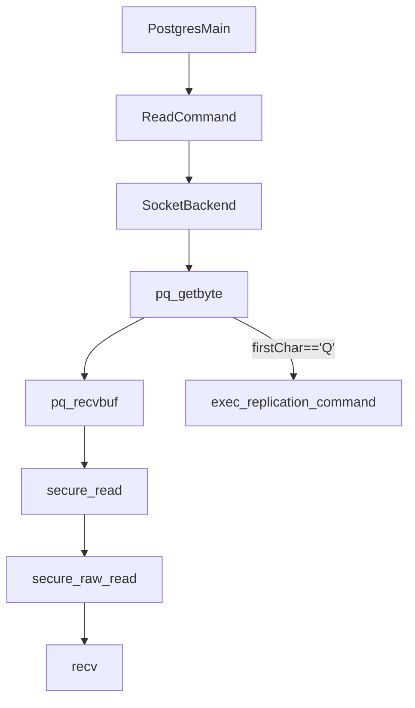
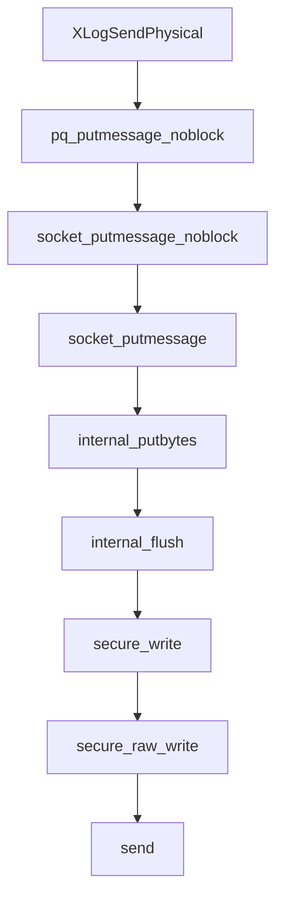
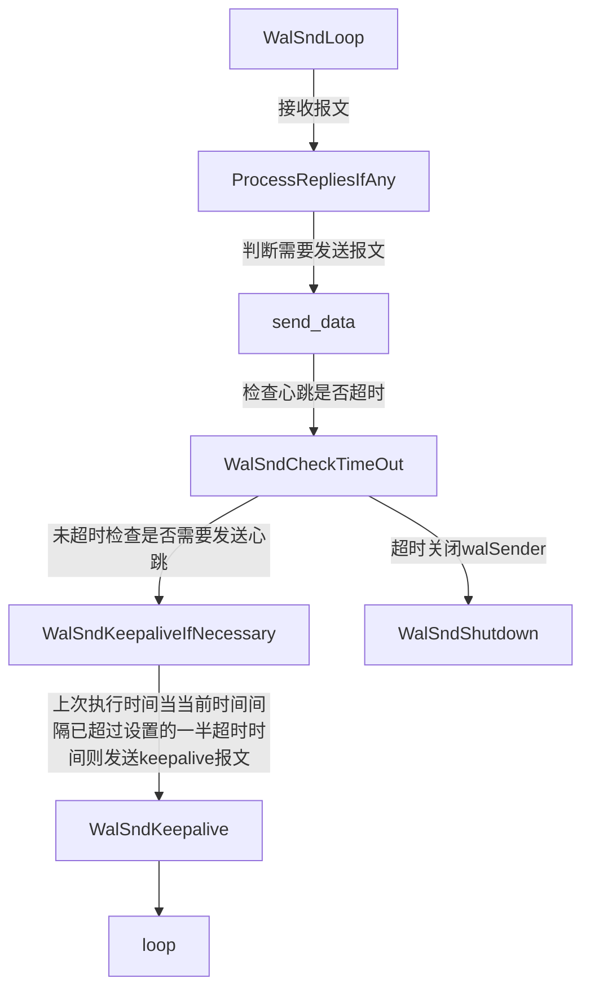
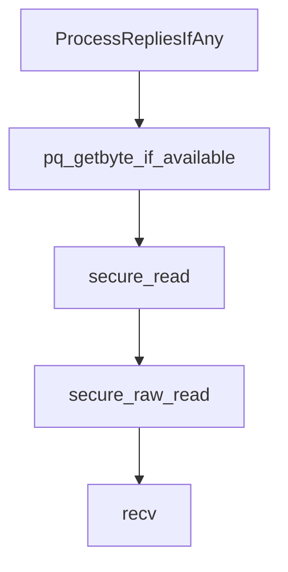
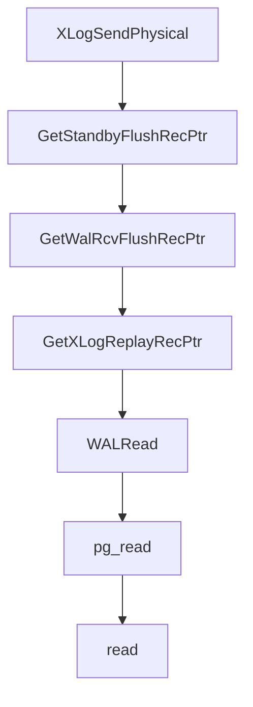

# pg_walsender

walsender分析分为两部分，

- 与备库建立链接前的流程

  主库会监听socket，并接受备库的tcp链接请求，当收到备库walReceiver请求后，主库postgres就会fork出一个waksender进程来处理相关请求。

- 与备库建立链接后的流程

  建立连接后，walsender需要判断发送哪些数据，并启动keepalive机制，探测备库receiver是否正常，同时发送数据。

## 建连前

### 全局变量

```c
/* global state */
extern PGDLLIMPORT bool am_walsender; // 是否是walsender进程
extern PGDLLIMPORT bool am_cascading_walsender; // 是否是级联walsender
extern PGDLLIMPORT bool am_db_walsender; // 是否连接到数据库
extern PGDLLIMPORT bool wake_wal_senders; 

/* user-settable parameters */
extern PGDLLIMPORT int max_wal_senders; // 最大walsender进程数
extern PGDLLIMPORT int wal_sender_timeout; // wal消息发送超时时间
extern PGDLLIMPORT bool log_replication_commands;
```

- am_walsender和am_db_walsender

  解析启动参数replication的值进行赋值，如果replication的值是database或者true就设置这两个值为true。

  ```c
  				if (strcmp(valptr, "database") == 0)
  				{
  					am_walsender = true;
  					am_db_walsender = true;
  				}
  				else if (!parse_bool(valptr, &am_walsender)) {
                      
                  }
  ```

- am_cascading_walsender

  am_cascading_walsender在初始化walSnd的时候赋值。

  ```c
  am_cascading_walsender = RecoveryInProgress();
  ```

  值呢主要来自于全局的LocalRecoveryInProgress，LocalRecoveryInProgress=false时就是false，否则的话就从xlogctl->SharedRecoveryState取值。

  ```c
  LocalRecoveryInProgress = (xlogctl->SharedRecoveryState != RECOVERY_STATE_DONE);
  ```

  

### 对外接口

```c
extern void InitWalSender(void);
extern bool exec_replication_command(const char *query_string);
extern void WalSndErrorCleanup(void);
extern void WalSndResourceCleanup(bool isCommit);
extern void WalSndSignals(void);
extern Size WalSndShmemSize(void);
extern void WalSndShmemInit(void);
extern void WalSndWakeup(void);
extern void WalSndInitStopping(void);
extern void WalSndWaitStopping(void);
extern void HandleWalSndInitStopping(void);
extern void WalSndRqstFileReload(void);
```

- InitWalSender

  初始化一个walSnd。当am_walsender为true的时候，porstgres启动的时候就会初始化一个walSnd。

  ```mermaid
  graph TB
  InitWalSender-->|初始化walSnd|InitWalSenderSlot-->MarkPostmasterChildWalSender-->SendPostmasterSignal-->MemoryContextAllocZero
  ```

  

  初始化slot的时候会将全局的WalSndCtl的walsnds初始化，walsnds是一个变长数组，会根据max_wal_senders进行内存分配和初始化。每个创建的walSnd都会保存到全局的WalSndCtl的数组中。
  
  根据walSnd的pid是否为0来判断是否需要初始化，每个初始化的walSnd的状态为WALSNDSTATE_STARTUP。

### 对内接口

```c
extern void WalSndSetState(WalSndState state);

/*
 * Internal functions for parsing the replication grammar, in repl_gram.y and
 * repl_scanner.l
 */
extern int	replication_yyparse(void);
extern int	replication_yylex(void);
extern void replication_yyerror(const char *str) pg_attribute_noreturn();
extern void replication_scanner_init(const char *query_string);
extern void replication_scanner_finish(void);
extern bool replication_scanner_is_replication_command(void);
```

- WalSndSetState

  用来更改walSnd的状态。

### 数据模型

- walsender状态

```c
typedef enum WalSndState
{
	WALSNDSTATE_STARTUP = 0,
	WALSNDSTATE_BACKUP,
	WALSNDSTATE_CATCHUP,
	WALSNDSTATE_STREAMING,
	WALSNDSTATE_STOPPING
} WalSndState;
```

- walsender 结构

一个进程对应一个walSnd结构。

```c
typedef struct WalSnd
{
	pid_t		pid;			/* this walsender's PID, or 0 if not active */

	WalSndState state;			/* this walsender's state */
	XLogRecPtr	sentPtr;		/* WAL has been sent up to this point */
	bool		needreload;		/* does currently-open file need to be
								 * reloaded? */

	/*
	 * The xlog locations that have been written, flushed, and applied by
	 * standby-side. These may be invalid if the standby-side has not offered
	 * values yet.
	 */
	XLogRecPtr	write;
	XLogRecPtr	flush;
	XLogRecPtr	apply;

	/* Measured lag times, or -1 for unknown/none. */
	TimeOffset	writeLag;
	TimeOffset	flushLag;
	TimeOffset	applyLag;

	/*
	 * The priority order of the standby managed by this WALSender, as listed
	 * in synchronous_standby_names, or 0 if not-listed.
	 */
	int			sync_standby_priority;

	/* Protects shared variables shown above. */
	slock_t		mutex;

	/*
	 * Pointer to the walsender's latch. Used by backends to wake up this
	 * walsender when it has work to do. NULL if the walsender isn't active.
	 */
	Latch	   *latch;

	/*
	 * Timestamp of the last message received from standby.
	 */
	TimestampTz replyTime;
} WalSnd;
```
- WalSndCtlData

```c
typedef struct
{
	/*
	 * Synchronous replication queue with one queue per request type.
	 * Protected by SyncRepLock.
	 */
	SHM_QUEUE	SyncRepQueue[NUM_SYNC_REP_WAIT_MODE];

	/*
	 * Current location of the head of the queue. All waiters should have a
	 * waitLSN that follows this value. Protected by SyncRepLock.
	 */
	XLogRecPtr	lsn[NUM_SYNC_REP_WAIT_MODE];
	
	/*
	 * Are any sync standbys defined?  Waiting backends can't reload the
	 * config file safely, so checkpointer updates this value as needed.
	 * Protected by SyncRepLock.
	 */
	bool		sync_standbys_defined;
	
	WalSnd		walsnds[FLEXIBLE_ARRAY_MEMBER];
} WalSndCtlData;
```

- NodeTag

```c
typedef enum NodeTag {
   .....
       /*
	 * TAGS FOR REPLICATION GRAMMAR PARSE NODES (replnodes.h)
	 */
	T_IdentifySystemCmd,
	T_BaseBackupCmd,
	T_CreateReplicationSlotCmd,
	T_DropReplicationSlotCmd,
	T_ReadReplicationSlotCmd,
	T_StartReplicationCmd,
	T_TimeLineHistoryCmd,
    ......
} NodeTag;
```

- XLogReaderState

  ```c
  typedef uint64 XLogRecPtr;
  struct XLogReaderState
  {
      XLogReaderRoutine routine;
      XLogRecPtr	ReadRecPtr;		/* start of last record read */
  	XLogRecPtr	EndRecPtr;		/* end+1 of last record read */
  }
  ```

  - XLogReaderRoutine

    ```c
    typedef int (*XLogPageReadCB) (XLogReaderState *xlogreader,
    							   XLogRecPtr targetPagePtr,
    							   int reqLen,
    							   XLogRecPtr targetRecPtr,
    							   char *readBuf);
    typedef void (*WALSegmentOpenCB) (XLogReaderState *xlogreader,
    								  XLogSegNo nextSegNo,
    								  TimeLineID *tli_p);
    typedef void (*WALSegmentCloseCB) (XLogReaderState *xlogreader);
    typedef struct XLogReaderRoutine
    {
    	XLogPageReadCB page_read;
    	WALSegmentOpenCB segment_open;
    	WALSegmentCloseCB segment_close;
    } XLogReaderRoutine;
    ```

- XLogRecoveryCtlData

  ```c
  typedef struct XLogRecoveryCtlData
  {
  	bool		SharedHotStandbyActive;
  
  	bool		SharedPromoteIsTriggered;
  
  	Latch		recoveryWakeupLatch;
  
  	/*
  	 * Last record successfully replayed.
  	 */
  	XLogRecPtr	lastReplayedReadRecPtr; /* start position */
  	XLogRecPtr	lastReplayedEndRecPtr;	/* end+1 position */
  	TimeLineID	lastReplayedTLI;	/* timeline */
  
  	XLogRecPtr	replayEndRecPtr;
  	TimeLineID	replayEndTLI;
  	/* timestamp of last COMMIT/ABORT record replayed (or being replayed) */
  	TimestampTz recoveryLastXTime;
  
  	TimestampTz currentChunkStartTime;
  	/* Recovery pause state */
  	RecoveryPauseState recoveryPauseState;
  	ConditionVariable recoveryNotPausedCV;
  
  	slock_t		info_lck;		/* locks shared variables shown above */
  } XLogRecoveryCtlData;
  ```

### 请求接收

postgresmain会监听socket，并接受对端的请求。




### 数据发送 

  数据通过socket接口进行发送，最终数据出口为操作系统提供的socket接口的send函数。

```c
typedef struct
{
	void		(*comm_reset) (void);
	int			(*flush) (void);
	int			(*flush_if_writable) (void);
	bool		(*is_send_pending) (void);
	int			(*putmessage) (char msgtype, const char *s, size_t len);
	void		(*putmessage_noblock) (char msgtype, const char *s, size_t len);
} PQcommMethods;
```

```c
static const PQcommMethods PqCommSocketMethods = {
	socket_comm_reset,
	socket_flush,
	socket_flush_if_writable,
	socket_is_send_pending,
	socket_putmessage,
	socket_putmessage_noblock
};
```

其执行流程如下：



## 建连后

## 基本流程

建立连接后，walsender会进入一个循环中，循环判断是否需要发送数据，是否需要启动心跳机制。

其流程如下：



其中walsender收包的流程如下：



需要特别注意的是recv分为阻塞IO和非阻塞IO，pg使用的是非阻塞IO，收包不会在这里卡住。

### 心跳

心跳主要由以下两个时间来控制：

```c
/* Timestamp of last ProcessRepliesIfAny(). */
static TimestampTz last_processing = 0;

/*
 * Timestamp of last ProcessRepliesIfAny() that saw a reply from the
 * standby. Set to 0 if wal_sender_timeout doesn't need to be active.
 */
static TimestampTz last_reply_timestamp = 0;
```

其中last_reply_timestamp会在进入循环的时候获取当前时间戳，

```c
last_reply_timestamp = GetCurrentTimestamp();
```

在每次sender循环中，都会先检查sender有没有收到receiver发过来的报文，此时在收包前会记下当前的时间戳，并赋值给last_processing。

```c
last_processing = GetCurrentTimestamp();
```

此时会适用recv进行收包，若收到报文类型为'd'和‘c’的报文时，会将是否收到报文的状态量received设置为true。并且若receivede为true，则在收包完成后更新last_reply_timestamp。

```c
	/*
	 * Save the last reply timestamp if we've received at least one reply.
	 */
	if (received)
	{
		last_reply_timestamp = last_processing;
		waiting_for_ping_response = false;
	}
```

当获取到last_processing和last_reply_timestamp时间后，再结合配置wal_send_timeout即可计算sender是否需要关闭，以及计算sender的keepalive发送的时机。

- 是否关闭sender

  通过WalSndCheckTimeOut来检查sender是否超时，其主要判断依据是

  ```c
  	timeout = TimestampTzPlusMilliseconds(last_reply_timestamp,
  										  wal_sender_timeout);
  
  	if (wal_sender_timeout > 0 && last_processing >= timeout)
  	{
  		/*
  		 * Since typically expiration of replication timeout means
  		 * communication problem, we don't send the error message to the
  		 * standby.
  		 */
  		ereport(COMMERROR,
  				(errmsg("terminating walsender process due to replication timeout")));
  
  		WalSndShutdown();
  	}
  ```

  用上一次收到回复的时刻，加上wal_sender_timeout，计算得到一个时间戳timeout，然后看last_processing是否已经超过了timeout。或者说从上次收到回复到当前执行的时间差值是否已经超过了wal_sender_timeout。

- 是否需要发送keepalive

  通过WalSndKeepaliveIfNecessary来检查是否需要发送keepalive报文。其判断逻辑如下：

  ```c
  	/*
  	 * If half of wal_sender_timeout has lapsed without receiving any reply
  	 * from the standby, send a keep-alive message to the standby requesting
  	 * an immediate reply.
  	 */
  	ping_time = TimestampTzPlusMilliseconds(last_reply_timestamp,
  											wal_sender_timeout / 2);
  	if (last_processing >= ping_time)
  	{
  		WalSndKeepalive(true, InvalidXLogRecPtr);
  
  		/* Try to flush pending output to the client */
  		if (pq_flush_if_writable() != 0)
  			WalSndShutdown();
  	}
  ```

  可以看到与超时关闭不同的是，发送心跳报文的判断时间是wal_sender_timeout的一半。

### sender消息处理

walsender收到receiver的消息后，通过消息的第一个字符来处理对应的消息。sender仅处理如下三种类型的报文：

- x

  x表示对端已经关闭了流复制的socket

- d

  d表示的是数据报文。

- c

  c表示的是copydone，表示备机已经完成流式复制，若sender还没有发送数据的话，也需要使用这种类型回复。

### sender消息发送

- 心跳报文

  心跳报文在WalSndKeepalive中发送，其消息格式如下：

  ```c
  	pq_sendbyte(&output_message, 'k');
  	pq_sendint64(&output_message, XLogRecPtrIsInvalid(writePtr) ? sentPtr : writePtr);
  	pq_sendint64(&output_message, GetCurrentTimestamp());
  	pq_sendbyte(&output_message, requestReply ? 1 : 0);
  ```

  第一个字符是'k'，表示心跳报文，然后跟着一个8字节的数据指针和一个8字节的时间戳，最后还有一个字节的是否需要回复标志。

- 数据报文

  ```c
  	pq_sendbyte(&output_message, 'w');
  
  	pq_sendint64(&output_message, startptr);	/* dataStart */
  	pq_sendint64(&output_message, SendRqstPtr); /* walEnd */
  	pq_sendint64(&output_message, 0);	/* sendtime, filled in last */
  ```

#### 逻辑复制


#### 物理复制

物理复制使用XLogSendPhysical进行数据发送。



先找到未同步的起始指针

```c
    receivePtr = GetWalRcvFlushRecPtr(NULL, &receiveTLI);
	replayPtr = GetXLogReplayRecPtr(&replayTLI);

	*tli = replayTLI;

	result = replayPtr;
	if (receiveTLI == replayTLI && receivePtr > replayPtr)
		result = receivePtr;
```


```mermaid
graph TB

```

