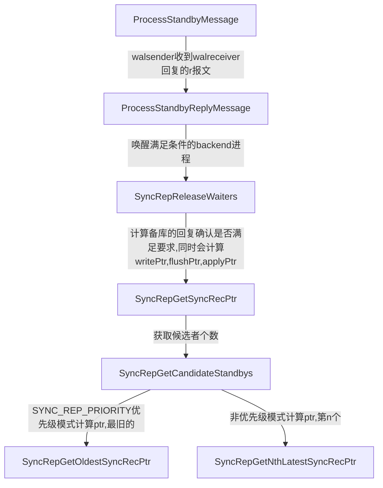

# postgresql流复制同异步分析

postgresql流复制主要是四个进程的交互。

- postgres（backend进程）（主节点）
  
  接受客户端的请求，并通过共享内存等待walsender唤醒。

- walsender（主节点）
  
  向walreceiver发送日志，通过tcp通信，采用流复制协议与walreceiver交互。

- walreceiver（备节点）
  
  向walsender请求日志，并回复wal日志接收，写入，数据apply信息，通过tcp通信，采用流复制协议与walsender通信。

- startup（备节点）
  
  进行日志回放，将wal日志redo成数据，通过共享内存和信号与walreceiver通信。

## 参数

流复制同异步由如下两个参数控制：

- synchronous_commit
  
  用于指定同异步模式。

- synchronous_standby_names
  
  用于指定同步时需要多少备节点确认。

### synchronous_commit

配置解析

```c
{"synchronous_commit", PGC_USERSET, WAL_SETTINGS,
            gettext_noop("Sets the current transaction's synchronization level."),
            NULL
        },
        &synchronous_commit,
        SYNCHRONOUS_COMMIT_ON, synchronous_commit_options,
        NULL, assign_synchronous_commit, NULL
```

```c
static const struct config_enum_entry synchronous_commit_options[] = {
    {"local", SYNCHRONOUS_COMMIT_LOCAL_FLUSH, false},
    {"remote_write", SYNCHRONOUS_COMMIT_REMOTE_WRITE, false},
    {"remote_apply", SYNCHRONOUS_COMMIT_REMOTE_APPLY, false},
    {"on", SYNCHRONOUS_COMMIT_ON, false},
    {"off", SYNCHRONOUS_COMMIT_OFF, false},
    {"true", SYNCHRONOUS_COMMIT_ON, true},
    {"false", SYNCHRONOUS_COMMIT_OFF, true},
    {"yes", SYNCHRONOUS_COMMIT_ON, true},
    {"no", SYNCHRONOUS_COMMIT_OFF, true},
    {"1", SYNCHRONOUS_COMMIT_ON, true},
    {"0", SYNCHRONOUS_COMMIT_OFF, true},
    {NULL, 0, false}
};
```

配置不同的值代表不同的同步模式。

### synchronous_standby_names

配置解析

```c
{
        {"synchronous_standby_names", PGC_SIGHUP, REPLICATION_PRIMARY,
            gettext_noop("Number of synchronous standbys and list of names of potential synchronous ones."),
            NULL,
            GUC_LIST_INPUT
        },
        &SyncRepStandbyNames,
        "",
        check_synchronous_standby_names, assign_synchronous_standby_names, NULL
    },
```

```c
SyncRepConfig = (SyncRepConfigData *) extra;
```

在check_synchronous_standby_names中解析后最终将其赋值给了SyncRepConfig。

synchronous_standby_names可以配置为某个具体的备节点名，也可以配置成any 1(*)的形式。

如

```shell
synchronous_standby_names = 'standby001'
```

或者

```shell
synchronous_standby_names='ANY 1 (*)'
```

### walsender进程处理同步



收到walreceiver的确认报文，walsender需要判断回复的standby个数是否满足配置的要求。SyncRepGetSyncRecPtr中会计算已经回复的standby个数并和配置的值进行比较，若满足则会返回true，否则返回false。

```c
got_recptr = SyncRepGetSyncRecPtr(&writePtr, &flushPtr, &applyPtr, &am_sync);
```

```c
    if (!got_recptr || !am_sync)    { // 若确认的standby个数不足或者不是sync模式直接返回
        LWLockRelease(SyncRepLock);
        announce_next_takeover = !am_sync;
        return;
    }
```

若确认的standby个数不足或者不是sync模式直接返回；

若确认的standby个数满足，且是sync模式，则需要唤醒对应模式的backend进程。

```c
    if (walsndctl->lsn[SYNC_REP_WAIT_WRITE] < writePtr)
    {
        walsndctl->lsn[SYNC_REP_WAIT_WRITE] = writePtr;
        numwrite = SyncRepWakeQueue(false, SYNC_REP_WAIT_WRITE);
    }
    if (walsndctl->lsn[SYNC_REP_WAIT_FLUSH] < flushPtr)
    {
        walsndctl->lsn[SYNC_REP_WAIT_FLUSH] = flushPtr;
        numflush = SyncRepWakeQueue(false, SYNC_REP_WAIT_FLUSH);
    }
    if (walsndctl->lsn[SYNC_REP_WAIT_APPLY] < applyPtr)
    {
        walsndctl->lsn[SYNC_REP_WAIT_APPLY] = applyPtr;
        numapply = SyncRepWakeQueue(false, SYNC_REP_WAIT_APPLY);
    }
```

此时唤醒对应的后端进程后，后端进程将回复客户端。

可以看到，针对不同的同步模式，唤醒后端进程采用的是不同的lsn指针。

```c
    switch (newval)
    {
        // 备库接收到wal日志并写入缓存
        case SYNCHRONOUS_COMMIT_REMOTE_WRITE:
            SyncRepWaitMode = SYNC_REP_WAIT_WRITE;
            break;
        // 备库接收到日志并写入磁盘
        case SYNCHRONOUS_COMMIT_REMOTE_FLUSH:
            SyncRepWaitMode = SYNC_REP_WAIT_FLUSH;
            break;
        // 备库接收到日志写入磁盘并且redo数据也写到磁盘
        case SYNCHRONOUS_COMMIT_REMOTE_APPLY:
            SyncRepWaitMode = SYNC_REP_WAIT_APPLY;
            break;
        default:
            SyncRepWaitMode = SYNC_REP_NO_WAIT;
            break;
    }
```

对于SYNC_REP_WAIT_WRITE，使用的是writePtr唤醒后端进程。

对于SYNC_REP_WAIT_FLUSH，使用的是flushPtr唤醒后端进程。

对于SYNC_REP_WAIT_APPLY，使用的是applyPtr唤醒后端进程。
