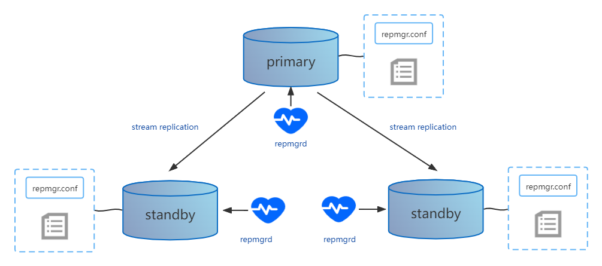

# repmgr

repmgr用于管理 PostgreSQL 服务器集群内的复制和故障转移。repmgr 支持并增强了 PostgreSQL 的内置流复制，它提供了一个单一的读/写主服务器和一个或多个只读备用服务器。

repmgr 流复制管理工具对 PostgreSQL 集群节点的管理是基于分布式的管理方式。集群每个节点都具备一个 repmgr.conf 配置文件，用来记录本节点的 ID、节点名称、连接信息、数据库的 PGDATA 目录等配置参数。在完成参数配置后，就可以通过 repmgr 命令实现对集群节点的 “**一键式**” 部署。

其架构如下图

集群节点部署完成后，每个节点都可通过 repmgrd 守护进程来监控节点数据库状态；每个节点元数据表可独立维护，这些元数据表将记录所有集群节点的信息。

## repmgr 节点分类

## repmgr 选举原理

## repmgr工具

repmgr主要由两个执行程序组成，一个为repmgr，另一个repmgrd。

- repmgr

  repmgr 是一个执行管理任务的命令行工具，方便进行 PostgreSQL 服务器集群的管理。具备以下功能特点：

  - 主从切换
  - 设置备用服务器
  - promote设备
  - 显示复制集群中服务器状态

- repmgrd

  repmgrd 是一个守护进程，它主动监视复制集群中的服务器并支持以下任务：

  - 记录和监控复制集群信息
  - 故障检查和故障转移
  - 集群事件通知

## repmgr扩展

为了有效地管理复制集群，repmgr 需要将集群中节点的相关信息存储在 repmgr 专用数据库表中。此架构由 repmgr 扩展自动创建，该扩展在初始化由 repmgr 管理的集群（repmgr primary register）的第一步中安装，并包含以下对象：

- Tables：
  - `repmgr.events`: records events of interest
  - `repmgr.nodes`: 复制集群中每个节点的连接和状态信息
  - `repmgr.monitoring_history`: repmgrd 写入的历史备用监控信息
- Views：
  - `repmgr.show_nodes`: 基于 `repmgr.nodes` 表，另外显示服务器上游节点的名称
  - `repmgr.replication_status`: 当启用 repmgrd 的监控时，显示每个 standby 的监控状态。repmgr 元数据信息可以存储在已有的数据库或在自己的专用数据库。

# reference

1. http://www.it120.vip/yq/6164.html
2. https://blog.csdn.net/zhaowenzhong/article/details/80774466