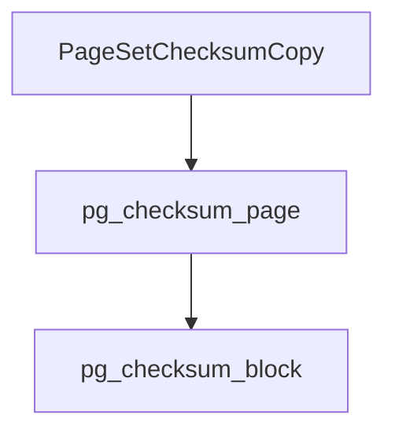
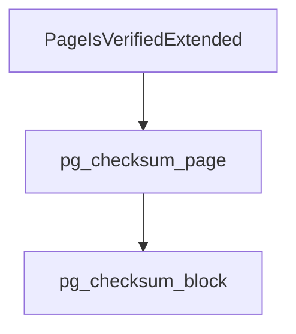

# pg_checksum

pg在将数据写入磁盘时才会进行checksum的计算写入。

## 写入流程



```c
char *
PageSetChecksumCopy(Page page, BlockNumber blkno)
{
	static char *pageCopy = NULL;

	/* If we don't need a checksum, just return the passed-in data */
	if (PageIsNew(page) || !DataChecksumsEnabled()) // 新页或者是未开启checksum直接返回
		return (char *) page;

	/*
	 * We allocate the copy space once and use it over on each subsequent
	 * call.  The point of palloc'ing here, rather than having a static char
	 * array, is first to ensure adequate alignment for the checksumming code
	 * and second to avoid wasting space in processes that never call this.
	 */
	if (pageCopy == NULL)
		pageCopy = MemoryContextAlloc(TopMemoryContext, BLCKSZ);
	
    // 将页拷贝一份
	memcpy(pageCopy, (char *) page, BLCKSZ);
	((PageHeader) pageCopy)->pd_checksum = pg_checksum_page(pageCopy, blkno);
	return pageCopy;
}
```

## 检测



```c
```

