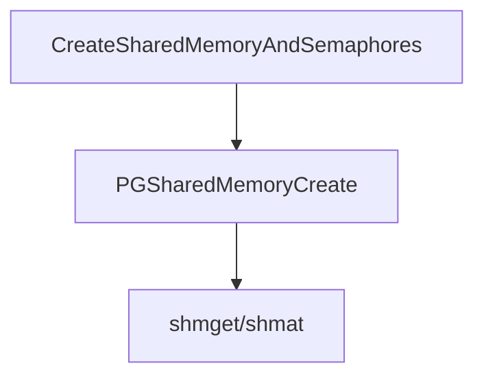
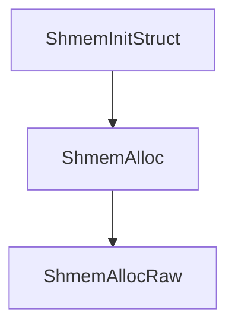

# pg共享内存

## 基本数据结构

- PGShmemHeader

```c
typedef struct PGShmemHeader	/* standard header for all Postgres shmem */
{
	int32		magic;			/* magic # to identify Postgres segments */
#define PGShmemMagic  679834894
	pid_t		creatorPID;		/* PID of creating process (set but unread) */
	Size		totalsize;		/* total size of segment */
	Size		freeoffset;		/* offset to first free space */
	dsm_handle	dsm_control;	/* ID of dynamic shared memory control seg */
	void	   *index;			/* pointer to ShmemIndex table */
#ifndef WIN32					/* Windows doesn't have useful inode#s */
	dev_t		device;			/* device data directory is on */
	ino_t		inode;			/* inode number of data directory */
#endif
} PGShmemHeader;
```

- ShmemIndexEnt

```c
/* this is a hash bucket in the shmem index table */
typedef struct
{
	char		key[SHMEM_INDEX_KEYSIZE];	/* string name */
	void	   *location;		/* location in shared mem */
	Size		size;			/* # bytes requested for the structure */
	Size		allocated_size; /* # bytes actually allocated */
} ShmemIndexEnt;
```


## 初始化

- 全局变量

```c
static HTAB *ShmemIndex = NULL; /* primary index hashtable for shmem */
```





## 处理逻辑




## 对外接口

