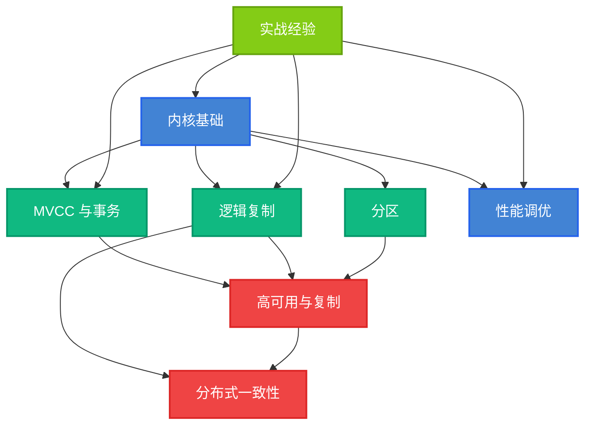

# 数据库专题

> 数据库内核是计算机系统软件中最复杂的领域之一。本专题收录我在 PostgreSQL / openGauss 内核开发、分布式一致性（Raft / DCF）、逻辑解码与双向同步、存储引擎等方向的实战笔记与源码解读，希望对同样走在这条路上的同行有所启发。

作为长期在 PostgreSQL 与 openGauss 内核一线搬砖的工程师，我日常的工作内容大致涵盖：**内核源码阅读与 Bug 定位**、**新特性设计（如 DDL-Replay 双向同步）**、**分布式一致性模块开发（DCF / Raft）**、**性能调优与故障排查**。下面把博客里相关的文章按主题串成一张导览图，方便按需取用。

## 主题导览图

下面这张关系图勾勒了数据库内核的八大主题及其依赖关系：内核基础是底盘，向上分支出 MVCC/事务、逻辑复制、分区与性能调优；这些基础模块共同支撑高可用与复制，并最终汇聚到分布式一致性这一最高层。点击下方任一主题卡片，可直接进入对应主题的全部文章列表。

## 主题卡片矩阵

下面每个卡片对应一个数据库内核主题。卡片显示主题简介、文章总数和最近 5 篇文章；点击主题名或卡片可进入 `/tags/<主题>/` 自动聚合页。新增文章只需在 `tools/sync-hexo.py` 的 `TOPIC_RULES` 中加入匹配规则，文章就会出现在对应主题卡片里，无需手动维护本页。

<!-- DATABASE_TOPICS_START -->
<!-- DATABASE_TOPICS_END -->

## 全部文章（按时间倒序）

下面这个列表是数据库分类下所有文章的平铺时间线，与上面卡片矩阵的数据源相同，但作为兜底展示。新增章节时，只需在目录的 `cascade.categories` 中加入"数据库"，无需再手工维护本页链接。

<!-- DATABASE_POSTS_START -->
<!-- DATABASE_POSTS_END -->

## 核心技术栈

  

    
PostgreSQL 内核

    

    
进程模型 · 存储引擎 · WAL · 复制 · 执行器 · MVCC

  

  

    
openGauss / DCF

    

    
分布式一致性 · 日志复制 · 投票机制 · 网络模块

  

  

    
分布式协议

    

    
Raft · 多数派 · Quorum 动态调整 · Leader 选举

  

  

    
逻辑解码与双向同步

    

    
pgoutput · pglogical · DDL-Replay · 跨版本迁移

  

  

    
多数据库架构对比

    

    
PostgreSQL / MySQL / SQLServer / TDengine 横向评测

  

  

    
性能调优与故障排查

    

    
Checkpoint · WAL · 锁等待 · 慢 SQL · 崩溃恢复

  

## 学习路径建议

如果你刚接触数据库内核开发，建议按下面这条路线循序渐进，每一档都附上对应的站内文章入口：

1. **入门**：[PostgreSQL 基操](/categories/PostgreSQL/) → [源码编译](/2023/09/14/pgsql/postgresql源码编译/) → [启动流程](/2023/05/17/pgsql/postgresql启动流程/)。先把一份能跑、能断点的内核源码环境搭起来。
2. **存储与 WAL**：[FSM 文件解析](/2024/02/21/pgsql/storage/PosgreSQL%20FSM%E6%96%87%E4%BB%B6%E8%A7%A3%E6%9E%90%20%E2%80%93%20%E8%9B%8B%E6%8C%9E/) → [full_page_writes](/2022/06/13/pgsql/storage/full_page_writes/) → [WAL 机制浅析](/2023/05/17/pgsql/wal机制浅析/) → [崩溃恢复](/2023/05/17/pgsql/数据库崩溃恢复/)。理解"数据页 + WAL + 检查点"这一数据库的基石三角。
3. **进程与执行器**：[BgWriter](/2022/04/22/pgsql/process/BgWriter/) → [Checkpoint](/2022/04/25/pgsql/process/Checkpoint/) → [WalWriter](/2022/04/22/pgsql/process/WalWriter/) → [insert 语句执行过程](/2023/05/17/pgsql/executor/PostgreSQL%E7%9A%84insert%E8%AF%AD%E5%8F%A5%E6%89%A7%E8%A1%8C%E8%BF%87%E7%A8%8B%E5%88%86%E6%9E%90%20-%20%E5%A2%A8%E5%A4%A9%E8%BD%AE/)。把后台进程和查询执行的主干打通。
4. **复制与高可用**：[流复制与 WAL 日志](/2024/02/06/pgsql/postgresql%E2%80%94%E2%80%94%E6%B5%81%E5%A4%8D%E5%88%B6%E5%92%8Cwal%E6%97%A5%E5%BF%97%EF%BC%88%E5%85%AB%EF%BC%89/) → [同步流复制原理](/2023/05/17/pgsql/replication/PostgreSQL%20%E5%90%8C%E6%AD%A5%E6%B5%81%E5%A4%8D%E5%88%B6%E5%8E%9F%E7%90%86%E5%92%8C%E4%BB%A3%E7%A0%81%E6%B5%85%E6%9E%90-%E9%98%BF%E9%87%8C%E4%BA%91%E5%BC%80%E5%8F%91%E8%80%85%E7%A4%BE%E5%8C%BA/) → [WalReceiver / WalSender 交互](/2023/05/17/pgsql/replication/PostgreSQL%E6%95%B0%E6%8D%AE%E5%BA%93%E5%A4%8D%E5%88%B6%E2%80%94%E2%80%94%E5%90%8E%E5%8F%B0%E4%B8%80%E7%AD%89%E5%85%AC%E6%B0%91%E8%BF%9B%E7%A8%8BWalReceiver&startup%E4%BA%A4%E4%BA%92_postgressql%20walreceive%E7%BA%BF%E7%A8%8B_%E8%82%A5%E5%8F%94%E8%8F%8C%E7%9A%84%E5%8D%9A%E5%AE%A2-CSDN%E5%8D%9A%E5%AE%A2/) → [repmgr 实现原理](/2024/02/19/pgsql/ha/repmgr实现原理/) → [伪双写](/2026/01/15/cluster/postgresql/postgresql伪双写/)。
5. **事务与并发控制**：[事务管理](/2026/03/03/cluster/postgresql/事务管理/) → [并发控制](/2022/04/13/pgsql/pgsql_main_structure/) → [MVCC 源码解读](/2022/04/13/pgsql/pgsql_main_structure/) → [锁等待排查](/2022/04/13/pgsql/pgsql_main_structure/)。
6. **逻辑解码与双向同步**：[逻辑复制源码分析](/2026/04/14/db/logical_decode/逻辑复制源码分析/) → [PG15 逻辑复制支持 DDL](/2026/03/11/db/logical_decode/pg15逻辑复制支持DDL/) → [pglogical 详解](/2026/03/06/db/logical_decode/pglogical详解/) → [DDL-Replay 框架设计](/2026/07/27/db/logical_decode/逻辑解码DDL-Replay框架设计/) → [AI 逻辑解码](/2026/03/06/db/logical_decode/ai逻辑解码/)。
7. **分布式一致性**：[Raft 重要概念](/2023/05/17/cluster/raft/raft重要概念/) → [一文读懂 openGauss DCF 网络模块](/2023/05/26/cluster/DCF/一文读懂openguass%20dcf网络模块/) → [DCF 投票系统详解](/2023/05/22/cluster/DCF/dcf投票系统详解/) → [DCF 运行机制](/2023/12/23/cluster/DCF/dcf运行机制/) → [DCF 写入机制](/2023/05/22/cluster/DCF/dcf写入机制/) → [Raft 协议动态调整 quorum](/2022/10/25/cluster/raft/raft协议动态调整quorum/)。

## 实战经验沉淀

- **内核 Bug 定位**：熟悉 gdb / perf / bpftrace 的组合用法，能从 panic 日志反推到具体的代码行。
- **性能优化**：在 openGauss 内核侧主导过 WAL 写入路径优化、复制槽回收策略改造等专项，单节点写入吞吐有数倍提升。
- **架构设计**：完整设计过一套基于 DCF 的两地三中心高可用方案，覆盖网络分区、脑裂、自动切换、降级运行等场景。

## 推荐阅读顺序

如果你只想读 5 篇文章理解数据库内核的脉络，我会推荐：

1. [PostgreSQL 主结构](/2022/04/13/pgsql/pgsql_main_structure/)
2. [WAL 机制浅析](/2023/05/17/pgsql/wal机制浅析/)
3. [PostgreSQL 流复制与 WAL 日志](/2024/02/06/pgsql/postgresql%E2%80%94%E2%80%94%E6%B5%81%E5%A4%8D%E5%88%B6%E5%92%8Cwal%E6%97%A5%E5%BF%97%EF%BC%88%E5%85%AB%EF%BC%89/)
4. [一文读懂 openGauss DCF 网络模块](/2023/05/26/cluster/DCF/一文读懂openguass%20dcf网络模块/)
5. [逻辑解码 DDL-Replay 框架设计](/2026/07/27/db/logical_decode/逻辑解码DDL-Replay框架设计/)

这五篇涵盖了存储、复制、分布式一致性与逻辑同步四条主线，足以勾勒出数据库内核的整体图景。

## 写在最后

数据库内核开发是一个"慢就是快"的领域：每一次对一行代码的深入理解，最终都会在某个深夜的故障排查里兑现回报。本专题会持续更新，把每一段新的源码阅读笔记、每一次新的故障复盘都沉淀下来。也欢迎通过 [GitHub](https://github.com/growdu) 与我交流。
