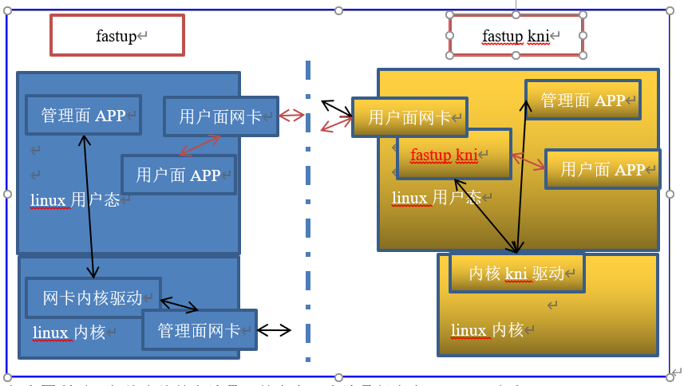
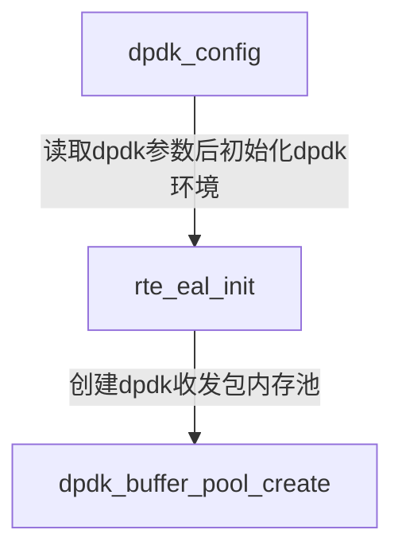
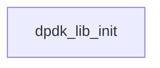
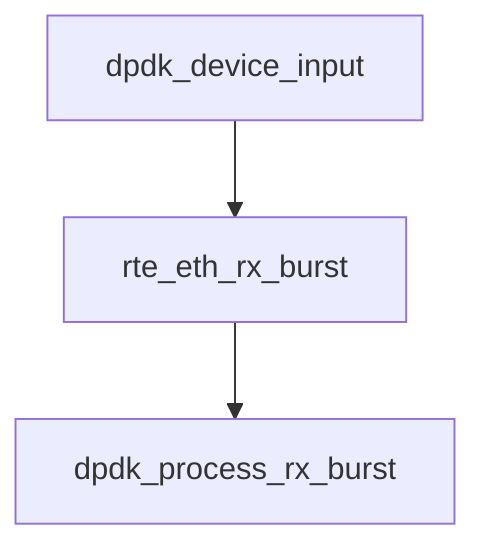
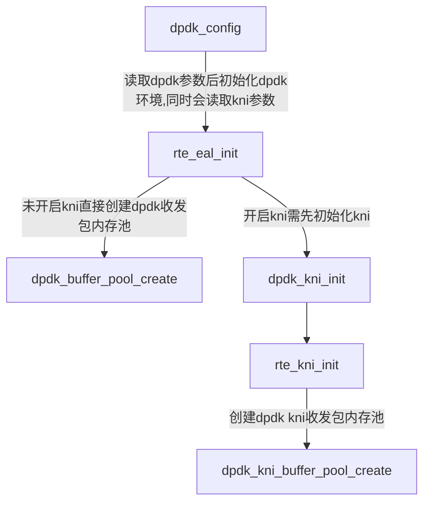
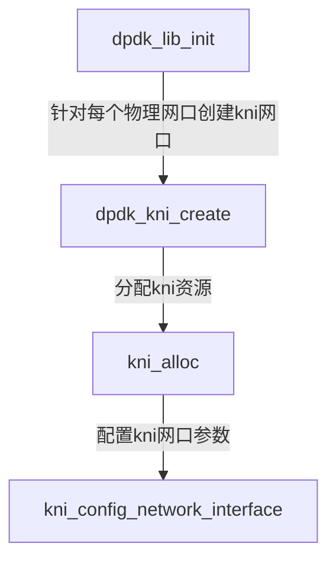
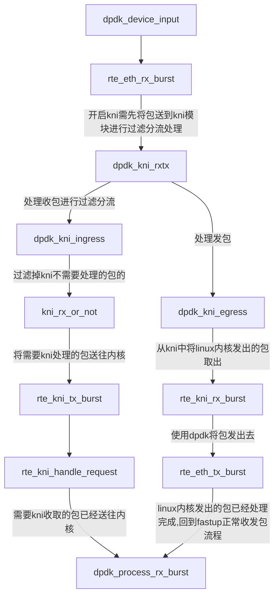
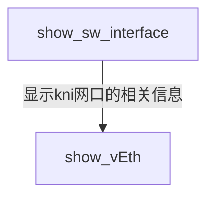

# fastup kni设计实现说明文档

## 背景

当前5G小基站CDU控制面和数据面需要使用两个网口与核心网进行通信。但对于CDU而言，控制面数据量较小，且属于突发性流量；而数据面数据量较大，为持续性流量。相对于数据面来说，控制面流量几乎可以忽略不计。在当前设计中，控制面却需要占用一张网卡，这带来了巨大的资源消耗和维护成本。

因而需要将控制面的数据转移到数据面网口上来跑，但当前数据面网口为了提升性能使用了DPDK进行收发包，旁路了内核，网口收到的包无法到达内核。同时fastup未实现完整的协议栈，无法支持全部的控制面协议。在这样的背景下，就需要寻求一种能对基于DPDK收发包的网口进行分流的能力，将控制面的报文交给内核协议栈来处理；而数据面的报文交由fastup处理的。

dpdk中的kni功能就是为了对dpdk网口进行分流而设计的，kni全称kernel network interface，用于将dpdk网口收到包转发到内核，交由内核协议栈处理。

## fastup kni设计原则

fastup kni实现需满足以下要求：

1. 对网口收到的数据进行分流，控制面交由内核处理，数据面交由fastup处理；
2. 设计分流规则，识别控制面和数据面；
3. 支持kni与非kni切换，即fastup kni需与原fastup适配，且不能影响原fastup功能；

fastup和fastup kni的功能流程如下图所示。



其中管理面即上文中提到的信令面，用户面即上文中提到的数据面。

## fastup kni代码流程图

fastup当前基于dpdk收发包未适配kni功能，需在fastup的dpdk插件中适配kni。

### fastup dpdk插件流程

#### 配置初始化



#### 加载网口




#### 收发包



#### cli


### fastup kni dpdk插件流程

#### 配置初始化



fastup配置文件本身预留了kni的配置项，只是未将其实现。fastup kni会使用该配置项以对fastup进行兼容。具体配置项为在startup.conf配置文件的dpdk模块添加如下内容：

```shell
kni 1 # 1表示kni网口的个数，无法创建超过物理网口个数的kni网口
```

比如：

```shell
dpdk {
	kni 1 # 1表示kni网口的个数，无法创建超过物理网口个数的kni网口
}
```


#### 加载网口




#### 网卡收发包



#### cli




## fastup kni实现

### 配置

兼容fastup配置，同时与vpp的配置文档中保持一致（虽然vpp中有kni相关配置，但vpp未实现kni适配）。

### 分流

分流采用注册机制，支持在代码层面更换分流策略，当前分流策略配置接口还未添加。但保留了代码层面接口，后续添加分流策略配置只需做上层配置，对底层功能没有影响。

### 查询

兼容原有fastup cli配置，且虚拟出的kni网口支持操作系统下的ifconfig、ethtool命令行。

## fastup kni功能描述

- fastup kni支持在同一张网卡上既跑内核协议栈，又跑用户态协议栈
- fastup kni支持同一台机器上一张网卡跑双栈（内核协议栈+用户态协议栈），另一张网口跑单栈（仅跑内核协议栈或用户态协议栈）
- fastup kni支持kni功能开启和关闭，开启或关闭kni功能需重启fastup
- fastup双栈需使用相同的mac地址，ip可不同，当ip不同时仅内核栈ip可以ping通
