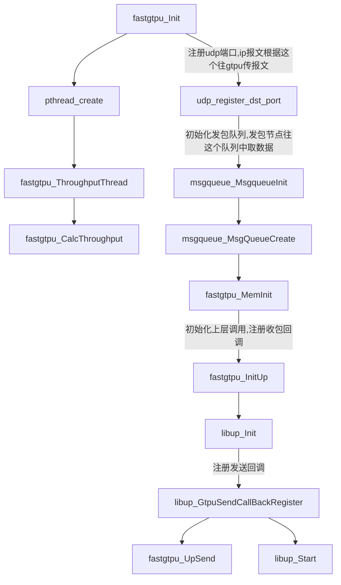
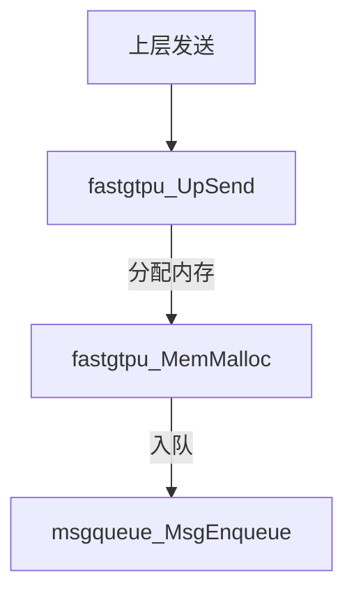
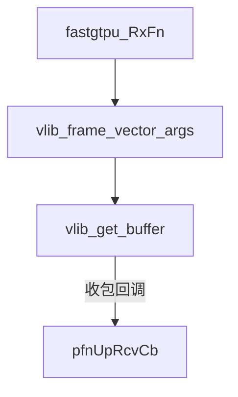
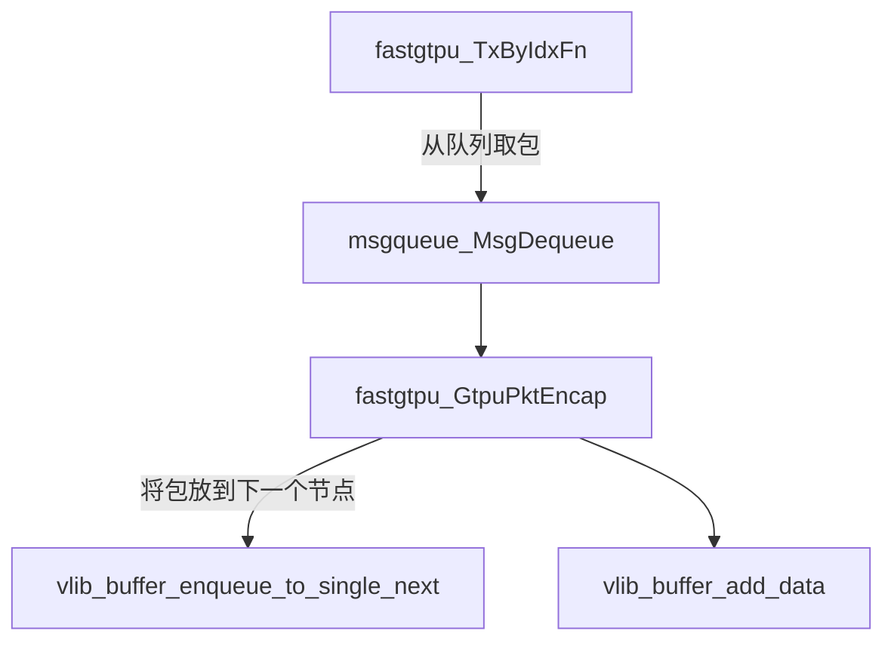

# fastgtpu插件加载

## 初始化

```c
VLIB_INIT_FUNCTION(fastgtpu_Init);
```


```mermaid
graph TB
fastgtpu_Init-->pthread_create-->fastgtpu_ThroughputThread-->fastgtpu_CalcThroughput
fastgtpu_Init-->|注册udp端口,ip报文根据这个往gtpu传报文|udp_register_dst_port-->|初始化发包队列,发包节点往这个队列中取数据|msgqueue_MsgqueueInit-->msgqueue_MsgQueueCreate-->fastgtpu_MemInit-->|初始化上层调用,注册收包回调|fastgtpu_InitUp-->libup_Init-->|注册发送回调|libup_GtpuSendCallBackRegister-->fastgtpu_UpSend
libup_GtpuSendCallBackRegister-->libup_Start
```


```mermaid
graph TB
上层发送-->fastgtpu_UpSend-->|分配内存|fastgtpu_MemMalloc-->|入队|msgqueue_MsgEnqueue
```

## 收包

```c
VLIB_REGISTER_NODE (g_stFastgtpuRxNode)
```


```mermaid
graph TB
fastgtpu_RxFn-->vlib_frame_vector_args-->vlib_get_buffer-->|收包回调|pfnUpRcvCb
```


## 发包

```c
VLIB_REGISTER_NODE (g_stFastgtpuTxNode)
```


```mermaid
graph TB
fastgtpu_TxByIdxFn-->|从队列取包|msgqueue_MsgDequeue-->fastgtpu_GtpuPktEncap-->|将包放到下一个节点|vlib_buffer_enqueue_to_single_next
fastgtpu_GtpuPktEncap-->vlib_buffer_add_data
```

