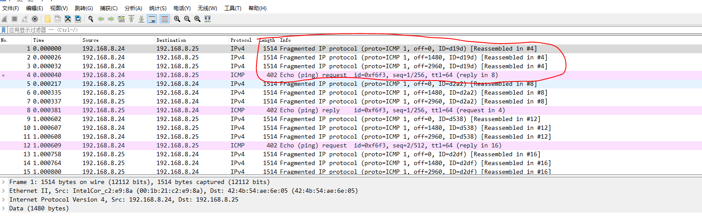
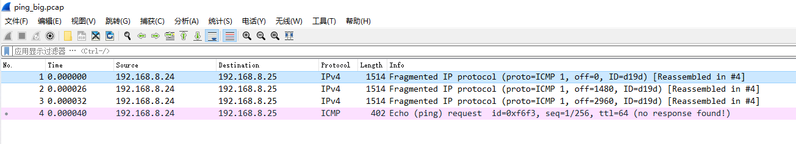
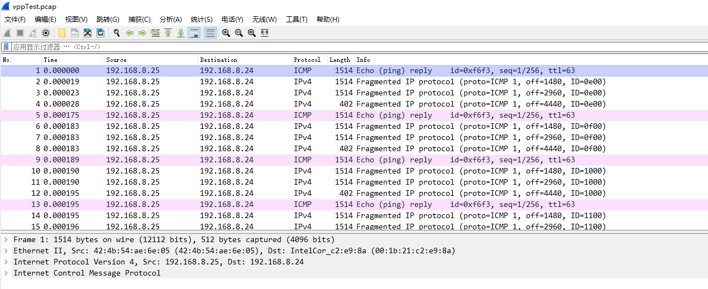

# fastup ip分片测试验证

fastup后续需考虑大包，会涉及到ip分片，需要分析验证fastup是否支持分片报文重组，以及大包分片发送。

## 构造分片报文

构造简单的ping报文作为大包发送。使用两张直连的网口配置ip抓取ping包，具体步骤如下：

### ip配置

- nxp网口

```shell
ifconfig eth3 192.168.8.25/16
```

- x86端

```shell
ifconfig p4p1 192.168.8.24/16
```

## ping大包

此处使用4800byte长度的ping报文。

```shell
ping -s 4800 192.168.8.25
```

### 抓包

在x86端进行抓包，抓包命令如下

```shell
tcpdump -i p4p1 -vvv icmp -w ping_big.pcap
```

抓到包后，因为报文中含有对端回复的报文，因而需要将抓到的包进行过滤。



上图中的4个报文为一个icmp报文的ping request，将这4个报文提取出来作为我们回放的报文。最终提取出来的报文如下：



## 回放分片报文

回放分片报文还是和正常fastup测试情况一致，NXP端启动fastup，配置ip为192.168.8.25/16作为接收端。x86机器作为发送端回放上文中抓取到的报文。

```shell
./app/x86_64-native-linuxapp-gcc/pktgen -c 0xe0000 --socket-mem 1024 -n 2 -- -P -m [18:19].0 -s 0:ping_big.pcap -T --crc-strip
```

<font color="red">需要特别注意的是，为了保证收到报文的完整性，需要设置pktgen的发送模式为发包个数，且发包个数需为4的整数倍，否则会导致发送异常报文。</font>

## 抓包验证

因为两端都使用dpdk收发包，无法直接使用tcpdump抓包，利用fastup的trace功能抓包进行验证。抓包命令如下：

```shell
# 查看tx 抓包状态
vpp# pcap tx trace status
max is 100 for any interface to file /tmp/vpe.pcap
pcap tx capture is off...
# 开启抓包
# max 1000指定最多抓取1000个报文
# intfc intface_name 指定抓取的网口
# file vppTest.pcap指定抓包文件保存时的文件名，最终会保存在/tmp目录下
vpp# pcap tx trace on max 1000 intfc intface_name file vppTest.pcap
# 设置好后再查看一下tx的抓包状态
vpp# pcap tx trace status
max is 1000 for interface local0 to file /tmp/vppTest.pcap
pcap tx capture is on: 48 of 1000 pkts..
# 运行一段时间后，有报文收发即可停止抓包
vpp# pcap tx trace off
captured 48 pkts...
saved to /tmp/vppTest.pcap...
```

实际抓包结果如下图：



## 结论

<font color="red">经过测试验证，fastup支持ip分片组包。</font>