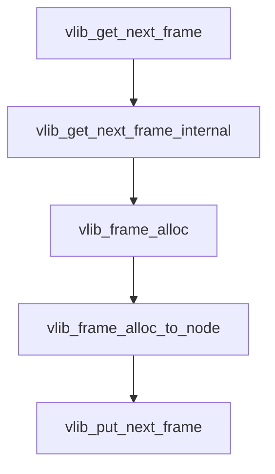

# vpp 主要数据结构

- vlib_main_t

  vpp最顶层结构，其中包含了vpp执行的绝大部分信息，后续注册加载都是填充该数据结构。执行都需要从该数据结构中获取相关信息。

  其中节点存在node_main中，即：

  ```c
  /* Node graph main structure. */
  vlib_node_main_t node_main;
  ```

- vlib_node_main_t

  存放节点图。其中节点实际存放位置为：

  ```c
  /* Public nodes. */
  vlib_node_t **nodes; // 存储非VLIB_NODE_TYPE_PROCESS节点
  
  /* Vector of process nodes.
       One for each node of type VLIB_NODE_TYPE_PROCESS. */
  vlib_process_t **processes; // 存储VLIB_NODE_TYPE_PROCESS节点
  
  /* Node index hashed by node name. */
  uword *node_by_name; // 根据名字取节点
  
  /* Nodes segregated by type for cache locality.
       Does not apply to nodes of type VLIB_NODE_TYPE_INTERNAL. */
  vlib_node_runtime_t *nodes_by_type[VLIB_N_NODE_TYPE]; // 存放各节点对应的runtime
  ```

- vlib_process_t

  存放VLIB_NODE_TYPE_PROCESS类型的节点的信息。

  ```c
   /* Node runtime for this process. */
    vlib_node_runtime_t node_runtime;
  ```

- vlib_node_t

  ```c
  /* Vector processing function for this node. */
  vlib_node_function_t *function;
  
   /* Index of corresponding node runtime. */
   u32 runtime_index; // 对于VLIB_NODE_TYPE_PROCESS节点是在vlib_node_main_t的proceses中的索引
  					// 对于非VLIB_NODE_TYPE_PROCESS节点是在vlib_node_main_t的nodes中的索引
  ```

- vlib_node_runtime_t

  调度框架实际频繁使用的结构，从vlib_node_t拷贝了部分信息，以及私有的频繁变动的信息。

- vlib_frame_t

  每个node都有一个对应的vlib_frame_t，用来保存供node使用的数据包集合。这是每个node最终处理数据的内存所在地。

  ```c
    /* Frame flags. */
    u16 frame_flags;
  
    /* User flags. Used for sending hints to the next node. */
    u16 flags;
  
    /* Number of scalar bytes in arguments. */
    u8 scalar_size;
   
    /* Number of bytes per vector argument. */
    u8 vector_size;
  
    /* Number of vector elements currently in frame. */
    u16 n_vectors;
  
  /* Scalar and vector arguments to next node. */
    u8 arguments[0];
  ```

- vlib_pending_frame_t

  当一个node处理完数据包，则填充该数据结构，并加入到全局链表，调度框架便能在下一次调度时找到需要 接手该数据包的下一个node 

  ```c
  /* A frame pending dispatch by main loop. */
  typedef struct
  {
    /* Node and runtime for this frame. */
    u32 node_runtime_index;
  
    /* Frame index (in the heap). */
    u32 frame_index;
      /* Start of next frames for this node. */
    u32 next_frame_index;
  
    /* Special value for next_frame_index when there is no next frame. */
  #define VLIB_PENDING_FRAME_NO_NEXT_FRAME ((u32) ~0)
  } vlib_pending_frame_t;
  ```

  

- vlib_next_frame_t

  主要是node内部逻辑使用，定位该node的下一条信息。

  ```c
  /* Frame index. */
    u32 frame_index;
  
    /* Node runtime for this next. */
    u32 node_runtime_index;
  
    /* Next frame flags. */
    u32 flags;
  
   /* Number of vectors enqueue to this next since last overflow. */
    u32 vectors_since_last_overflow;
  ```

## 报文流转

报文处理主要包含如下三个方面：

- 存储节点
- 存储报文
- 报文传送

报文流转的流程如下：

1. 确定报文发送给哪个孩子节点

   确定把报文送给哪个孩子节点处理，是由该 node 的业务逻辑决定的，通常有两种方式：一是通过解析报文的内容来决定，比如 ethernet-input 节点通过解析报文是 ipv4 还是 ipv6 报文把报文发送给ip4-input 或 ip6-input 去处理；二是通过查找转发表来决定，比如 ip4-lookup 通过查找路由表来决定
   把报文发送给 ip4-arp 还是 ip4-rewrite 节点来处理。

2. 找到孩子节点对应的用于存放报文的结构vlib_frame_t

   确定把报文发送给第几个孩子节点之后，就可以获取该孩子节点对应的 vlib_next_frame_t 结构了。vlib_next_frame_t 结构中的 frame_index 字段指向vlib_frame_t 结构，vlib_frame_t 结构是存放报文的地方

3. 把报文放入vlib_frame_t结构

   vlib_frame_t 结构最后一个字段为可变数组，初始化的时候会分配一块内存，用于存放报文的索引。

4.  创建 vlib_pending_frame_t 结构，并把它加入数组 vm->node_main. pending_frames 等待调度

   vlib_pending_frame_t 结构记录报文所在的结构 vlib_next_frame_t 的 index，以及处理这些报文的node 的 vlib_node_runtime_t 结构的索引，这样通过 vlib_pending_frame_t 结构里面的信息就可以把报文分发给指定的 node 处理了



