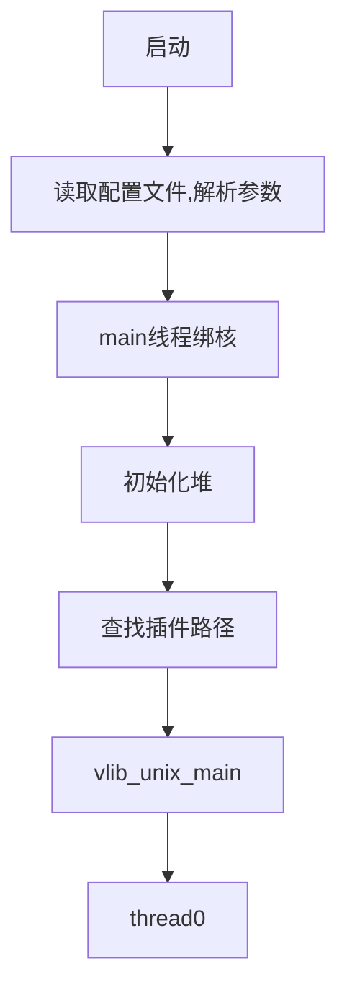
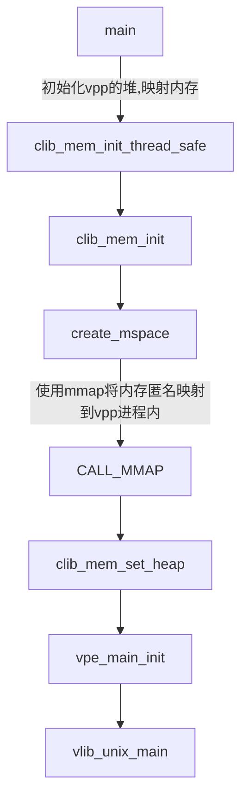
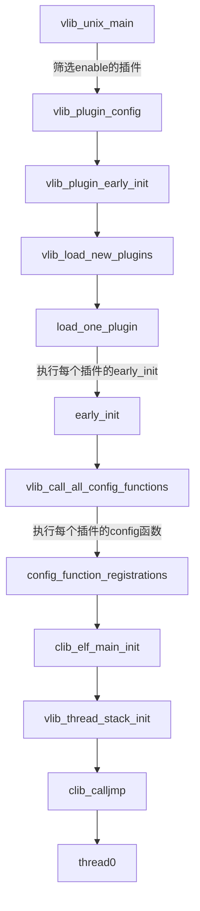
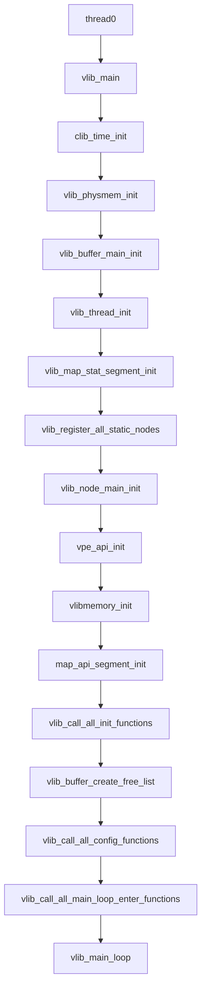
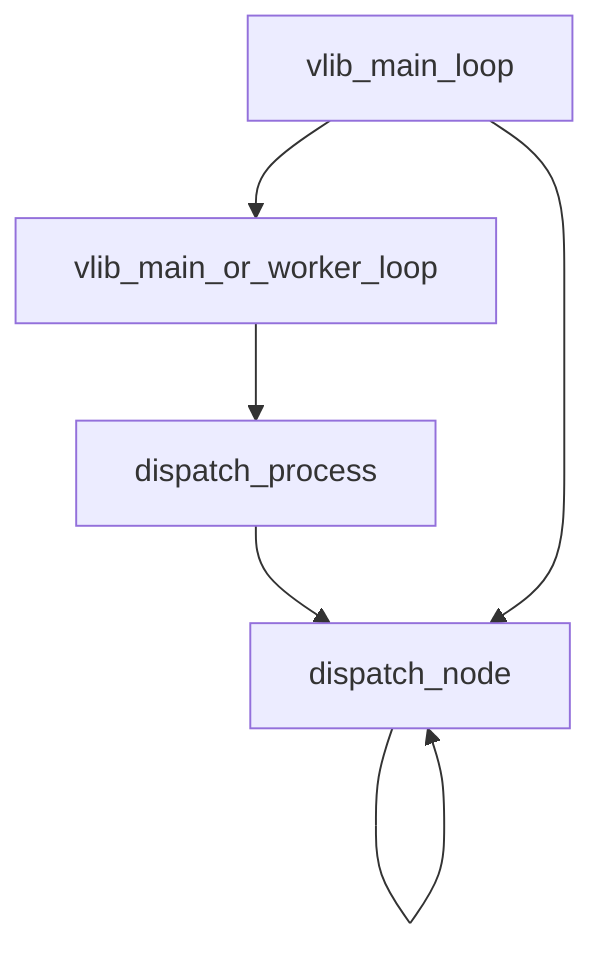
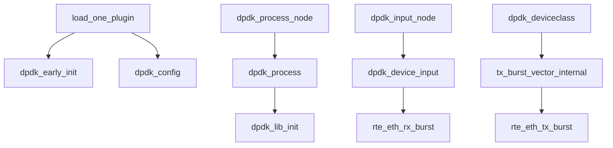

# vpp代码流程分析

常规程序都是从main函数开始执行，main函数执行完后程序退出。但vpp利用gcc的 \_\_attribute\_\_((constructor))特性，使很多函数都在main函数之前执行。主要是插件的配置、注册等操作。当然这些配置和注册操作只是告诉vpp有哪些插件和配置，具体的注册加载执行还需要使用dlopen的方式，按照接口约定拿到具体的执行函数才能进行注册加载以及后续的插件处理。

> VLIB_INIT_FUNCTION用来定义构造函数，注册函数到vlib_main_t->init_function_registrations，这个链表在main()函数之前创建。
>
> vlib_main()-> vlib_call_all_init_functions()注册的函数在这里被调用初始化，最后执行函数vlib_main_loop()。
>
> 像这样由宏定义和构造函数创建的全局链表的方式还有如下几个:
>
> ·    VLIB_API_INIT_FUNCTION
>
> ·    VLIB_CLI_COMMAND
>
> ·    VLIB_CONFIG_FUNCTION
>
> ·    VLIB_EARLY_CONFIG_FUNCTION
>
> ·    VLIB_MAIN_LOOP_ENTER_FUNCTION
>
> ·    VLIB_MAIN_LOOP_EXIT_FUNCTION
>
> ·    VLIB_REGISTER_NODE

vpp具体来说，包含如下几个部分：

- 基础数据结构（重点是hash和vec）
- 堆管理（内存池）
- 线程管理
- 日志管理
- 插件管理
- 定时器
- 节点调度

## 代码流程

- main

- vlib_unix_main

- thread0

- vlib_main_loop

- dpdk plugin

